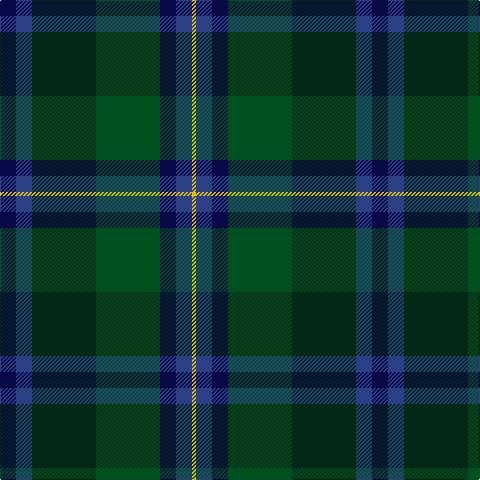

This page is one **sett** — a single exact thread-count. It belongs to the [tartan](/tartans/db4db4dg16dg16db4db4ly1/)
(the same proportion at any scale), whose colour order is pattern [BBGGBBY](/stripes/bbggbby/).

Sourced from register-of-tartans.  It is a [7 stripe tartan](/stripes/stripes7/).

Original link https://www.tartanregister.gov.uk/tartanDetails.aspx?ref=4392

## Also known as

This cloth is also recorded under:

- Unidentified, Waistcoat

## Register references

External register numbers recorded for this tartan.

- Scottish Register of Tartans: [4392](https://www.tartanregister.gov.uk/tartanDetails.aspx?ref=4392)
- Scottish Tartans World Register: 1895

## Thread count
DB/16 B16 DG64 G64 DB16 B16 Y/4

## Palette

Palette: <strong>Tartan Register</strong> <small style="color:#888">(4 of 5 colours)</small>
<table><thead><tr><th>Colour</th><th>Threads</th><th>Shade</th><th>Base</th><th>OKLCh</th></tr></thead><tbody><tr><td>DB/</td><td style="text-align:right;font-variant-numeric:tabular-nums">16</td><td><code style="background-color:#080848;">#080848</code> <small style="color:#888">#080848</small></td><td>B <code style="background-color:#2A418A;">#2A418A</code></td><td><small style="color:#888">oklch(20.2% 0.112 270.4)</small></td></tr><tr><td>B</td><td style="text-align:right;font-variant-numeric:tabular-nums">16</td><td><code style="background-color:#2C4084;">#2C4084</code> <small style="color:#888">#2C4084</small></td><td>B <code style="background-color:#2A418A;">#2A418A</code></td><td><small style="color:#888">oklch(39.4% 0.117 268.3)</small></td></tr><tr><td>DG</td><td style="text-align:right;font-variant-numeric:tabular-nums">64</td><td><code style="background-color:#002814;">#002814</code> <small style="color:#888">#002814</small></td><td>G <code style="background-color:#006100;">#006100</code></td><td><small style="color:#888">oklch(24.4% 0.059 156.5)</small></td></tr><tr><td>G</td><td style="text-align:right;font-variant-numeric:tabular-nums">64</td><td><code style="background-color:#005020;">#005020</code> <small style="color:#888">#005020</small></td><td>G <code style="background-color:#006100;">#006100</code></td><td><small style="color:#888">oklch(37.7% 0.105 149.6)</small></td></tr><tr><td>DB</td><td style="text-align:right;font-variant-numeric:tabular-nums">16</td><td><code style="background-color:#080848;">#080848</code> <small style="color:#888">#080848</small></td><td>B <code style="background-color:#2A418A;">#2A418A</code></td><td><small style="color:#888">oklch(20.2% 0.112 270.4)</small></td></tr><tr><td>B</td><td style="text-align:right;font-variant-numeric:tabular-nums">16</td><td><code style="background-color:#2C4084;">#2C4084</code> <small style="color:#888">#2C4084</small></td><td>B <code style="background-color:#2A418A;">#2A418A</code></td><td><small style="color:#888">oklch(39.4% 0.117 268.3)</small></td></tr><tr><td>Y/</td><td style="text-align:right;font-variant-numeric:tabular-nums">4</td><td><code style="background-color:#E8C000;">#E8C000</code> <small style="color:#888">#E8C000</small></td><td>Y <code style="background-color:#F2BF00;">#F2BF00</code></td><td><small style="color:#888">oklch(81.9% 0.168 93.7)</small></td></tr></tbody></table>

# Sample pattern

## Nearest tartans

The nearest existing variants by ΔTartan distance, with this tartan at the top so the swatches line up against it.

ΔTartan

Tartan

Sett

—

<a href="/ttd/edit/#slug=db4db4dg16dg16db4db4ly1~x4">Unidentified Waistcoat</a> <a class="nn-out" href="/setts/s7/db4db4dg16dg16db4db4ly1~x4/" title="open its dictionary page">↗</a>

1.24

<a href="/ttd/edit/#slug=r4n38k4n6k41dg62y4">Bennett, John Paul (Personal)</a> <a class="nn-out" href="/setts/s7/r4n38k4n6k41dg62y4/" title="open its dictionary page">↗</a>

1.31

<a href="/ttd/edit/#slug=db6k3db3dt13g13k1g13dt13w1db3k3~x2">Wacker (Name)</a> <a class="nn-out" href="/setts/s11/db6k3db3dt13g13k1g13dt13w1db3k3~x2/" title="open its dictionary page">↗</a>

1.32

<a href="/ttd/edit/#slug=dt13dg19k2dg7k2dg7k2db18r2dt13~x2">South Australia</a> <a class="nn-out" href="/setts/s10/dt13dg19k2dg7k2dg7k2db18r2dt13~x2/" title="open its dictionary page">↗</a>

1.38

<a href="/ttd/edit/#slug=dg3r1dg18k20r1db18t1dg2~x4">Lochaber #2</a> <a class="nn-out" href="/setts/s8/dg3r1dg18k20r1db18t1dg2~x4/" title="open its dictionary page">↗</a>

1.44

<a href="/ttd/edit/#slug=r7dg3r2dg33k31db31k3db3">Baird</a> <a class="nn-out" href="/setts/s8/r7dg3r2dg33k31db31k3db3/" title="open its dictionary page">↗</a>

1.45

<a href="/ttd/edit/#slug=do31lo6lr3db36do8dg60lo7t7~x2">Little-Dowse Wedding</a> <a class="nn-out" href="/setts/s8/do31lo6lr3db36do8dg60lo7t7~x2/" title="open its dictionary page">↗</a>

1.45

<a href="/ttd/edit/#slug=dt14k5dp5k5dt14dg32r4~x2">Bennachie (Whisky)</a> <a class="nn-out" href="/setts/s7/dt14k5dp5k5dt14dg32r4~x2/" title="open its dictionary page">↗</a>

1.46

<a href="/ttd/edit/#slug=dt4k9g20dp2dg20k5dt6lb2~x2">Linden</a> <a class="nn-out" href="/setts/s8/dt4k9g20dp2dg20k5dt6lb2~x2/" title="open its dictionary page">↗</a>

1.48

<a href="/ttd/edit/#slug=k2dg12k12r1db12dg2~x2">Ferguson of Balquhidder</a> <a class="nn-out" href="/setts/s6/k2dg12k12r1db12dg2~x2/" title="open its dictionary page">↗</a>

1.50

<a href="/ttd/edit/#slug=t1db11k11dg11k2t1~x2">Unidentified No 59</a> <a class="nn-out" href="/setts/s6/t1db11k11dg11k2t1~x2/" title="open its dictionary page">↗</a>

## Neighbour map

Every grey dot is one of 14299 variants placed by the first two principal components of the ΔTartan feature space (44% of its variance). Red is this tartan; blue dots are its nearest — click one to open its page.

<svg viewBox="0 0 640 380" role="img" style="max-width:100%;height:auto;border:1px solid #e0e0e0;border-radius:4px;display:block" xmlns="http://www.w3.org/2000/svg"><image href="/nn/cloud.v1.png" width="640" height="380"/><a href="/setts/s7/r4n38k4n6k41dg62y4/"><circle cx="291.5" cy="211.6" r="4" fill="#3465a4"><title>Bennett, John Paul (Personal)</title></circle></a><a href="/setts/s11/db6k3db3dt13g13k1g13dt13w1db3k3~x2/"><circle cx="219.6" cy="208.3" r="4" fill="#3465a4"><title>Wacker (Name)</title></circle></a><a href="/setts/s10/dt13dg19k2dg7k2dg7k2db18r2dt13~x2/"><circle cx="234.9" cy="232.8" r="4" fill="#3465a4"><title>South Australia</title></circle></a><a href="/setts/s8/dg3r1dg18k20r1db18t1dg2~x4/"><circle cx="263.4" cy="180.3" r="4" fill="#3465a4"><title>Lochaber #2</title></circle></a><a href="/setts/s8/r7dg3r2dg33k31db31k3db3/"><circle cx="256.0" cy="208.5" r="4" fill="#3465a4"><title>Baird</title></circle></a><a href="/setts/s8/do31lo6lr3db36do8dg60lo7t7~x2/"><circle cx="254.0" cy="176.9" r="4" fill="#3465a4"><title>Little-Dowse Wedding</title></circle></a><a href="/setts/s7/dt14k5dp5k5dt14dg32r4~x2/"><circle cx="252.6" cy="242.9" r="4" fill="#3465a4"><title>Bennachie (Whisky)</title></circle></a><a href="/setts/s8/dt4k9g20dp2dg20k5dt6lb2~x2/"><circle cx="159.2" cy="208.7" r="4" fill="#3465a4"><title>Linden</title></circle></a><a href="/setts/s6/k2dg12k12r1db12dg2~x2/"><circle cx="250.1" cy="250.9" r="4" fill="#3465a4"><title>Ferguson of Balquhidder</title></circle></a><a href="/setts/s6/t1db11k11dg11k2t1~x2/"><circle cx="243.5" cy="250.4" r="4" fill="#3465a4"><title>Unidentified No 59</title></circle></a><circle cx="233.3" cy="223.3" r="5" fill="#c00000"/></svg>

ID: /setts/s7/db4db4dg16dg16db4db4ly1~x4/
