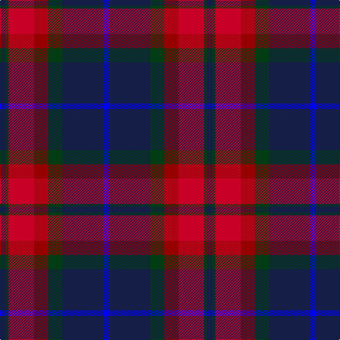

This page is one **sett** — a single exact thread-count. It belongs to the [tartan](/tartans/db4dg2r18ri10dg10db29b4/)
(the same proportion at any scale), whose colour order is pattern [BBGRRGB](/stripes/bbgrrgb/).

Sourced from register-of-tartans.  It is a [7 stripe tartan](/stripes/stripes7/).

Original link https://www.tartanregister.gov.uk/tartanDetails.aspx?ref=912

## Register references

External register numbers recorded for this tartan.

- Scottish Register of Tartans: [912](https://www.tartanregister.gov.uk/tartanDetails.aspx?ref=912)
- Scottish Tartans Authority (ITI): 2814
- Scottish Tartans World Register: 2814

## Thread count
DB/8 DG4 R36 DR20 DG20 DB58 B/8

## Palette

Palette: <strong>Tartan Register</strong> <small style="color:#888">(4 of 5 colours)</small>
<table><thead><tr><th>Colour</th><th>Threads</th><th>Shade</th><th>Base</th><th>OKLCh</th></tr></thead><tbody><tr><td>DB/</td><td style="text-align:right;font-variant-numeric:tabular-nums">8</td><td><code style="background-color:#141E46;">#141E46</code> <small style="color:#888">#141E46</small></td><td>B <code style="background-color:#2A418A;">#2A418A</code></td><td><small style="color:#888">oklch(25.2% 0.076 269.7)</small></td></tr><tr><td>DG</td><td style="text-align:right;font-variant-numeric:tabular-nums">4</td><td><code style="background-color:#003C14;">#003C14</code> <small style="color:#888">#003C14</small></td><td>G <code style="background-color:#006100;">#006100</code></td><td><small style="color:#888">oklch(31.1% 0.089 148.5)</small></td></tr><tr><td>R</td><td style="text-align:right;font-variant-numeric:tabular-nums">36</td><td><code style="background-color:#C80028;">#C80028</code> <small style="color:#888">#C80028</small></td><td>R <code style="background-color:#CC0000;">#CC0000</code></td><td><small style="color:#888">oklch(52.5% 0.212 23.0)</small></td></tr><tr><td>DR</td><td style="text-align:right;font-variant-numeric:tabular-nums">20</td><td><code style="background-color:#960000;">#960000</code> <small style="color:#888">#960000</small></td><td>R <code style="background-color:#CC0000;">#CC0000</code></td><td><small style="color:#888">oklch(42.3% 0.173 29.2)</small></td></tr><tr><td>DG</td><td style="text-align:right;font-variant-numeric:tabular-nums">20</td><td><code style="background-color:#003C14;">#003C14</code> <small style="color:#888">#003C14</small></td><td>G <code style="background-color:#006100;">#006100</code></td><td><small style="color:#888">oklch(31.1% 0.089 148.5)</small></td></tr><tr><td>DB</td><td style="text-align:right;font-variant-numeric:tabular-nums">58</td><td><code style="background-color:#141E46;">#141E46</code> <small style="color:#888">#141E46</small></td><td>B <code style="background-color:#2A418A;">#2A418A</code></td><td><small style="color:#888">oklch(25.2% 0.076 269.7)</small></td></tr><tr><td>B/</td><td style="text-align:right;font-variant-numeric:tabular-nums">8</td><td><code style="background-color:#0000FF;">#0000FF</code> <small style="color:#888">#0000FF</small></td><td>B <code style="background-color:#2A418A;">#2A418A</code></td><td><small style="color:#888">oklch(45.2% 0.313 264.1)</small></td></tr></tbody></table>

# Sample pattern

## Nearest tartans

The nearest existing variants by ΔTartan distance, with this tartan at the top so the swatches line up against it.

ΔTartan

Tartan

Sett

—

<a href="/ttd/edit/#slug=db4dg2r18ri10dg10db29b4~x2">Ross Dempster (Personal)</a> <a class="nn-out" href="/setts/s7/db4dg2r18ri10dg10db29b4~x2/" title="open its dictionary page">↗</a>

0.87

<a href="/ttd/edit/#slug=dp18k7g5r4g7k1ly2~x2">Regent</a> <a class="nn-out" href="/setts/s7/dp18k7g5r4g7k1ly2~x2/" title="open its dictionary page">↗</a>

0.96

<a href="/ttd/edit/#slug=dg8db5k1db17r10db2r10o2~x2">Harrower, John Anthony (Personal)</a> <a class="nn-out" href="/setts/s8/dg8db5k1db17r10db2r10o2~x2/" title="open its dictionary page">↗</a>

1.13

<a href="/ttd/edit/#slug=r25k2n4k2r8k31db32k8">Black and Red</a> <a class="nn-out" href="/setts/s8/r25k2n4k2r8k31db32k8/" title="open its dictionary page">↗</a>

1.17

<a href="/ttd/edit/#slug=r15ri98db72t25db8w15">Afternoon Tea / Assam</a> <a class="nn-out" href="/setts/s6/r15ri98db72t25db8w15/" title="open its dictionary page">↗</a>

1.17

<a href="/ttd/edit/#slug=lb2db20n2dt15r9lb2~x2">Open Championship (1998)</a> <a class="nn-out" href="/setts/s6/lb2db20n2dt15r9lb2~x2/" title="open its dictionary page">↗</a>

1.18

<a href="/ttd/edit/#slug=r12lo2db3k3db30k20dr6k10lo2dr4~x2">KPMG (Corporate)</a> <a class="nn-out" href="/setts/s10/r12lo2db3k3db30k20dr6k10lo2dr4~x2/" title="open its dictionary page">↗</a>

1.18

<a href="/ttd/edit/#slug=dt12w2dt13dg3g2r24g3~x2">Wellmont Foundation (Corporate)</a> <a class="nn-out" href="/setts/s7/dt12w2dt13dg3g2r24g3~x2/" title="open its dictionary page">↗</a>

1.21

<a href="/ttd/edit/#slug=g3db12w1dg12r12dg2~x2">Patterson, John (Personal)</a> <a class="nn-out" href="/setts/s6/g3db12w1dg12r12dg2~x2/" title="open its dictionary page">↗</a>

1.22

<a href="/ttd/edit/#slug=db4dg2r17ri9dg10db30n2~x2">Dempster, Ross (Personal)</a> <a class="nn-out" href="/setts/s7/db4dg2r17ri9dg10db30n2~x2/" title="open its dictionary page">↗</a>

1.22

<a href="/ttd/edit/#slug=db18k5r26k5g25k5db18ly2~x2">St. Clement of Rome (Corporate)</a> <a class="nn-out" href="/setts/s8/db18k5r26k5g25k5db18ly2~x2/" title="open its dictionary page">↗</a>

## Neighbour map

Every grey dot is one of 14359 variants placed by the first two principal components of the ΔTartan feature space (44% of its variance). Red is this tartan; blue dots are its nearest — click one to open its page.

<svg viewBox="0 0 640 380" role="img" style="max-width:100%;height:auto;border:1px solid #e0e0e0;border-radius:4px;display:block" xmlns="http://www.w3.org/2000/svg"><image href="/nn/cloud.v1.png" width="640" height="380"/><a href="/setts/s7/dp18k7g5r4g7k1ly2~x2/"><circle cx="215.0" cy="170.7" r="4" fill="#3465a4"><title>Regent</title></circle></a><a href="/setts/s8/dg8db5k1db17r10db2r10o2~x2/"><circle cx="247.3" cy="175.8" r="4" fill="#3465a4"><title>Harrower, John Anthony (Personal)</title></circle></a><a href="/setts/s8/r25k2n4k2r8k31db32k8/"><circle cx="240.0" cy="182.0" r="4" fill="#3465a4"><title>Black and Red</title></circle></a><a href="/setts/s6/r15ri98db72t25db8w15/"><circle cx="216.3" cy="175.2" r="4" fill="#3465a4"><title>Afternoon Tea / Assam</title></circle></a><a href="/setts/s6/lb2db20n2dt15r9lb2~x2/"><circle cx="205.2" cy="204.8" r="4" fill="#3465a4"><title>Open Championship (1998)</title></circle></a><a href="/setts/s10/r12lo2db3k3db30k20dr6k10lo2dr4~x2/"><circle cx="217.7" cy="164.7" r="4" fill="#3465a4"><title>KPMG (Corporate)</title></circle></a><a href="/setts/s7/dt12w2dt13dg3g2r24g3~x2/"><circle cx="248.0" cy="180.6" r="4" fill="#3465a4"><title>Wellmont Foundation (Corporate)</title></circle></a><a href="/setts/s6/g3db12w1dg12r12dg2~x2/"><circle cx="168.9" cy="200.8" r="4" fill="#3465a4"><title>Patterson, John (Personal)</title></circle></a><a href="/setts/s7/db4dg2r17ri9dg10db30n2~x2/"><circle cx="281.0" cy="195.7" r="4" fill="#3465a4"><title>Dempster, Ross (Personal)</title></circle></a><a href="/setts/s8/db18k5r26k5g25k5db18ly2~x2/"><circle cx="158.6" cy="186.3" r="4" fill="#3465a4"><title>St. Clement of Rome (Corporate)</title></circle></a><circle cx="224.6" cy="184.7" r="5" fill="#c00000"/></svg>

ID: /setts/s7/db4dg2r18ri10dg10db29b4~x2/
