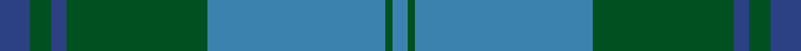
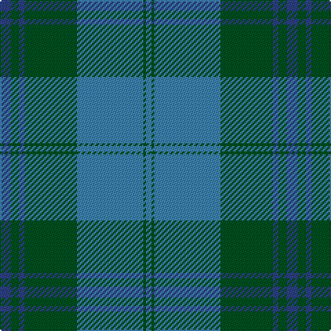

**Bands:** [BGBGBGB](/stripes/bgbgbgb/) · **Stripes:** [DB DG DB DG T DG T](/stripes/stripes7/) DB DG DB DG T DG T

This was sourced from register-of-tartans.  It is a [7 band tartan](/bands/bands7/).

Original link https://www.tartanregister.gov.uk/tartanDetails.aspx?ref=4207

## Also known as

This cloth is also recorded under:

- Unidentified #6

## Register references

External register numbers recorded for this tartan.

- Scottish Register of Tartans: [4207](https://www.tartanregister.gov.uk/tartanDetails.aspx?ref=4207)
- Scottish Tartans World Register: 143

## Thread count
B/8 G6 B4 G38 Ba48 G2 Ba/4

## Palette
Each colour and its ΔE from the base-6 reference it is a variant of.

| Colour | Shade | Base | ΔE (OKLab) |
|---|---|---|---|
| B | <code style="background-color:#2C4084;">#2C4084</code> `#2C4084` | B <code style="background-color:#2A418A;">#2A418A</code> | 0.01 |
| Ba | <code style="background-color:#3C82AF;">#3C82AF</code> `#3C82AF` | B <code style="background-color:#2A418A;">#2A418A</code> | 0.19 |
| G | <code style="background-color:#005020;">#005020</code> `#005020` | G <code style="background-color:#006100;">#006100</code> | 0.07 |

# Sample pattern

## Nearest tartans

The nearest existing variants by ΔTartan distance.

1. [Unidentified 1](/setts/s7/db4g3db2g19t24g1t2~x2/) — ΔT 0.77
1. [Greenlaw, American (Name)](/setts/s8/b46r2b3r2b14g38k3g4~x2/) — ΔT 1.33
1. [Melville (Two black lines)](/setts/s6/dg4w1dg26b26k2b4~x4/) — ΔT 1.42
1. [Wcwm 1530](/setts/s8/dg36db3dg3db3dg6n34r4n4~x2/) — ΔT 1.58
1. [Irvine of Drum](/setts/s8/t3k3t21g49t21k3t3w3~x2/) — ΔT 1.64
1. [Lockhart](/setts/s9/g13k2g34k6b16r2b16k2g13~x2/) — ΔT 1.69
1. [Unidentified Tweed](/setts/s6/dg4db1dg12db12w1db4~x2/) — ΔT 1.70
1. [MacAuliffe/McAucliffe](/setts/s8/dg38w2dg6db24o6db2o3db2~x2/) — ΔT 1.71
1. [Yarmouth NS (District)](/setts/s12/lo2t2lo1t18y2t10y10t2y18ly1y2ly2~x2/) — ΔT 1.77
1. [Port Authority of NY & NJ](/setts/s6/t9db2t39dt33lo2dt5~x2/) — ΔT 1.79

## Neighbour map

Every grey dot is one of 14299 variants placed by the first two principal components of the ΔTartan feature space (44% of its variance). Red is this tartan; blue dots are its nearest — click one to open its page.

<svg viewBox="0 0 640 380" role="img" style="max-width:100%;height:auto;border:1px solid #e0e0e0;border-radius:4px;display:block" xmlns="http://www.w3.org/2000/svg"><image href="/nn/cloud.v1.png" width="640" height="380"/><a href="/setts/s7/db4g3db2g19t24g1t2~x2/"><circle cx="386.7" cy="206.9" r="4" fill="#3465a4"><title>Unidentified 1</title></circle></a><a href="/setts/s8/b46r2b3r2b14g38k3g4~x2/"><circle cx="410.6" cy="183.1" r="4" fill="#3465a4"><title>Greenlaw, American (Name)</title></circle></a><a href="/setts/s6/dg4w1dg26b26k2b4~x4/"><circle cx="370.5" cy="193.3" r="4" fill="#3465a4"><title>Melville (Two black lines)</title></circle></a><a href="/setts/s8/dg36db3dg3db3dg6n34r4n4~x2/"><circle cx="361.3" cy="218.1" r="4" fill="#3465a4"><title>Wcwm 1530</title></circle></a><a href="/setts/s8/t3k3t21g49t21k3t3w3~x2/"><circle cx="367.5" cy="200.7" r="4" fill="#3465a4"><title>Irvine of Drum</title></circle></a><a href="/setts/s9/g13k2g34k6b16r2b16k2g13~x2/"><circle cx="373.9" cy="213.3" r="4" fill="#3465a4"><title>Lockhart</title></circle></a><a href="/setts/s6/dg4db1dg12db12w1db4~x2/"><circle cx="385.7" cy="269.5" r="4" fill="#3465a4"><title>Unidentified Tweed</title></circle></a><a href="/setts/s8/dg38w2dg6db24o6db2o3db2~x2/"><circle cx="364.5" cy="179.2" r="4" fill="#3465a4"><title>MacAuliffe/McAucliffe</title></circle></a><a href="/setts/s12/lo2t2lo1t18y2t10y10t2y18ly1y2ly2~x2/"><circle cx="342.7" cy="175.8" r="4" fill="#3465a4"><title>Yarmouth NS (District)</title></circle></a><a href="/setts/s6/t9db2t39dt33lo2dt5~x2/"><circle cx="381.6" cy="202.7" r="4" fill="#3465a4"><title>Port Authority of NY &amp; NJ</title></circle></a><circle cx="392.8" cy="212.1" r="5" fill="#c00000"/></svg>

ID: /setts/s7/db4dg3db2dg19t24dg1t2~x2/
