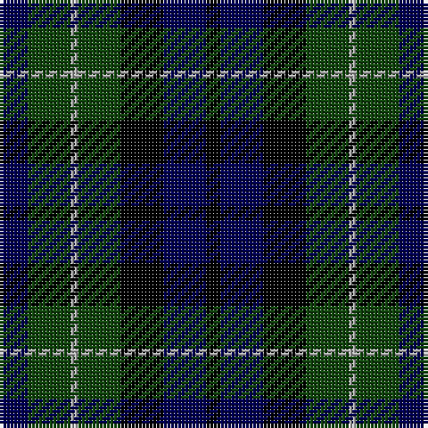

In pattern [BGYGKBK](/stripes/bgygkbk/).

This was sourced from weddslist.  It is a [7 stripe tartan](/stripes/stripes7/).

Original link http://www.weddslist.com/cgi-bin/tartans/pg.pl?source=tinsel

## Attestations

This cloth appears in 2 source records; the oldest owns this page.

- undated — MacNiel of Colonsay (weddslist, [record](http://www.weddslist.com/cgi-bin/tartans/pg.pl?source=tinsel))
- undated — MacNiel of Colonsay (weddslist, [record](http://www.weddslist.com/cgi-bin/tartans/pg.pl?source=x))

## Thread count
DB/8 DG12 N2 DG12 K12 DB12 K/4

## Palette
Each colour and the base-6 reference it is a variant of.

| Colour | Shade | Base |
|---|---|---|
| DB | <code style="background-color:#000052;">#000052</code> `oklch(19.8% 0.137 264.1)` <small>#000052</small> | B <code style="background-color:#2A418A;">#2A418A</code> |
| DG | <code style="background-color:#11450D;">#11450D</code> `oklch(34.4% 0.101 142.1)` <small>#11450D</small> | G <code style="background-color:#006100;">#006100</code> |
| K | <code style="background-color:#000000;">#000000</code> `oklch(0.0% 0.000 0.0)` <small>#000000</small> | K <code style="background-color:#000000;">#000000</code> |
| N | <code style="background-color:#AAAAAA;">#AAAAAA</code> `oklch(73.8% 0.000 89.9)` <small>#AAAAAA</small> | Y <code style="background-color:#F2BF00;">#F2BF00</code> |

# Sample pattern

## Nearest tartans

The nearest existing variants by ΔTartan distance.

1. [MacNeil of Colonsay](/setts/s7/db4dg6lb1dg6k6db6k2~x2/) — ΔT 0.53
1. [Campbell of Breadalbane](/setts/s7/k9dg9ly2dg9k9db9k3~x2/) — ΔT 0.88
1. [Graham of Montrose](/setts/s7/k4dg4lr1dg4k4db4k1~x2/) — ΔT 0.89
1. [Wilson's No 97](/setts/s7/k11dg12k2dg12k12dp12w3~x2/) — ΔT 1.01
1. [Abercrombie (Wilsons No 2/64)](/setts/s7/k6dg6ly1dg6k6dp6k1~x4/) — ΔT 1.09
1. [MacCallum](/setts/s7/dg8k2b1dg4k6db6k1~x2/) — ΔT 1.12
1. [Fletcher](/setts/s7/db6k1db6k8r1dg8k2/) — ΔT 1.13
1. [MacNeil of Colonsay](/setts/s7/db4dg6w1dg6k6db6k2~x2/) — ΔT 1.13
1. [Graham of Montrose](/setts/s7/k4dg4lb1dg4k4db4k1~x2/) — ΔT 1.14
1. [Campbell Breadalbane](/setts/s7/k9dg9ly2dg9k9db9k3/) — ΔT 1.15

## Neighbour map

Every grey dot is one of 14299 variants placed by the first two principal components of the ΔTartan feature space (44% of its variance). Red is this tartan; blue dots are its nearest — click one to open its page.

<svg viewBox="0 0 640 380" role="img" style="max-width:100%;height:auto;border:1px solid #e0e0e0;border-radius:4px;display:block" xmlns="http://www.w3.org/2000/svg"><image href="/nn/cloud.v1.png" width="640" height="380"/><a href="/setts/s7/db4dg6lb1dg6k6db6k2~x2/"><circle cx="145.5" cy="278.6" r="4" fill="#3465a4"><title>MacNeil of Colonsay</title></circle></a><a href="/setts/s7/k9dg9ly2dg9k9db9k3~x2/"><circle cx="155.2" cy="297.3" r="4" fill="#3465a4"><title>Campbell of Breadalbane</title></circle></a><a href="/setts/s7/k4dg4lr1dg4k4db4k1~x2/"><circle cx="145.7" cy="297.3" r="4" fill="#3465a4"><title>Graham of Montrose</title></circle></a><a href="/setts/s7/k11dg12k2dg12k12dp12w3~x2/"><circle cx="165.1" cy="274.7" r="4" fill="#3465a4"><title>Wilson's No 97</title></circle></a><a href="/setts/s7/k6dg6ly1dg6k6dp6k1~x4/"><circle cx="192.7" cy="278.7" r="4" fill="#3465a4"><title>Abercrombie (Wilsons No 2/64)</title></circle></a><a href="/setts/s7/dg8k2b1dg4k6db6k1~x2/"><circle cx="216.5" cy="256.2" r="4" fill="#3465a4"><title>MacCallum</title></circle></a><a href="/setts/s7/db6k1db6k8r1dg8k2/"><circle cx="197.2" cy="257.1" r="4" fill="#3465a4"><title>Fletcher</title></circle></a><a href="/setts/s7/db4dg6w1dg6k6db6k2~x2/"><circle cx="161.7" cy="279.7" r="4" fill="#3465a4"><title>MacNeil of Colonsay</title></circle></a><a href="/setts/s7/k4dg4lb1dg4k4db4k1~x2/"><circle cx="134.4" cy="292.0" r="4" fill="#3465a4"><title>Graham of Montrose</title></circle></a><a href="/setts/s7/k9dg9ly2dg9k9db9k3/"><circle cx="143.0" cy="291.2" r="4" fill="#3465a4"><title>Campbell Breadalbane</title></circle></a><circle cx="161.0" cy="286.0" r="5" fill="#c00000"/></svg>

ID: /setts/s7/db4dg6lr1dg6k6db6k2~x2/
