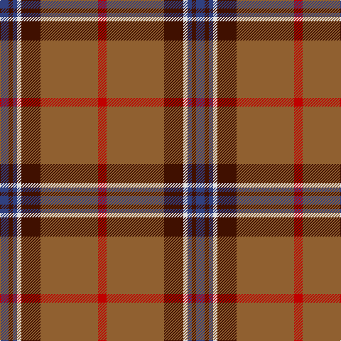

In pattern [BBBWBRR](/stripes/bbbwbrr/).

This was sourced from weddslist.  It is a [7 stripe tartan](/stripes/stripes7/).

Original link http://www.weddslist.com/cgi-bin/tartans/pg.pl?source=sts

## Thread count
R/12 LT81 DR27 LN6 B6 DR6 B/12

## Palette
Each colour and the base-6 reference it is a variant of.

| Colour | Shade | Base |
|---|---|---|
| B | <code style="background-color:#304080;">#304080</code> `oklch(39.4% 0.109 270.2)` <small>#304080</small> | B <code style="background-color:#2A418A;">#2A418A</code> |
| DR | <code style="background-color:#401000;">#401000</code> `oklch(25.3% 0.079 39.9)` <small>#401000</small> | B <code style="background-color:#2A418A;">#2A418A</code> |
| LN | <code style="background-color:#E0E0E0;">#E0E0E0</code> `oklch(90.7% 0.000 89.9)` <small>#E0E0E0</small> | W <code style="background-color:#F7F7F7;">#F7F7F7</code> |
| LT | <code style="background-color:#906030;">#906030</code> `oklch(53.1% 0.089 63.7)` <small>#906030</small> | R <code style="background-color:#CC0000;">#CC0000</code> |
| R | <code style="background-color:#C00000;">#C00000</code> `oklch(50.7% 0.208 29.2)` <small>#C00000</small> | R <code style="background-color:#CC0000;">#CC0000</code> |

# Sample pattern

## Nearest tartans

The nearest existing variants by ΔTartan distance, with this tartan at the top so the swatches line up against it.

ΔTartan

Tartan

Sett

—

<a href="/ttd/edit/#slug=db4dr2db2w2dr9o27r4~x3">Unidentified 35</a> <a class="nn-out" href="/setts/s7/db4dr2db2w2dr9o27r4~x3/" title="open its dictionary page">↗</a>

0.72

<a href="/ttd/edit/#slug=r2dg16r1r2r12ly1y1~x2">Spragg, Andrew</a> <a class="nn-out" href="/setts/s7/r2dg16r1r2r12ly1y1~x2/" title="open its dictionary page">↗</a>

0.82

<a href="/ttd/edit/#slug=y47w6r24w3dp5lo3~x2">Duminiak (Trevose, Pennsylvania)</a> <a class="nn-out" href="/setts/s6/y47w6r24w3dp5lo3~x2/" title="open its dictionary page">↗</a>

0.97

<a href="/ttd/edit/#slug=lb2g6r1g1r14k1lb1~x4">MacMaster (USA) #1</a> <a class="nn-out" href="/setts/s7/lb2g6r1g1r14k1lb1~x4/" title="open its dictionary page">↗</a>

1.02

<a href="/ttd/edit/#slug=r2g16r1r2r12ly1t1~x2">Spragg (Name)</a> <a class="nn-out" href="/setts/s7/r2g16r1r2r12ly1t1~x2/" title="open its dictionary page">↗</a>

1.17

<a href="/ttd/edit/#slug=lo3y40db12lo3k2lb4k2lo3~x2">Tunes of Glory (Film)</a> <a class="nn-out" href="/setts/s8/lo3y40db12lo3k2lb4k2lo3~x2/" title="open its dictionary page">↗</a>

1.22

<a href="/ttd/edit/#slug=r3db1r12o3dg12lb1dg2~x4">Leckie (Personal)</a> <a class="nn-out" href="/setts/s7/r3db1r12o3dg12lb1dg2~x4/" title="open its dictionary page">↗</a>

1.24

<a href="/ttd/edit/#slug=r24lb1k3lb1g14r8k3dp3lb2~x4">Leach (1995)</a> <a class="nn-out" href="/setts/s9/r24lb1k3lb1g14r8k3dp3lb2~x4/" title="open its dictionary page">↗</a>

1.28

<a href="/ttd/edit/#slug=r26n4r1p2dg1n4dg14w2~x2">Redpath, Robert A (Personal)</a> <a class="nn-out" href="/setts/s8/r26n4r1p2dg1n4dg14w2~x2/" title="open its dictionary page">↗</a>

1.33

<a href="/ttd/edit/#slug=r7w2r32db7g3db2g3db2g16r3~x2">Chisholm, hunting</a> <a class="nn-out" href="/setts/s10/r7w2r32db7g3db2g3db2g16r3~x2/" title="open its dictionary page">↗</a>

1.34

<a href="/ttd/edit/#slug=r8w2m30g12m3g12m3~x2">Wasko (Personal)</a> <a class="nn-out" href="/setts/s7/r8w2m30g12m3g12m3~x2/" title="open its dictionary page">↗</a>

## Neighbour map

Every grey dot is one of 14299 variants placed by the first two principal components of the ΔTartan feature space (44% of its variance). Red is this tartan; blue dots are its nearest — click one to open its page.

<svg viewBox="0 0 640 380" role="img" style="max-width:100%;height:auto;border:1px solid #e0e0e0;border-radius:4px;display:block" xmlns="http://www.w3.org/2000/svg"><image href="/nn/cloud.v1.png" width="640" height="380"/><a href="/setts/s7/r2dg16r1r2r12ly1y1~x2/"><circle cx="302.5" cy="154.1" r="4" fill="#3465a4"><title>Spragg, Andrew</title></circle></a><a href="/setts/s6/y47w6r24w3dp5lo3~x2/"><circle cx="335.4" cy="166.8" r="4" fill="#3465a4"><title>Duminiak (Trevose, Pennsylvania)</title></circle></a><a href="/setts/s7/lb2g6r1g1r14k1lb1~x4/"><circle cx="343.7" cy="149.7" r="4" fill="#3465a4"><title>MacMaster (USA) #1</title></circle></a><a href="/setts/s7/r2g16r1r2r12ly1t1~x2/"><circle cx="299.2" cy="152.4" r="4" fill="#3465a4"><title>Spragg (Name)</title></circle></a><a href="/setts/s8/lo3y40db12lo3k2lb4k2lo3~x2/"><circle cx="356.8" cy="126.1" r="4" fill="#3465a4"><title>Tunes of Glory (Film)</title></circle></a><a href="/setts/s7/r3db1r12o3dg12lb1dg2~x4/"><circle cx="275.0" cy="180.8" r="4" fill="#3465a4"><title>Leckie (Personal)</title></circle></a><a href="/setts/s9/r24lb1k3lb1g14r8k3dp3lb2~x4/"><circle cx="330.7" cy="129.6" r="4" fill="#3465a4"><title>Leach (1995)</title></circle></a><a href="/setts/s8/r26n4r1p2dg1n4dg14w2~x2/"><circle cx="347.2" cy="140.0" r="4" fill="#3465a4"><title>Redpath, Robert A (Personal)</title></circle></a><a href="/setts/s10/r7w2r32db7g3db2g3db2g16r3~x2/"><circle cx="344.8" cy="151.0" r="4" fill="#3465a4"><title>Chisholm, hunting</title></circle></a><a href="/setts/s7/r8w2m30g12m3g12m3~x2/"><circle cx="331.5" cy="186.3" r="4" fill="#3465a4"><title>Wasko (Personal)</title></circle></a><circle cx="324.6" cy="160.6" r="5" fill="#c00000"/></svg>

ID: /setts/s7/db4dr2db2w2dr9o27r4~x3/
