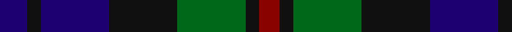

**Bands:** [BKBKGKR](/stripes/bkbkgkr/) · **Stripes:** [DB K DB K G K R](/stripes/stripes7/) DB K DB K G K R

This was sourced from tartans-authority.  It is a [7 band tartan](/bands/bands7/).

Original link http://www.tartansauthority.com/tartan-ferret/display/218/

## Variants

Other setts woven to the same stripe pattern.

- [Renfrew](/setts/s7/db6k2db18k18g18k3r2~x2/)

## Thread count
DB/8 K4 DB20 K20 G20 K4 DR/6

## Palette
Each colour and its ΔE from the base-6 reference it is a variant of.

| Colour | Shade | Base | ΔE (OKLab) |
|---|---|---|---|
| DB | <code style="background-color:#1C0070;">#1C0070</code> `#1C0070` | B <code style="background-color:#2A418A;">#2A418A</code> | 0.14 |
| DR | <code style="background-color:#880000;">#880000</code> `#880000` | R <code style="background-color:#CC0000;">#CC0000</code> | 0.15 |
| G | <code style="background-color:#006818;">#006818</code> `#006818` | G <code style="background-color:#006100;">#006100</code> | 0.02 |
| K | <code style="background-color:#101010;">#101010</code> `#101010` | K <code style="background-color:#000000;">#000000</code> | 0.17 |

# Sample pattern

## Nearest tartans

The nearest existing variants by ΔTartan distance.

1. [Inneryne (Personal)](/setts/s7/db4k3db16k14g14r3g3~x2/) — ΔT 0.64
1. [Lennie](/setts/s6/dg2dp8k9y2dg10k2~x2/) — ΔT 0.84
1. [Ferguson of Balquhidder #3](/setts/s6/k3db12r2k12dg12k3~x2/) — ΔT 0.95
1. [Baird (Modern)](/setts/s8/db3k2db8k8g8dp1g1dp3~x4/) — ΔT 0.96
1. [Baird Clan Tartan Tartan Number: 104. Earliest known date: 1906 This tartan is first recorded in Johnston's work of 1906, and the sample from the Highland Society of London probably dates from the same period. In both these early references the triple stripes are rendered in red. Today, however, they are generally woven in purple. The name originates from 'bard' meaning poet. The Bairds owned estates in Aberdeenshire which were later purchased by the Gordons. See products available Copyright © Blair Urquhart, Comrie, 2015](/setts/s8/db3k2db8k8g8dp1g1dp3~x2/) — ΔT 0.96
1. [Murray #3](/setts/s6/db2k2db12k8dg11r2~x2/) — ΔT 0.96
1. [Gallamore](/setts/s6/k3db14r2k14g14k3~x2/) — ΔT 0.96
1. [Forbes #4](/setts/s7/db1k1db6k6dg6k1w1~x2/) — ΔT 0.97
1. [Campbell, Sir Walter Scott](/setts/s6/k2dg8db2k9dp7k2~x2/) — ΔT 1.03
1. [Scottish Airports Corporate Tartan Tartan Number: 2510. Earliest known date: November 1988 An archetypal Kinloch Anderson blue design. Scottish Tartan Society notes say that Percy Pilcher (an early aviation pioneer 1866 -1899) had connections to the Gunn tartan (his mother was a Robinson). The design is based on that sett using the colours of the British Airports Authority with the purple line added to represent the Scottish thistle. See products available Copyright © Blair Urquhart, Comrie, 2015](/setts/s10/db18k17db3g18db4g18db3k17db18p4~x2/) — ΔT 1.03

## Neighbour map

Every grey dot is one of 14313 variants placed by the first two principal components of the ΔTartan feature space (44% of its variance). Red is this tartan; blue dots are its nearest — click one to open its page.

<svg viewBox="0 0 640 380" role="img" style="max-width:100%;height:auto;border:1px solid #e0e0e0;border-radius:4px;display:block" xmlns="http://www.w3.org/2000/svg"><image href="/nn/cloud.v1.png" width="640" height="380"/><a href="/setts/s7/db4k3db16k14g14r3g3~x2/"><circle cx="179.4" cy="259.6" r="4" fill="#3465a4"><title>Inneryne (Personal)</title></circle></a><a href="/setts/s6/dg2dp8k9y2dg10k2~x2/"><circle cx="200.6" cy="280.9" r="4" fill="#3465a4"><title>Lennie</title></circle></a><a href="/setts/s6/k3db12r2k12dg12k3~x2/"><circle cx="224.9" cy="280.0" r="4" fill="#3465a4"><title>Ferguson of Balquhidder #3</title></circle></a><a href="/setts/s8/db3k2db8k8g8dp1g1dp3~x4/"><circle cx="181.0" cy="241.9" r="4" fill="#3465a4"><title>Baird (Modern)</title></circle></a><a href="/setts/s8/db3k2db8k8g8dp1g1dp3~x2/"><circle cx="181.0" cy="241.9" r="4" fill="#3465a4"><title>Baird Clan Tartan Tartan Number: 104. Earliest known date: 1906 This tartan is first recorded in Johnston's work of 1906, and the sample from the Highland Society of London probably dates from the same period. In both these early references the triple stripes are rendered in red. Today, however, they are generally woven in purple. The name originates from 'bard' meaning poet. The Bairds owned estates in Aberdeenshire which were later purchased by the Gordons. See products available Copyright © Blair Urquhart, Comrie, 2015</title></circle></a><a href="/setts/s6/db2k2db12k8dg11r2~x2/"><circle cx="217.2" cy="272.3" r="4" fill="#3465a4"><title>Murray #3</title></circle></a><a href="/setts/s6/k3db14r2k14g14k3~x2/"><circle cx="214.0" cy="260.7" r="4" fill="#3465a4"><title>Gallamore</title></circle></a><a href="/setts/s7/db1k1db6k6dg6k1w1~x2/"><circle cx="191.7" cy="246.7" r="4" fill="#3465a4"><title>Forbes #4</title></circle></a><a href="/setts/s6/k2dg8db2k9dp7k2~x2/"><circle cx="223.6" cy="293.2" r="4" fill="#3465a4"><title>Campbell, Sir Walter Scott</title></circle></a><a href="/setts/s10/db18k17db3g18db4g18db3k17db18p4~x2/"><circle cx="183.3" cy="257.3" r="4" fill="#3465a4"><title>Scottish Airports Corporate Tartan Tartan Number: 2510. Earliest known date: November 1988 An archetypal Kinloch Anderson blue design. Scottish Tartan Society notes say that Percy Pilcher (an early aviation pioneer 1866 -1899) had connections to the Gunn tartan (his mother was a Robinson). The design is based on that sett using the colours of the British Airports Authority with the purple line added to represent the Scottish thistle. See products available Copyright © Blair Urquhart, Comrie, 2015</title></circle></a><circle cx="171.5" cy="274.7" r="5" fill="#c00000"/></svg>

ID: /setts/s7/db4k2db10k10g10k2r3~x2/
