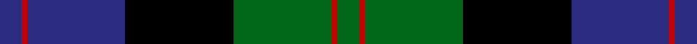

In pattern [BRBKGRG](/stripes/brbkgrg/).

This was sourced from register-of-tartans.  It is a [7 stripe tartan](/stripes/stripes7/).

Original link https://www.tartanregister.gov.uk/tartanDetails.aspx?ref=291

## Attestations

This cloth appears in 2 source records; the oldest owns this page.

- 01/01/1999 — Blair (register-of-tartans, [record](https://www.tartanregister.gov.uk/tartanDetails.aspx?ref=291))
- pre 1999 — Blair (Name) (tartans-authority, [record](http://www.tartansauthority.com/tartan-ferret/display/416/))

## Register references

External register numbers recorded for this tartan.

- Scottish Register of Tartans: [291](https://www.tartanregister.gov.uk/tartanDetails.aspx?ref=291)
- Scottish Tartans Authority (ITI): 416
- Scottish Tartans World Register: 416

## Thread count
DBa/8 Ra2 DBa36 K40 Ga36 Ra2 Ga/8

## Palette
Each colour and its ΔE from the base-6 reference it is a variant of.

| Colour | Shade | Base | ΔE (OKLab) |
|---|---|---|---|
| B | <code style="background-color:#1474B4;">#1474B4</code> `#1474B4` | B <code style="background-color:#2A418A;">#2A418A</code> | 0.15 |
| DB | <code style="background-color:#000048;">#000048</code> `#000048` | B <code style="background-color:#2A418A;">#2A418A</code> | 0.22 |
| DBa | <code style="background-color:#2C2C80;">#2C2C80</code> `#2C2C80` | B <code style="background-color:#2A418A;">#2A418A</code> | 0.06 |
| DG | <code style="background-color:#044028;">#044028</code> `#044028` | G <code style="background-color:#006100;">#006100</code> | 0.13 |
| G | <code style="background-color:#408060;">#408060</code> `#408060` | G <code style="background-color:#006100;">#006100</code> | 0.14 |
| Ga | <code style="background-color:#006818;">#006818</code> `#006818` | G <code style="background-color:#006100;">#006100</code> | 0.02 |
| K | <code style="background-color:#000000;">#000000</code> `#000000` | K <code style="background-color:#000000;">#000000</code> | 0.00 |
| R | <code style="background-color:#C80000;">#C80000</code> `#C80000` | R <code style="background-color:#CC0000;">#CC0000</code> | 0.01 |
| Ra | <code style="background-color:#C80000;">#C80000</code> `#C80000` | R <code style="background-color:#CC0000;">#CC0000</code> | 0.01 |

# Sample pattern

## Nearest tartans

The nearest existing variants by ΔTartan distance.

1. [Meoni (Personal)](/setts/s7/k1r1k18g12db18g1db1~x2/) — ΔT 0.74
1. [Dress Watch](/setts/s8/db4k3db18k18g18db1g2w4~x2/) — ΔT 0.83
1. [Baird](/setts/s8/r7g3r2g33k31db31k3db3/) — ΔT 0.83
1. [Glenturret Distillery](/setts/s6/lo4db24g3k21g23k1~x2/) — ΔT 0.95
1. [Hebridean Old](/setts/s9/k2db3g16b1k13b1db18k2db2~x2/) — ΔT 1.01
1. [Common Kilt](/setts/s8/r3k2db25k28g25k2r1db2~x2/) — ΔT 1.02
1. [MacLeod](/setts/s7/r3k2dg15k10db21k1ly2/) — ΔT 1.10
1. [Graham of Menteith](/setts/s6/dg8lb2dg1k12db12k1~x2/) — ΔT 1.12
1. [Colquhoun VS](/setts/s7/db4k2db16lb1k8dg24r4/) — ΔT 1.14
1. [Herd Family Tartan Tartan Number: 170. Earliest known date: 1978 Woven for the wedding of William Hurd to Heather Petit. From JCT: STS monitoring committee recorded 1978. In march 2005. STS Record has the application being made by Councillor R J Herd, C.Eng, M.I.C.E., A.M.B.I.M. who had been granted arms by Lord Lyon. See products available Copyright © Blair Urquhart, Comrie, 2015](/setts/s6/db2g12k13w1db13w2~x2/) — ΔT 1.14

## Neighbour map

Every grey dot is one of 14299 variants placed by the first two principal components of the ΔTartan feature space (44% of its variance). Red is this tartan; blue dots are its nearest — click one to open its page.

<svg viewBox="0 0 640 380" role="img" style="max-width:100%;height:auto;border:1px solid #e0e0e0;border-radius:4px;display:block" xmlns="http://www.w3.org/2000/svg"><image href="/nn/cloud.v1.png" width="640" height="380"/><a href="/setts/s7/k1r1k18g12db18g1db1~x2/"><circle cx="232.1" cy="177.8" r="4" fill="#3465a4"><title>Meoni (Personal)</title></circle></a><a href="/setts/s8/db4k3db18k18g18db1g2w4~x2/"><circle cx="197.3" cy="180.0" r="4" fill="#3465a4"><title>Dress Watch</title></circle></a><a href="/setts/s8/r7g3r2g33k31db31k3db3/"><circle cx="179.2" cy="169.9" r="4" fill="#3465a4"><title>Baird</title></circle></a><a href="/setts/s6/lo4db24g3k21g23k1~x2/"><circle cx="226.1" cy="198.5" r="4" fill="#3465a4"><title>Glenturret Distillery</title></circle></a><a href="/setts/s9/k2db3g16b1k13b1db18k2db2~x2/"><circle cx="220.6" cy="160.3" r="4" fill="#3465a4"><title>Hebridean Old</title></circle></a><a href="/setts/s8/r3k2db25k28g25k2r1db2~x2/"><circle cx="224.9" cy="145.9" r="4" fill="#3465a4"><title>Common Kilt</title></circle></a><a href="/setts/s7/r3k2dg15k10db21k1ly2/"><circle cx="203.0" cy="161.7" r="4" fill="#3465a4"><title>MacLeod</title></circle></a><a href="/setts/s6/dg8lb2dg1k12db12k1~x2/"><circle cx="190.6" cy="216.9" r="4" fill="#3465a4"><title>Graham of Menteith</title></circle></a><a href="/setts/s7/db4k2db16lb1k8dg24r4/"><circle cx="232.7" cy="163.1" r="4" fill="#3465a4"><title>Colquhoun VS</title></circle></a><a href="/setts/s6/db2g12k13w1db13w2~x2/"><circle cx="187.9" cy="213.2" r="4" fill="#3465a4"><title>Herd Family Tartan Tartan Number: 170. Earliest known date: 1978 Woven for the wedding of William Hurd to Heather Petit. From JCT: STS monitoring committee recorded 1978. In march 2005. STS Record has the application being made by Councillor R J Herd, C.Eng, M.I.C.E., A.M.B.I.M. who had been granted arms by Lord Lyon. See products available Copyright © Blair Urquhart, Comrie, 2015</title></circle></a><circle cx="205.4" cy="184.8" r="5" fill="#c00000"/></svg>

ID: /setts/s7/db4r1db18k20g18r1g4~x2/
