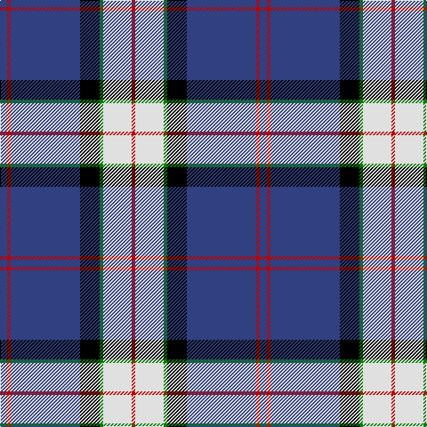

In pattern [BRBKGWR](/stripes/brbkgwr/).

This was sourced from weddslist.  It is a [7 stripe tartan](/stripes/stripes7/).

Original link http://www.weddslist.com/cgi-bin/tartans/pg.pl?source=sts

## Also known as

This cloth is also recorded under:

- Sinclair, The Jack

## Attestations

This cloth appears in 2 source records; the oldest owns this page.

- undated — Sinclair, The Jack (weddslist, [record](http://www.weddslist.com/cgi-bin/tartans/pg.pl?source=sts))
- undated — Sinclair Dress Personal Tartan Tartan Number: 2047. Earliest known date: 1977 Originally a private copyright tartan which has been given approval by the Earl of Caithness. Jack Sinclair wore this tartan on stage. The following was noted in 2003: More recently the tartan has become known as the Sinclair Dress and restrictions on its use are no longer applied. In 2010 the designer, M. Sinclair intimated that she wished the restrictions on use to be applied for the exclusive use of Jack Sinclair and his immediate family. See products available Copyright © Blair Urquhart, Comrie, 2015 (house-of-tartan, [record](http://www.house-of-tartan.scotland.net/house/TartanViewjs.asp?colr=Def&tnam=2047))

## Thread count
B/8 R4 B78 K22 G4 LN32 R/4

## Palette
Each colour and the base-6 reference it is a variant of.

| Colour | Shade | Base |
|---|---|---|
| B | <code style="background-color:#304080;">#304080</code> `oklch(39.4% 0.109 270.2)` <small>#304080</small> | B <code style="background-color:#2A418A;">#2A418A</code> |
| G | <code style="background-color:#008000;">#008000</code> `oklch(52.0% 0.177 142.5)` <small>#008000</small> | G <code style="background-color:#006100;">#006100</code> |
| K | <code style="background-color:#000000;">#000000</code> `oklch(0.0% 0.000 0.0)` <small>#000000</small> | K <code style="background-color:#000000;">#000000</code> |
| LN | <code style="background-color:#E0E0E0;">#E0E0E0</code> `oklch(90.7% 0.000 89.9)` <small>#E0E0E0</small> | W <code style="background-color:#F7F7F7;">#F7F7F7</code> |
| R | <code style="background-color:#C00000;">#C00000</code> `oklch(50.7% 0.208 29.2)` <small>#C00000</small> | R <code style="background-color:#CC0000;">#CC0000</code> |

# Sample pattern

## Nearest tartans

The nearest existing variants by ΔTartan distance.

1. [Sinclair, Blue (Personal)](/setts/s7/db4r2db40k11g2w16r2~x2/) — ΔT 0.42
1. [Royal Troon Golf Club, The](/setts/s8/lo3db4w10dg2w2dg5db34ly3~x2/) — ΔT 0.82
1. [Bell of the Borders.](/setts/s9/r3g2k9b2k2b24ly2b2ly1~x2/) — ΔT 0.93
1. [Detroit Lions](/setts/s8/db30lb2k9w3db6w4k3lb6~x2/) — ΔT 1.06
1. [East Tennessee State University](/setts/s7/lo2w1db6w1ly2k17ly1~x2/) — ΔT 1.12
1. [Wolverines (Corporate)](/setts/s6/lo8w3db40k12w3lo3~x2/) — ΔT 1.14
1. [Royal Troon Golf Club, The](/setts/s8/r3dt4w10dg2w2dg5dt34ly3~x2/) — ΔT 1.15
1. [Longniddry Eildon Blue Dress Fancy Tartan Tartan Number: 5486. Earliest known date: pre 1992 Dancers tartan See products available Copyright © Blair Urquhart, Comrie, 2015](/setts/s8/db42lb2lb2lb2db5dt12lb32db4~x2/) — ΔT 1.16
1. [Sinclair dress](/setts/s7/db2r1db16k5g2w11g1~x4/) — ΔT 1.18
1. [Hydro-Electric](/setts/s6/k3db30k8w8k2r3~x2/) — ΔT 1.18

## Neighbour map

Every grey dot is one of 14299 variants placed by the first two principal components of the ΔTartan feature space (44% of its variance). Red is this tartan; blue dots are its nearest — click one to open its page.

<svg viewBox="0 0 640 380" role="img" style="max-width:100%;height:auto;border:1px solid #e0e0e0;border-radius:4px;display:block" xmlns="http://www.w3.org/2000/svg"><image href="/nn/cloud.v1.png" width="640" height="380"/><a href="/setts/s7/db4r2db40k11g2w16r2~x2/"><circle cx="291.0" cy="126.2" r="4" fill="#3465a4"><title>Sinclair, Blue (Personal)</title></circle></a><a href="/setts/s8/lo3db4w10dg2w2dg5db34ly3~x2/"><circle cx="304.0" cy="117.4" r="4" fill="#3465a4"><title>Royal Troon Golf Club, The</title></circle></a><a href="/setts/s9/r3g2k9b2k2b24ly2b2ly1~x2/"><circle cx="317.7" cy="96.0" r="4" fill="#3465a4"><title>Bell of the Borders.</title></circle></a><a href="/setts/s8/db30lb2k9w3db6w4k3lb6~x2/"><circle cx="291.5" cy="153.4" r="4" fill="#3465a4"><title>Detroit Lions</title></circle></a><a href="/setts/s7/lo2w1db6w1ly2k17ly1~x2/"><circle cx="283.2" cy="132.5" r="4" fill="#3465a4"><title>East Tennessee State University</title></circle></a><a href="/setts/s6/lo8w3db40k12w3lo3~x2/"><circle cx="306.9" cy="166.6" r="4" fill="#3465a4"><title>Wolverines (Corporate)</title></circle></a><a href="/setts/s8/r3dt4w10dg2w2dg5dt34ly3~x2/"><circle cx="302.9" cy="118.8" r="4" fill="#3465a4"><title>Royal Troon Golf Club, The</title></circle></a><a href="/setts/s8/db42lb2lb2lb2db5dt12lb32db4~x2/"><circle cx="289.4" cy="138.9" r="4" fill="#3465a4"><title>Longniddry Eildon Blue Dress Fancy Tartan Tartan Number: 5486. Earliest known date: pre 1992 Dancers tartan See products available Copyright © Blair Urquhart, Comrie, 2015</title></circle></a><a href="/setts/s7/db2r1db16k5g2w11g1~x4/"><circle cx="210.0" cy="139.2" r="4" fill="#3465a4"><title>Sinclair dress</title></circle></a><a href="/setts/s6/k3db30k8w8k2r3~x2/"><circle cx="291.8" cy="167.8" r="4" fill="#3465a4"><title>Hydro-Electric</title></circle></a><circle cx="284.9" cy="128.0" r="5" fill="#c00000"/></svg>

ID: /setts/s7/db4r2db39k11g2w16r2~x2/
