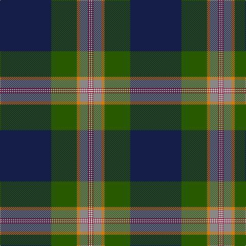

**Bands:** [BGYRRWR](/stripes/bgyrrwr/) · **Stripes:** [DB DG LO O R W R](/stripes/stripes7/) DB DG LO O R W R

This was sourced from register-of-tartans.  It is a [7 band tartan](/bands/bands7/).

Original link https://www.tartanregister.gov.uk/tartanDetails.aspx?ref=11106

## Register references

External register numbers recorded for this tartan.

- Scottish Register of Tartans: [11106](https://www.tartanregister.gov.uk/tartanDetails.aspx?ref=11106)

## Thread count
DB/100 G50 O6 N16 DR2 W2 DR/2

## Palette
Each colour and its ΔE from the base-6 reference it is a variant of.

| Colour | Shade | Base | ΔE (OKLab) |
|---|---|---|---|
| DB | <code style="background-color:#141E46;">#141E46</code> `#141E46` | B <code style="background-color:#2A418A;">#2A418A</code> | 0.16 |
| DR | <code style="background-color:#960028;">#960028</code> `#960028` | R <code style="background-color:#CC0000;">#CC0000</code> | 0.12 |
| G | <code style="background-color:#285800;">#285800</code> `#285800` | G <code style="background-color:#006100;">#006100</code> | 0.03 |
| N | <code style="background-color:#888888;">#888888</code> `#888888` | R <code style="background-color:#CC0000;">#CC0000</code> | 0.24 |
| O | <code style="background-color:#D87C00;">#D87C00</code> `#D87C00` | Y <code style="background-color:#F2BF00;">#F2BF00</code> | 0.17 |
| W | <code style="background-color:#F8F8F8;">#F8F8F8</code> `#F8F8F8` | W <code style="background-color:#F7F7F7;">#F7F7F7</code> | 0.00 |

# Sample pattern

## Nearest tartans

The nearest existing variants by ΔTartan distance.

1. [Victorian Highland Pipe Band Association (Australia)](/setts/s8/dt46w1lo3dg13w1r7g3w1~x2/) — ΔT 0.78
1. [Victorian Highland Pipe Band Assoc](/setts/s8/db46ly1ly3dg13ly1r7g3ly1~x2/) — ΔT 1.01
1. [Kilmaine Saints (Corporate)](/setts/s6/k54o11g13lo1b13w1~x2/) — ΔT 1.04
1. [Brighton Mac Dermott (Fashion)](/setts/s9/n47lo1k27o4dg5lo1o8b1k1~x2/) — ΔT 1.07
1. [Stirling, University of](/setts/s9/dg90r1k10w6k4dg6r10db62ly8/) — ΔT 1.17
1. [Royal Yacht Britannia](/setts/s8/k43ly3dg1w1db1ly3db25r2~x2/) — ΔT 1.19
1. [Kirkcaldy Name Tartan Tartan Number: 9072. Earliest known date: 2008 Blue and white for the Scottish flag, the red and yellow is from William Kirkcaldy's shield (it is also my son's army colours). It is for general use. See products available Copyright © Blair Urquhart, Comrie, 2015](/setts/s6/t23w3k10r2dt45ly1~x2/) — ΔT 1.20
1. [Mulcahy (Name)](/setts/s9/db33k1db5k8g8r2g15ly1w2~x2/) — ΔT 1.24
1. [Kilmaine Saints](/setts/s6/k54n11g13ly1db13w1~x2/) — ΔT 1.25
1. [St. Andrew Quebec City (Corporate)](/setts/s8/ly2db40g10lo1g5r5w1r2~x2/) — ΔT 1.26

## Neighbour map

Every grey dot is one of 14313 variants placed by the first two principal components of the ΔTartan feature space (44% of its variance). Red is this tartan; blue dots are its nearest — click one to open its page.

<svg viewBox="0 0 640 380" role="img" style="max-width:100%;height:auto;border:1px solid #e0e0e0;border-radius:4px;display:block" xmlns="http://www.w3.org/2000/svg"><image href="/nn/cloud.v1.png" width="640" height="380"/><a href="/setts/s8/dt46w1lo3dg13w1r7g3w1~x2/"><circle cx="402.9" cy="95.7" r="4" fill="#3465a4"><title>Victorian Highland Pipe Band Association (Australia)</title></circle></a><a href="/setts/s8/db46ly1ly3dg13ly1r7g3ly1~x2/"><circle cx="391.5" cy="88.3" r="4" fill="#3465a4"><title>Victorian Highland Pipe Band Assoc</title></circle></a><a href="/setts/s6/k54o11g13lo1b13w1~x2/"><circle cx="342.8" cy="110.4" r="4" fill="#3465a4"><title>Kilmaine Saints (Corporate)</title></circle></a><a href="/setts/s9/n47lo1k27o4dg5lo1o8b1k1~x2/"><circle cx="316.1" cy="81.5" r="4" fill="#3465a4"><title>Brighton Mac Dermott (Fashion)</title></circle></a><a href="/setts/s9/dg90r1k10w6k4dg6r10db62ly8/"><circle cx="314.7" cy="87.7" r="4" fill="#3465a4"><title>Stirling, University of</title></circle></a><a href="/setts/s8/k43ly3dg1w1db1ly3db25r2~x2/"><circle cx="354.3" cy="90.6" r="4" fill="#3465a4"><title>Royal Yacht Britannia</title></circle></a><a href="/setts/s6/t23w3k10r2dt45ly1~x2/"><circle cx="332.3" cy="120.8" r="4" fill="#3465a4"><title>Kirkcaldy Name Tartan Tartan Number: 9072. Earliest known date: 2008 Blue and white for the Scottish flag, the red and yellow is from William Kirkcaldy's shield (it is also my son's army colours). It is for general use. See products available Copyright © Blair Urquhart, Comrie, 2015</title></circle></a><a href="/setts/s9/db33k1db5k8g8r2g15ly1w2~x2/"><circle cx="301.2" cy="113.4" r="4" fill="#3465a4"><title>Mulcahy (Name)</title></circle></a><a href="/setts/s6/k54n11g13ly1db13w1~x2/"><circle cx="336.4" cy="109.0" r="4" fill="#3465a4"><title>Kilmaine Saints</title></circle></a><a href="/setts/s8/ly2db40g10lo1g5r5w1r2~x2/"><circle cx="381.5" cy="89.1" r="4" fill="#3465a4"><title>St. Andrew Quebec City (Corporate)</title></circle></a><circle cx="371.9" cy="103.9" r="5" fill="#c00000"/></svg>

ID: /setts/s7/db50dg25lo3o8r1w1r1~x2/
