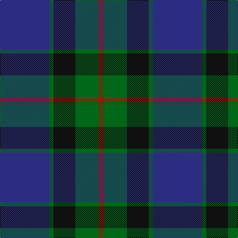

In pattern [BGKGRGR](/stripes/bgkgrgr/).

This was sourced from register-of-tartans.  It is a [7 stripe tartan](/stripes/stripes7/).

Original link https://www.tartanregister.gov.uk/tartanDetails.aspx?ref=587

## Attestations

This cloth appears in 2 source records; the oldest owns this page.

- 01/01/1990 — Casely of Mannerston (Personal) (register-of-tartans, [record](https://www.tartanregister.gov.uk/tartanDetails.aspx?ref=587))
- 1990 — Casely of Mannerston (Personal) (tartans-authority, [record](http://www.tartansauthority.com/tartan-ferret/display/7166/))

## Register references

External register numbers recorded for this tartan.

- Scottish Register of Tartans: [587](https://www.tartanregister.gov.uk/tartanDetails.aspx?ref=587)
- Scottish Tartans Authority (ITI): 7166

## Thread count
DB/100 G8 K44 G46 R2 G2 R/4

## Palette
Each colour and the base-6 reference it is a variant of.

| Colour | Shade | Base |
|---|---|---|
| DB | <code style="background-color:#2C2C80;">#2C2C80</code> `oklch(35.0% 0.138 276.6)` <small>#2C2C80</small> | B <code style="background-color:#2A418A;">#2A418A</code> |
| G | <code style="background-color:#006818;">#006818</code> `oklch(45.0% 0.142 145.0)` <small>#006818</small> | G <code style="background-color:#006100;">#006100</code> |
| K | <code style="background-color:#101010;">#101010</code> `oklch(17.3% 0.000 89.9)` <small>#101010</small> | K <code style="background-color:#000000;">#000000</code> |
| R | <code style="background-color:#C80000;">#C80000</code> `oklch(52.3% 0.215 29.2)` <small>#C80000</small> | R <code style="background-color:#CC0000;">#CC0000</code> |

# Sample pattern

## Nearest tartans

The nearest existing variants by ΔTartan distance.

1. [Koot Wedding (Personal)](/setts/s6/dt48k32r1k8r3w3~x2/) — ΔT 1.13
1. [Sinclair-Brown (Personal)](/setts/s8/db64k11r2k4r2k4g32lo4~x2/) — ΔT 1.26
1. [Unidentified (School)](/setts/s9/y35k3db2k5db3k1db20k3w3~x2/) — ΔT 1.38
1. [Johnstone/Johnston](/setts/s8/k3db3k3db22dg26k2db1ly3~x2/) — ΔT 1.41
1. [Koot Wedding (Personal)](/setts/s6/db48k32r1k8r3w3~x2/) — ΔT 1.43
1. [MacTaggart](/setts/s7/dg30db4dg2k20db18r1db4~x2/) — ΔT 1.43
1. [Oliphant](/setts/s6/db4k4db24dg32lr1dg2~x2/) — ΔT 1.44
1. [Doral](/setts/s7/db26dg6db2dg17dy4w1dy4~x4/) — ΔT 1.44
1. [George (Personal)](/setts/s9/r6db2r1db16r3db16dg28w2dg4~x2/) — ΔT 1.46
1. [MacLaurin of Brioch](/setts/s7/db36k10dg3r3dg6k1ly2~x2/) — ΔT 1.48

## Neighbour map

Every grey dot is one of 14299 variants placed by the first two principal components of the ΔTartan feature space (44% of its variance). Red is this tartan; blue dots are its nearest — click one to open its page.

<svg viewBox="0 0 640 380" role="img" style="max-width:100%;height:auto;border:1px solid #e0e0e0;border-radius:4px;display:block" xmlns="http://www.w3.org/2000/svg"><image href="/nn/cloud.v1.png" width="640" height="380"/><a href="/setts/s6/dt48k32r1k8r3w3~x2/"><circle cx="404.6" cy="166.2" r="4" fill="#3465a4"><title>Koot Wedding (Personal)</title></circle></a><a href="/setts/s8/db64k11r2k4r2k4g32lo4~x2/"><circle cx="347.9" cy="132.3" r="4" fill="#3465a4"><title>Sinclair-Brown (Personal)</title></circle></a><a href="/setts/s9/y35k3db2k5db3k1db20k3w3~x2/"><circle cx="332.0" cy="130.7" r="4" fill="#3465a4"><title>Unidentified (School)</title></circle></a><a href="/setts/s8/k3db3k3db22dg26k2db1ly3~x2/"><circle cx="321.1" cy="171.1" r="4" fill="#3465a4"><title>Johnstone/Johnston</title></circle></a><a href="/setts/s6/db48k32r1k8r3w3~x2/"><circle cx="390.4" cy="155.7" r="4" fill="#3465a4"><title>Koot Wedding (Personal)</title></circle></a><a href="/setts/s7/dg30db4dg2k20db18r1db4~x2/"><circle cx="311.3" cy="192.3" r="4" fill="#3465a4"><title>MacTaggart</title></circle></a><a href="/setts/s6/db4k4db24dg32lr1dg2~x2/"><circle cx="389.7" cy="190.9" r="4" fill="#3465a4"><title>Oliphant</title></circle></a><a href="/setts/s7/db26dg6db2dg17dy4w1dy4~x4/"><circle cx="348.8" cy="199.2" r="4" fill="#3465a4"><title>Doral</title></circle></a><a href="/setts/s9/r6db2r1db16r3db16dg28w2dg4~x2/"><circle cx="316.5" cy="164.4" r="4" fill="#3465a4"><title>George (Personal)</title></circle></a><a href="/setts/s7/db36k10dg3r3dg6k1ly2~x2/"><circle cx="393.9" cy="136.1" r="4" fill="#3465a4"><title>MacLaurin of Brioch</title></circle></a><circle cx="367.3" cy="153.3" r="5" fill="#c00000"/></svg>

ID: /setts/s7/db50g4k22g23r1g1r2~x2/
