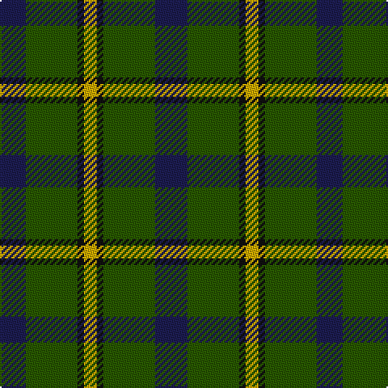

This page is one **sett** — a single exact thread-count. It belongs to the [tartan](/tartans/db5g8k1y2k1g8db4/)
(the same proportion at any scale), whose colour order is pattern [BGKYKGB](/stripes/bgkykgb/).

Sourced from tartans-authority.  It is a [7 stripe tartan](/stripes/stripes7/).

Original link http://www.tartansauthority.com/tartan-ferret/display/150/

## Thread count
DB/20 G32 K4 Y8 K4 G32 DB/16

## Palette
Each colour and the base-6 reference it is a variant of.

| Colour | Shade | Base |
|---|---|---|
| DB | <code style="background-color:#1C1C50;">#1C1C50</code> `oklch(26.2% 0.093 277.9)` <small>#1C1C50</small> | B <code style="background-color:#2A418A;">#2A418A</code> |
| G | <code style="background-color:#285800;">#285800</code> `oklch(41.0% 0.122 135.8)` <small>#285800</small> | G <code style="background-color:#006100;">#006100</code> |
| K | <code style="background-color:#101010;">#101010</code> `oklch(17.3% 0.000 89.9)` <small>#101010</small> | K <code style="background-color:#000000;">#000000</code> |
| Y | <code style="background-color:#CCA800;">#CCA800</code> `oklch(74.2% 0.152 93.4)` <small>#CCA800</small> | Y <code style="background-color:#F2BF00;">#F2BF00</code> |

# Sample pattern

## Nearest tartans

The nearest existing variants by ΔTartan distance, with this tartan at the top so the swatches line up against it.

ΔTartan

Tartan

Sett

—

<a href="/ttd/edit/#slug=db5dg8k1ly2k1dg8db4~x4">Salvation Army Htg (Corporate)</a> <a class="nn-out" href="/setts/s7/db5dg8k1ly2k1dg8db4~x4/" title="open its dictionary page">↗</a>

0.73

<a href="/ttd/edit/#slug=g3db8g3k4g15r2~x2">Lauder (Family)</a> <a class="nn-out" href="/setts/s6/g3db8g3k4g15r2~x2/" title="open its dictionary page">↗</a>

0.75

<a href="/ttd/edit/#slug=dg2n8dg2k3dg12r2~x2">Wcwm 1045</a> <a class="nn-out" href="/setts/s6/dg2n8dg2k3dg12r2~x2/" title="open its dictionary page">↗</a>

0.83

<a href="/ttd/edit/#slug=r3dg10r3dg14db16dg3ly2~x2">Cameron Hunting</a> <a class="nn-out" href="/setts/s7/r3dg10r3dg14db16dg3ly2~x2/" title="open its dictionary page">↗</a>

0.89

<a href="/ttd/edit/#slug=g14r2g2r3g7db12g2dr2~x2">Glen Nevis #3</a> <a class="nn-out" href="/setts/s8/g14r2g2r3g7db12g2dr2~x2/" title="open its dictionary page">↗</a>

0.94

<a href="/ttd/edit/#slug=r5g20r5g20db24g6ly4">Cameron of Lochiel (Hunting) Clan/Family Tartan Tartan Number: 5351. Earliest known date: 01/01/1940 Design close to Cameron Hunting which has two red lines shown in Vestiarium Scoticum. This design evolved in the 1940s by J G MacKay of Portree and was first put on show at the Cameron Gathering at Achnacarry in 1956. (original STA ref: 1535) See products available Copyright © Blair Urquhart, Comrie, 2015</a> <a class="nn-out" href="/setts/s7/r5g20r5g20db24g6ly4/" title="open its dictionary page">↗</a>

0.95

<a href="/ttd/edit/#slug=dt6r15g41r15dt20g41db6">Bean of Freeport Htg (Corporate)</a> <a class="nn-out" href="/setts/s7/dt6r15g41r15dt20g41db6/" title="open its dictionary page">↗</a>

0.95

<a href="/ttd/edit/#slug=ly2dg12db6r3dg12r4db1~x2">MacKintosh Hunting</a> <a class="nn-out" href="/setts/s7/ly2dg12db6r3dg12r4db1~x2/" title="open its dictionary page">↗</a>

0.96

<a href="/ttd/edit/#slug=r3k9g20k16g7b3~x2">Holman (Personal)</a> <a class="nn-out" href="/setts/s6/r3k9g20k16g7b3~x2/" title="open its dictionary page">↗</a>

1.02

<a href="/ttd/edit/#slug=g5k15g5k15g19r2g13lb4~x2">Strath Hallidale (Fashion)</a> <a class="nn-out" href="/setts/s8/g5k15g5k15g19r2g13lb4~x2/" title="open its dictionary page">↗</a>

1.10

<a href="/ttd/edit/#slug=g3db1g8db7k3ly1~x2">Trafalgar (Fashion)</a> <a class="nn-out" href="/setts/s6/g3db1g8db7k3ly1~x2/" title="open its dictionary page">↗</a>

## Neighbour map

Every grey dot is one of 14299 variants placed by the first two principal components of the ΔTartan feature space (44% of its variance). Red is this tartan; blue dots are its nearest — click one to open its page.

<svg viewBox="0 0 640 380" role="img" style="max-width:100%;height:auto;border:1px solid #e0e0e0;border-radius:4px;display:block" xmlns="http://www.w3.org/2000/svg"><image href="/nn/cloud.v1.png" width="640" height="380"/><a href="/setts/s6/g3db8g3k4g15r2~x2/"><circle cx="329.0" cy="253.4" r="4" fill="#3465a4"><title>Lauder (Family)</title></circle></a><a href="/setts/s6/dg2n8dg2k3dg12r2~x2/"><circle cx="294.4" cy="259.4" r="4" fill="#3465a4"><title>Wcwm 1045</title></circle></a><a href="/setts/s7/r3dg10r3dg14db16dg3ly2~x2/"><circle cx="285.4" cy="241.4" r="4" fill="#3465a4"><title>Cameron Hunting</title></circle></a><a href="/setts/s8/g14r2g2r3g7db12g2dr2~x2/"><circle cx="322.5" cy="241.3" r="4" fill="#3465a4"><title>Glen Nevis #3</title></circle></a><a href="/setts/s7/r5g20r5g20db24g6ly4/"><circle cx="264.1" cy="247.8" r="4" fill="#3465a4"><title>Cameron of Lochiel (Hunting) Clan/Family Tartan Tartan Number: 5351. Earliest known date: 01/01/1940 Design close to Cameron Hunting which has two red lines shown in Vestiarium Scoticum. This design evolved in the 1940s by J G MacKay of Portree and was first put on show at the Cameron Gathering at Achnacarry in 1956. (original STA ref: 1535) See products available Copyright © Blair Urquhart, Comrie, 2015</title></circle></a><a href="/setts/s7/dt6r15g41r15dt20g41db6/"><circle cx="305.0" cy="258.2" r="4" fill="#3465a4"><title>Bean of Freeport Htg (Corporate)</title></circle></a><a href="/setts/s7/ly2dg12db6r3dg12r4db1~x2/"><circle cx="334.5" cy="226.4" r="4" fill="#3465a4"><title>MacKintosh Hunting</title></circle></a><a href="/setts/s6/r3k9g20k16g7b3~x2/"><circle cx="252.3" cy="262.9" r="4" fill="#3465a4"><title>Holman (Personal)</title></circle></a><a href="/setts/s8/g5k15g5k15g19r2g13lb4~x2/"><circle cx="279.5" cy="238.2" r="4" fill="#3465a4"><title>Strath Hallidale (Fashion)</title></circle></a><a href="/setts/s6/g3db1g8db7k3ly1~x2/"><circle cx="248.8" cy="247.4" r="4" fill="#3465a4"><title>Trafalgar (Fashion)</title></circle></a><circle cx="295.5" cy="252.0" r="5" fill="#c00000"/></svg>

ID: /setts/s7/db5dg8k1ly2k1dg8db4~x4/
