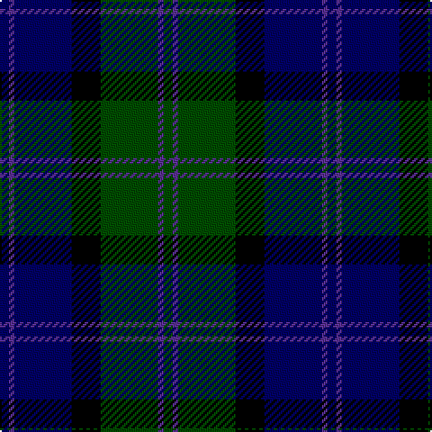

**Bands:** [BBBKGBG](/stripes/bbbkgbg/) · **Stripes:** [DB DP DB K DG DP DG](/stripes/stripes7/) DB DP DB K DG DP DG

This was sourced from weddslist.  It is a [7 band tartan](/bands/bands7/).

Original link http://www.weddslist.com/cgi-bin/tartans/pg.pl?source=rb

## Register references

External register numbers recorded for this tartan.

- Scottish Register of Tartans: [2540](https://www.tartanregister.gov.uk/tartanDetails.aspx?ref=2540)
- Scottish Register of Tartans: [2666](https://www.tartanregister.gov.uk/tartanDetails.aspx?ref=2666)
- Scottish Register of Tartans: [3808](https://www.tartanregister.gov.uk/tartanDetails.aspx?ref=3808)
- Scottish Tartans Authority (ITI): 218
- Scottish Tartans World Register: 1010
- Scottish Tartans World Register: 1585
- Scottish Tartans World Register: 218

## Thread count
DB/5 P3 DB32 K16 G32 P3 G/5

## Palette
Each colour and its ΔE from the base-6 reference it is a variant of.

| Colour | Shade | Base | ΔE (OKLab) |
|---|---|---|---|
| DB | <code style="background-color:#000064;">#000064</code> `#000064` | B <code style="background-color:#2A418A;">#2A418A</code> | 0.18 |
| G | <code style="background-color:#004C00;">#004C00</code> `#004C00` | G <code style="background-color:#006100;">#006100</code> | 0.07 |
| K | <code style="background-color:#000000;">#000000</code> `#000000` | K <code style="background-color:#000000;">#000000</code> | 0.00 |
| P | <code style="background-color:#5A3094;">#5A3094</code> `#5A3094` | B <code style="background-color:#2A418A;">#2A418A</code> | 0.08 |

# Sample pattern

## Nearest tartans

The nearest existing variants by ΔTartan distance.

1. [MacThomas](/setts/s7/db3dr2db21k11dg21dr2dg3~x2/) — ΔT 0.72
1. [MacThomas](/setts/s7/db3dr2db21k11dg21dr2dg3/) — ΔT 0.72
1. [Abercrombie D](/setts/s9/db14k2db2k2db2k7dg7lr1dg14~x2/) — ΔT 0.82
1. [Gammell (1978) (Personal)](/setts/s7/db3r2db22k11g22r2g3~x2/) — ΔT 0.85
1. [Graham of Menteith](/setts/s6/dg16b2dg1k12db12k1~x2/) — ΔT 0.93
1. [National Galleries of Scotland](/setts/s7/k7g22k22db6r2db15r2~x2/) — ΔT 0.96
1. [MacThomas LC](/setts/s7/db5dp3db32k16dg32n3dg5~x2/) — ΔT 0.99
1. [MacThomas LC](/setts/s7/db5dp3db32k16dg32n3dg5/) — ΔT 0.99
1. [Reid and Taylor](/setts/s7/db2k1r1db9k9g10k2~x2/) — ΔT 1.01
1. [Mowat (Clans Originaux)](/setts/s7/db24k3db5k23ly2k11g22~x2/) — ΔT 1.02

## Neighbour map

Every grey dot is one of 14313 variants placed by the first two principal components of the ΔTartan feature space (44% of its variance). Red is this tartan; blue dots are its nearest — click one to open its page.

<svg viewBox="0 0 640 380" role="img" style="max-width:100%;height:auto;border:1px solid #e0e0e0;border-radius:4px;display:block" xmlns="http://www.w3.org/2000/svg"><image href="/nn/cloud.v1.png" width="640" height="380"/><a href="/setts/s7/db3dr2db21k11dg21dr2dg3~x2/"><circle cx="250.3" cy="231.9" r="4" fill="#3465a4"><title>MacThomas</title></circle></a><a href="/setts/s7/db3dr2db21k11dg21dr2dg3/"><circle cx="250.3" cy="231.9" r="4" fill="#3465a4"><title>MacThomas</title></circle></a><a href="/setts/s9/db14k2db2k2db2k7dg7lr1dg14~x2/"><circle cx="252.5" cy="207.4" r="4" fill="#3465a4"><title>Abercrombie D</title></circle></a><a href="/setts/s7/db3r2db22k11g22r2g3~x2/"><circle cx="231.5" cy="210.5" r="4" fill="#3465a4"><title>Gammell (1978) (Personal)</title></circle></a><a href="/setts/s6/dg16b2dg1k12db12k1~x2/"><circle cx="242.7" cy="220.0" r="4" fill="#3465a4"><title>Graham of Menteith</title></circle></a><a href="/setts/s7/k7g22k22db6r2db15r2~x2/"><circle cx="218.3" cy="229.4" r="4" fill="#3465a4"><title>National Galleries of Scotland</title></circle></a><a href="/setts/s7/db5dp3db32k16dg32n3dg5~x2/"><circle cx="230.2" cy="213.5" r="4" fill="#3465a4"><title>MacThomas LC</title></circle></a><a href="/setts/s7/db5dp3db32k16dg32n3dg5/"><circle cx="230.2" cy="213.5" r="4" fill="#3465a4"><title>MacThomas LC</title></circle></a><a href="/setts/s7/db2k1r1db9k9g10k2~x2/"><circle cx="221.2" cy="231.7" r="4" fill="#3465a4"><title>Reid and Taylor</title></circle></a><a href="/setts/s7/db24k3db5k23ly2k11g22~x2/"><circle cx="238.3" cy="231.6" r="4" fill="#3465a4"><title>Mowat (Clans Originaux)</title></circle></a><circle cx="234.6" cy="223.5" r="5" fill="#c00000"/></svg>

ID: /setts/s7/db5dp3db32k16dg32dp3dg5/
