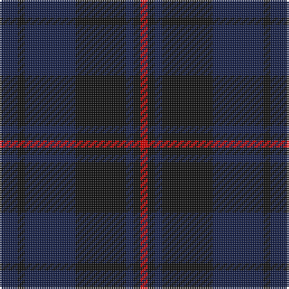

In pattern [BKBKBKR](/stripes/bkbkbkr/).

This was sourced from register-of-tartans.  It is a [7 stripe tartan](/stripes/stripes7/).

Original link https://www.tartanregister.gov.uk/tartanDetails.aspx?ref=5993

## Register references

External register numbers recorded for this tartan.

- Scottish Register of Tartans: [5993](https://www.tartanregister.gov.uk/tartanDetails.aspx?ref=5993)
- Scottish Tartans World Register: 3284

## Thread count
DB/10 K4 DB28 K28 DB4 K4 R/4

## Palette
Each colour and the base-6 reference it is a variant of.

| Colour | Shade | Base |
|---|---|---|
| DB | <code style="background-color:#141E46;">#141E46</code> `oklch(25.2% 0.076 269.7)` <small>#141E46</small> | B <code style="background-color:#2A418A;">#2A418A</code> |
| K | <code style="background-color:#101010;">#101010</code> `oklch(17.3% 0.000 89.9)` <small>#101010</small> | K <code style="background-color:#000000;">#000000</code> |
| LT | <code style="background-color:#855E42;">#855E42</code> `oklch(51.6% 0.066 56.4)` <small>#855E42</small> | R <code style="background-color:#CC0000;">#CC0000</code> |
| R | <code style="background-color:#DC0000;">#DC0000</code> `oklch(56.2% 0.230 29.2)` <small>#DC0000</small> | R <code style="background-color:#CC0000;">#CC0000</code> |
| Y | <code style="background-color:#FFD700;">#FFD700</code> `oklch(88.7% 0.182 95.3)` <small>#FFD700</small> | Y <code style="background-color:#F2BF00;">#F2BF00</code> |

# Sample pattern

## Nearest tartans

The nearest existing variants by ΔTartan distance.

1. [Edinburgh Monarchs](/setts/s8/dt5db4dr1db14dt14dr1dt5lo3~x2/) — ΔT 1.82
1. [MacArthur of Milton Hunting](/setts/s6/dg7db1dg1k4dp4k1~x4/) — ΔT 1.87
1. [Breckon Hunting (Name)](/setts/s9/db3r1db14dg14r1dg1r1dg1r2~x4/) — ΔT 1.95
1. [New Club Centenary](/setts/s9/dg4db3dg20db9r2db2r2db18dp4~x2/) — ΔT 1.96
1. [McWilliams (2014)](/setts/s12/k3dt15k9do3k2do14k2do3k9dt13k2dt3~x2/) — ΔT 1.98
1. [Hopkins Welsh Name Tartan Tartan Number: 3233. Earliest known date: 2002 The tartan for this Welsh surname and its variations, is actually woven in Wales at the Cambrian Woollen Mill, weaving on the same site since 1830. This tartan differs from many traditional patterns in that the warp and weft differ, giving the finished worsted wool cloth more of a predominant stripe, vertically noticeable in the finished Kilt, or Cilt in Wales. See products available Copyright © Blair Urquhart, Comrie, 2015](/setts/s12/db5k2db2k2db2dt5k2dt1o1dt1k10db3~x4/) — ΔT 1.99
1. [Hopkins (Wales)](/setts/s12/dt5k2dt2k2dt2db5k2db1o1db1k10dt3~x4/) — ΔT 2.06
1. [Daks Muted blue Trade Tartan Tartan Number: 1725. Earliest known date: 1987 Submitted in 1981 as a potential Currie sett. See products available Copyright © Blair Urquhart, Comrie, 2015](/setts/s8/dy5db12db4lo4db22db3db4dy5/) — ΔT 2.10
1. [Casterton (Corporate)](/setts/s6/k7r2k33db33k2db7~x2/) — ΔT 2.18
1. [Metropolitan Atlanta Police](/setts/s13/r2k2k21k8dg16k3dg16k8k3k3k21k2r2~x2/) — ΔT 2.19

## Neighbour map

Every grey dot is one of 14299 variants placed by the first two principal components of the ΔTartan feature space (44% of its variance). Red is this tartan; blue dots are its nearest — click one to open its page.

<svg viewBox="0 0 640 380" role="img" style="max-width:100%;height:auto;border:1px solid #e0e0e0;border-radius:4px;display:block" xmlns="http://www.w3.org/2000/svg"><image href="/nn/cloud.v1.png" width="640" height="380"/><a href="/setts/s8/dt5db4dr1db14dt14dr1dt5lo3~x2/"><circle cx="386.8" cy="254.0" r="4" fill="#3465a4"><title>Edinburgh Monarchs</title></circle></a><a href="/setts/s6/dg7db1dg1k4dp4k1~x4/"><circle cx="345.2" cy="314.0" r="4" fill="#3465a4"><title>MacArthur of Milton Hunting</title></circle></a><a href="/setts/s9/db3r1db14dg14r1dg1r1dg1r2~x4/"><circle cx="419.7" cy="240.6" r="4" fill="#3465a4"><title>Breckon Hunting (Name)</title></circle></a><a href="/setts/s9/dg4db3dg20db9r2db2r2db18dp4~x2/"><circle cx="376.8" cy="249.8" r="4" fill="#3465a4"><title>New Club Centenary</title></circle></a><a href="/setts/s12/k3dt15k9do3k2do14k2do3k9dt13k2dt3~x2/"><circle cx="333.2" cy="291.6" r="4" fill="#3465a4"><title>McWilliams (2014)</title></circle></a><a href="/setts/s12/db5k2db2k2db2dt5k2dt1o1dt1k10db3~x4/"><circle cx="338.4" cy="257.5" r="4" fill="#3465a4"><title>Hopkins Welsh Name Tartan Tartan Number: 3233. Earliest known date: 2002 The tartan for this Welsh surname and its variations, is actually woven in Wales at the Cambrian Woollen Mill, weaving on the same site since 1830. This tartan differs from many traditional patterns in that the warp and weft differ, giving the finished worsted wool cloth more of a predominant stripe, vertically noticeable in the finished Kilt, or Cilt in Wales. See products available Copyright © Blair Urquhart, Comrie, 2015</title></circle></a><a href="/setts/s12/dt5k2dt2k2dt2db5k2db1o1db1k10dt3~x4/"><circle cx="331.4" cy="254.2" r="4" fill="#3465a4"><title>Hopkins (Wales)</title></circle></a><a href="/setts/s8/dy5db12db4lo4db22db3db4dy5/"><circle cx="335.3" cy="266.5" r="4" fill="#3465a4"><title>Daks Muted blue Trade Tartan Tartan Number: 1725. Earliest known date: 1987 Submitted in 1981 as a potential Currie sett. See products available Copyright © Blair Urquhart, Comrie, 2015</title></circle></a><a href="/setts/s6/k7r2k33db33k2db7~x2/"><circle cx="452.0" cy="266.5" r="4" fill="#3465a4"><title>Casterton (Corporate)</title></circle></a><a href="/setts/s13/r2k2k21k8dg16k3dg16k8k3k3k21k2r2~x2/"><circle cx="340.3" cy="251.3" r="4" fill="#3465a4"><title>Metropolitan Atlanta Police</title></circle></a><circle cx="431.1" cy="309.7" r="5" fill="#c00000"/></svg>

ID: /setts/s7/db5k2db14k14db2k2r2~x2/
