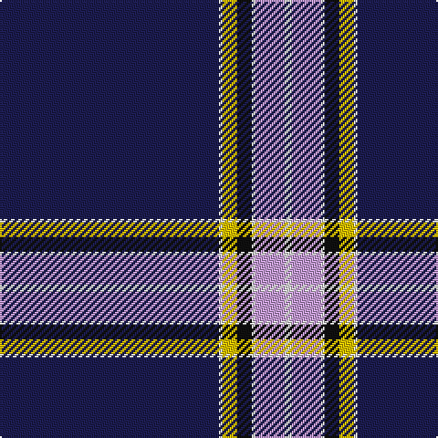

In pattern [BWYKWWW](/stripes/bwykwww/).

This was sourced from tartans-authority.  It is a [7 stripe tartan](/stripes/stripes7/).

Original link http://www.tartansauthority.com/tartan-ferret/display/7705/

## Attestations

This cloth appears in 2 source records; the oldest owns this page.

- Aug 2008 — Nunavut Territory (District) (tartans-authority, [record](http://www.tartansauthority.com/tartan-ferret/display/7705/))
- undated — Nunavut Territory (register-of-tartans, [record](https://www.tartanregister.gov.uk/tartanDetails.aspx?ref=5697))

## Register references

External register numbers recorded for this tartan.

- Scottish Register of Tartans: [5697](https://www.tartanregister.gov.uk/tartanDetails.aspx?ref=5697)
- Scottish Tartans Authority (ITI): 7705

## Thread count
DB/120 LN2 Y8 K8 LN2 LP16 LN/4

## Palette
Each colour and the base-6 reference it is a variant of.

| Colour | Shade | Base |
|---|---|---|
| DB | <code style="background-color:#1C1C50;">#1C1C50</code> `oklch(26.2% 0.093 277.9)` <small>#1C1C50</small> | B <code style="background-color:#2A418A;">#2A418A</code> |
| K | <code style="background-color:#101010;">#101010</code> `oklch(17.3% 0.000 89.9)` <small>#101010</small> | K <code style="background-color:#000000;">#000000</code> |
| LN | <code style="background-color:#E0E0E0;">#E0E0E0</code> `oklch(90.7% 0.000 89.9)` <small>#E0E0E0</small> | W <code style="background-color:#F7F7F7;">#F7F7F7</code> |
| LP | <code style="background-color:#C49CD8;">#C49CD8</code> `oklch(75.0% 0.095 314.2)` <small>#C49CD8</small> | W <code style="background-color:#F7F7F7;">#F7F7F7</code> |
| Y | <code style="background-color:#E8C000;">#E8C000</code> `oklch(81.9% 0.168 93.7)` <small>#E8C000</small> | Y <code style="background-color:#F2BF00;">#F2BF00</code> |

# Sample pattern

## Nearest tartans

The nearest existing variants by ΔTartan distance, with this tartan at the top so the swatches line up against it.

ΔTartan

Tartan

Sett

—

<a href="/ttd/edit/#slug=db60w1ly4k4w1lp8w2~x2">Nunavut Territory (District)</a> <a class="nn-out" href="/setts/s7/db60w1ly4k4w1lp8w2~x2/" title="open its dictionary page">↗</a>

1.08

<a href="/ttd/edit/#slug=w3dt9ly1lb3dp9lb1dt40dp2~x2">Parkin</a> <a class="nn-out" href="/setts/s8/w3dt9ly1lb3dp9lb1dt40dp2~x2/" title="open its dictionary page">↗</a>

1.29

<a href="/ttd/edit/#slug=db62w2db4w5db6lo2r8lo3w4~x2">George, Stuart (Personal)</a> <a class="nn-out" href="/setts/s9/db62w2db4w5db6lo2r8lo3w4~x2/" title="open its dictionary page">↗</a>

1.30

<a href="/ttd/edit/#slug=b7db5w6db5r7db2b2db70w2">United States (Corporate)</a> <a class="nn-out" href="/setts/s9/b7db5w6db5r7db2b2db70w2/" title="open its dictionary page">↗</a>

1.32

<a href="/ttd/edit/#slug=db5ly1g7r1db45r5ly3db4ly3~x2">Brooks Brothers Signature</a> <a class="nn-out" href="/setts/s9/db5ly1g7r1db45r5ly3db4ly3~x2/" title="open its dictionary page">↗</a>

1.32

<a href="/ttd/edit/#slug=db62w2db4w5db6ly2r8ly3w4~x2">George, Stuart (Personal)</a> <a class="nn-out" href="/setts/s9/db62w2db4w5db6ly2r8ly3w4~x2/" title="open its dictionary page">↗</a>

1.37

<a href="/ttd/edit/#slug=db62r1db2r1db4k14g4w2g6k4~x2">Parr</a> <a class="nn-out" href="/setts/s10/db62r1db2r1db4k14g4w2g6k4~x2/" title="open its dictionary page">↗</a>

1.46

<a href="/ttd/edit/#slug=db62w4k2w7dp2dg3ly2db16~x2">Boat of Garten</a> <a class="nn-out" href="/setts/s8/db62w4k2w7dp2dg3ly2db16~x2/" title="open its dictionary page">↗</a>

1.47

<a href="/ttd/edit/#slug=db62r1db2r1db4k14g4k2g6k4~x2">Park</a> <a class="nn-out" href="/setts/s10/db62r1db2r1db4k14g4k2g6k4~x2/" title="open its dictionary page">↗</a>

1.48

<a href="/ttd/edit/#slug=w6db32o3db3o1db3o2db4db1ly2~x2">X Marks the Scot</a> <a class="nn-out" href="/setts/s10/w6db32o3db3o1db3o2db4db1ly2~x2/" title="open its dictionary page">↗</a>

1.49

<a href="/ttd/edit/#slug=ly2db66r16w2r1w1~x2">Coogan (Personal)</a> <a class="nn-out" href="/setts/s6/ly2db66r16w2r1w1~x2/" title="open its dictionary page">↗</a>

## Neighbour map

Every grey dot is one of 14299 variants placed by the first two principal components of the ΔTartan feature space (44% of its variance). Red is this tartan; blue dots are its nearest — click one to open its page.

<svg viewBox="0 0 640 380" role="img" style="max-width:100%;height:auto;border:1px solid #e0e0e0;border-radius:4px;display:block" xmlns="http://www.w3.org/2000/svg"><image href="/nn/cloud.v1.png" width="640" height="380"/><a href="/setts/s8/w3dt9ly1lb3dp9lb1dt40dp2~x2/"><circle cx="474.3" cy="109.5" r="4" fill="#3465a4"><title>Parkin</title></circle></a><a href="/setts/s9/db62w2db4w5db6lo2r8lo3w4~x2/"><circle cx="484.3" cy="102.4" r="4" fill="#3465a4"><title>George, Stuart (Personal)</title></circle></a><a href="/setts/s9/b7db5w6db5r7db2b2db70w2/"><circle cx="525.5" cy="107.7" r="4" fill="#3465a4"><title>United States (Corporate)</title></circle></a><a href="/setts/s9/db5ly1g7r1db45r5ly3db4ly3~x2/"><circle cx="481.9" cy="103.5" r="4" fill="#3465a4"><title>Brooks Brothers Signature</title></circle></a><a href="/setts/s9/db62w2db4w5db6ly2r8ly3w4~x2/"><circle cx="482.6" cy="100.9" r="4" fill="#3465a4"><title>George, Stuart (Personal)</title></circle></a><a href="/setts/s10/db62r1db2r1db4k14g4w2g6k4~x2/"><circle cx="451.4" cy="78.0" r="4" fill="#3465a4"><title>Parr</title></circle></a><a href="/setts/s8/db62w4k2w7dp2dg3ly2db16~x2/"><circle cx="486.2" cy="90.6" r="4" fill="#3465a4"><title>Boat of Garten</title></circle></a><a href="/setts/s10/db62r1db2r1db4k14g4k2g6k4~x2/"><circle cx="458.0" cy="82.1" r="4" fill="#3465a4"><title>Park</title></circle></a><a href="/setts/s10/w6db32o3db3o1db3o2db4db1ly2~x2/"><circle cx="414.6" cy="91.6" r="4" fill="#3465a4"><title>X Marks the Scot</title></circle></a><a href="/setts/s6/ly2db66r16w2r1w1~x2/"><circle cx="542.5" cy="123.0" r="4" fill="#3465a4"><title>Coogan (Personal)</title></circle></a><circle cx="497.6" cy="85.9" r="5" fill="#c00000"/></svg>

ID: /setts/s7/db60w1ly4k4w1lp8w2~x2/
