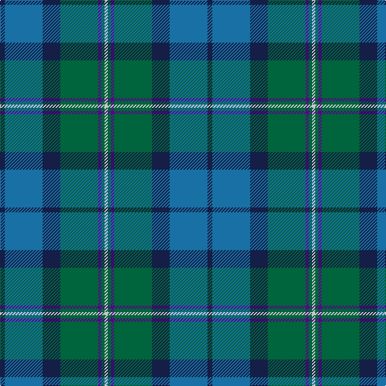

In pattern [BBBGBGW](/stripes/bbbgbgw/).

This was sourced from register-of-tartans.  It is a [7 stripe tartan](/stripes/stripes7/).

Original link https://www.tartanregister.gov.uk/tartanDetails.aspx?ref=11162

## Register references

External register numbers recorded for this tartan.

- Scottish Register of Tartans: [11162](https://www.tartanregister.gov.uk/tartanDetails.aspx?ref=11162)

## Thread count
DB/6 B47 DB22 G47 P4 G4 N/4

## Palette
Each colour and the base-6 reference it is a variant of.

| Colour | Shade | Base |
|---|---|---|
| B | <code style="background-color:#1870A4;">#1870A4</code> `oklch(52.2% 0.113 241.2)` <small>#1870A4</small> | B <code style="background-color:#2A418A;">#2A418A</code> |
| DB | <code style="background-color:#141E46;">#141E46</code> `oklch(25.2% 0.076 269.7)` <small>#141E46</small> | B <code style="background-color:#2A418A;">#2A418A</code> |
| G | <code style="background-color:#00643C;">#00643C</code> `oklch(44.3% 0.104 157.7)` <small>#00643C</small> | G <code style="background-color:#006100;">#006100</code> |
| N | <code style="background-color:#C8C8C8;">#C8C8C8</code> `oklch(83.3% 0.000 89.9)` <small>#C8C8C8</small> | W <code style="background-color:#F7F7F7;">#F7F7F7</code> |
| P | <code style="background-color:#5A008C;">#5A008C</code> `oklch(37.0% 0.191 306.3)` <small>#5A008C</small> | B <code style="background-color:#2A418A;">#2A418A</code> |

# Sample pattern

## Nearest tartans

The nearest existing variants by ΔTartan distance.

1. [Boroughmuir](/setts/s7/db6b47db22g47dp4g4o4/) — ΔT 0.35
1. [MacThomas](/setts/s7/g5m3g32k16b32m3b5~x2/) — ΔT 1.09
1. [Gamba Tuscany Fife](/setts/s5/dg5r3g30db30w3~x2/) — ΔT 1.10
1. [Cowal Gathering](/setts/s9/dg2g8dt1g1dt1g1dt8db10w1~x4/) — ΔT 1.15
1. [Graeme Heckenberg Hunting](/setts/s7/db3g13lr1o3lr1db10lo1~x2/) — ΔT 1.17
1. [Scottish Power (Corporate)](/setts/s8/dg5g32dp5k10dg8r3dg8dp3~x2/) — ΔT 1.19
1. [Rhode Island, State of](/setts/s7/dt4b28dt11w2dt2g14ly2~x2/) — ΔT 1.23
1. [MacThomas (Clan)](/setts/s7/dg5lp3dg32k16b32m3b5~x2/) — ΔT 1.31
1. [Corey (Name)](/setts/s5/b32dy16g3lo4dg28~x2/) — ΔT 1.33
1. [Seaford House](/setts/s9/t3dt3t12dt26dg26r3dg26dt28w3/) — ΔT 1.33

## Neighbour map

Every grey dot is one of 14299 variants placed by the first two principal components of the ΔTartan feature space (44% of its variance). Red is this tartan; blue dots are its nearest — click one to open its page.

<svg viewBox="0 0 640 380" role="img" style="max-width:100%;height:auto;border:1px solid #e0e0e0;border-radius:4px;display:block" xmlns="http://www.w3.org/2000/svg"><image href="/nn/cloud.v1.png" width="640" height="380"/><a href="/setts/s7/db6b47db22g47dp4g4o4/"><circle cx="236.0" cy="202.3" r="4" fill="#3465a4"><title>Boroughmuir</title></circle></a><a href="/setts/s7/g5m3g32k16b32m3b5~x2/"><circle cx="212.2" cy="198.7" r="4" fill="#3465a4"><title>MacThomas</title></circle></a><a href="/setts/s5/dg5r3g30db30w3~x2/"><circle cx="278.8" cy="235.9" r="4" fill="#3465a4"><title>Gamba Tuscany Fife</title></circle></a><a href="/setts/s9/dg2g8dt1g1dt1g1dt8db10w1~x4/"><circle cx="195.9" cy="198.5" r="4" fill="#3465a4"><title>Cowal Gathering</title></circle></a><a href="/setts/s7/db3g13lr1o3lr1db10lo1~x2/"><circle cx="261.7" cy="190.9" r="4" fill="#3465a4"><title>Graeme Heckenberg Hunting</title></circle></a><a href="/setts/s8/dg5g32dp5k10dg8r3dg8dp3~x2/"><circle cx="243.4" cy="196.9" r="4" fill="#3465a4"><title>Scottish Power (Corporate)</title></circle></a><a href="/setts/s7/dt4b28dt11w2dt2g14ly2~x2/"><circle cx="246.6" cy="181.4" r="4" fill="#3465a4"><title>Rhode Island, State of</title></circle></a><a href="/setts/s7/dg5lp3dg32k16b32m3b5~x2/"><circle cx="213.8" cy="200.8" r="4" fill="#3465a4"><title>MacThomas (Clan)</title></circle></a><a href="/setts/s5/b32dy16g3lo4dg28~x2/"><circle cx="218.0" cy="237.9" r="4" fill="#3465a4"><title>Corey (Name)</title></circle></a><a href="/setts/s9/t3dt3t12dt26dg26r3dg26dt28w3/"><circle cx="248.8" cy="221.2" r="4" fill="#3465a4"><title>Seaford House</title></circle></a><circle cx="243.1" cy="206.9" r="5" fill="#c00000"/></svg>

ID: /setts/s7/db6b47db22g47dp4g4lb4/
