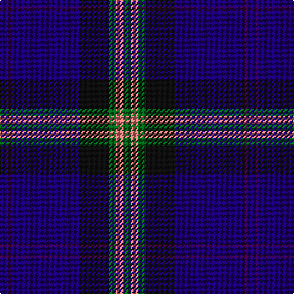

This page is one **sett** — a single exact thread-count. It belongs to the [tartan](/tartans/db6dp3db56k24g6r6g6/)
(the same proportion at any scale), whose colour order is pattern [BBBKGRG](/stripes/bbbkgrg/).

Sourced from register-of-tartans.  It is a [7 stripe tartan](/stripes/stripes7/).

Original link https://www.tartanregister.gov.uk/tartanDetails.aspx?ref=4561

## Register references

External register numbers recorded for this tartan.

- Scottish Register of Tartans: [4561](https://www.tartanregister.gov.uk/tartanDetails.aspx?ref=4561)
- Scottish Tartans Authority (ITI): 4277

## Thread count
DB/6 DP3 DB56 K24 G6 LR6 G/6

## Palette

Palette: <strong>Tartan Register</strong>
<table><thead><tr><th>Colour</th><th>Threads</th><th>Shade</th><th>Base</th><th>OKLCh</th></tr></thead><tbody><tr><td>DB/</td><td style="text-align:right;font-variant-numeric:tabular-nums">6</td><td><code style="background-color:#1C0070;">#1C0070</code> <small style="color:#888">#1C0070</small></td><td>B <code style="background-color:#2A418A;">#2A418A</code></td><td><small style="color:#888">oklch(26.3% 0.162 277.1)</small></td></tr><tr><td>DP</td><td style="text-align:right;font-variant-numeric:tabular-nums">3</td><td><code style="background-color:#440044;">#440044</code> <small style="color:#888">#440044</small></td><td>B <code style="background-color:#2A418A;">#2A418A</code></td><td><small style="color:#888">oklch(27.1% 0.125 328.4)</small></td></tr><tr><td>DB</td><td style="text-align:right;font-variant-numeric:tabular-nums">56</td><td><code style="background-color:#1C0070;">#1C0070</code> <small style="color:#888">#1C0070</small></td><td>B <code style="background-color:#2A418A;">#2A418A</code></td><td><small style="color:#888">oklch(26.3% 0.162 277.1)</small></td></tr><tr><td>K</td><td style="text-align:right;font-variant-numeric:tabular-nums">24</td><td><code style="background-color:#101010;">#101010</code> <small style="color:#888">#101010</small></td><td>K <code style="background-color:#000000;">#000000</code></td><td><small style="color:#888">oklch(17.3% 0.000 89.9)</small></td></tr><tr><td>G</td><td style="text-align:right;font-variant-numeric:tabular-nums">6</td><td><code style="background-color:#006818;">#006818</code> <small style="color:#888">#006818</small></td><td>G <code style="background-color:#006100;">#006100</code></td><td><small style="color:#888">oklch(45.0% 0.142 145.0)</small></td></tr><tr><td>LR</td><td style="text-align:right;font-variant-numeric:tabular-nums">6</td><td><code style="background-color:#E87878;">#E87878</code> <small style="color:#888">#E87878</small></td><td>R <code style="background-color:#CC0000;">#CC0000</code></td><td><small style="color:#888">oklch(70.0% 0.139 21.2)</small></td></tr><tr><td>G/</td><td style="text-align:right;font-variant-numeric:tabular-nums">6</td><td><code style="background-color:#006818;">#006818</code> <small style="color:#888">#006818</small></td><td>G <code style="background-color:#006100;">#006100</code></td><td><small style="color:#888">oklch(45.0% 0.142 145.0)</small></td></tr></tbody></table>

# Sample pattern

## Nearest tartans

The nearest existing variants by ΔTartan distance, with this tartan at the top so the swatches line up against it.

ΔTartan

Tartan

Sett

—

<a href="/ttd/edit/#slug=db6dp3db56k24g6r6g6">Wcwm 9275-1395</a> <a class="nn-out" href="/setts/s7/db6dp3db56k24g6r6g6/" title="open its dictionary page">↗</a>

0.88

<a href="/ttd/edit/#slug=db42k6lo2k3lo2g10r7k2~x2">MacBeth (Fashion)</a> <a class="nn-out" href="/setts/s8/db42k6lo2k3lo2g10r7k2~x2/" title="open its dictionary page">↗</a>

0.89

<a href="/ttd/edit/#slug=db8r2db33dt15g12lo2g2r2~x2">Moray Council</a> <a class="nn-out" href="/setts/s8/db8r2db33dt15g12lo2g2r2~x2/" title="open its dictionary page">↗</a>

1.07

<a href="/ttd/edit/#slug=dp2g13db8g3db33dy3db8dy13r2~x2">Burt Family</a> <a class="nn-out" href="/setts/s9/dp2g13db8g3db33dy3db8dy13r2~x2/" title="open its dictionary page">↗</a>

1.18

<a href="/ttd/edit/#slug=r1db2dt1db3dt19db3ly1db2ly1~x4">Pagus Wasia</a> <a class="nn-out" href="/setts/s9/r1db2dt1db3dt19db3ly1db2ly1~x4/" title="open its dictionary page">↗</a>

1.19

<a href="/ttd/edit/#slug=w2r3db12db3db3db28r3db3ly2~x2">Royal Scottish Corporation</a> <a class="nn-out" href="/setts/s9/w2r3db12db3db3db28r3db3ly2~x2/" title="open its dictionary page">↗</a>

1.21

<a href="/ttd/edit/#slug=k40db8o3db6k3db6r4~x2">Edinburgh and Lothian Tourist Board</a> <a class="nn-out" href="/setts/s7/k40db8o3db6k3db6r4~x2/" title="open its dictionary page">↗</a>

1.21

<a href="/ttd/edit/#slug=k8ly1k1db28k12dg2k1t2~x2">Hope-Weir/Weir</a> <a class="nn-out" href="/setts/s8/k8ly1k1db28k12dg2k1t2~x2/" title="open its dictionary page">↗</a>

1.22

<a href="/ttd/edit/#slug=k17db24g3db3w3db3r3db24k17w1~x2">Al-Fadhli (Personal)</a> <a class="nn-out" href="/setts/s10/k17db24g3db3w3db3r3db24k17w1~x2/" title="open its dictionary page">↗</a>

1.24

<a href="/ttd/edit/#slug=db36k8g3r3g6k1lo2~x2">MacLaurin of Broich (Clan)</a> <a class="nn-out" href="/setts/s7/db36k8g3r3g6k1lo2~x2/" title="open its dictionary page">↗</a>

1.29

<a href="/ttd/edit/#slug=k8r4k36db48r6g3lo2~x2">Royal Marines Condor</a> <a class="nn-out" href="/setts/s7/k8r4k36db48r6g3lo2~x2/" title="open its dictionary page">↗</a>

## Neighbour map

Every grey dot is one of 14299 variants placed by the first two principal components of the ΔTartan feature space (44% of its variance). Red is this tartan; blue dots are its nearest — click one to open its page.

<svg viewBox="0 0 640 380" role="img" style="max-width:100%;height:auto;border:1px solid #e0e0e0;border-radius:4px;display:block" xmlns="http://www.w3.org/2000/svg"><image href="/nn/cloud.v1.png" width="640" height="380"/><a href="/setts/s8/db42k6lo2k3lo2g10r7k2~x2/"><circle cx="343.2" cy="139.7" r="4" fill="#3465a4"><title>MacBeth (Fashion)</title></circle></a><a href="/setts/s8/db8r2db33dt15g12lo2g2r2~x2/"><circle cx="326.9" cy="180.8" r="4" fill="#3465a4"><title>Moray Council</title></circle></a><a href="/setts/s9/dp2g13db8g3db33dy3db8dy13r2~x2/"><circle cx="335.1" cy="179.1" r="4" fill="#3465a4"><title>Burt Family</title></circle></a><a href="/setts/s9/r1db2dt1db3dt19db3ly1db2ly1~x4/"><circle cx="375.5" cy="141.3" r="4" fill="#3465a4"><title>Pagus Wasia</title></circle></a><a href="/setts/s9/w2r3db12db3db3db28r3db3ly2~x2/"><circle cx="341.6" cy="156.1" r="4" fill="#3465a4"><title>Royal Scottish Corporation</title></circle></a><a href="/setts/s7/k40db8o3db6k3db6r4~x2/"><circle cx="368.6" cy="191.6" r="4" fill="#3465a4"><title>Edinburgh and Lothian Tourist Board</title></circle></a><a href="/setts/s8/k8ly1k1db28k12dg2k1t2~x2/"><circle cx="370.7" cy="149.7" r="4" fill="#3465a4"><title>Hope-Weir/Weir</title></circle></a><a href="/setts/s10/k17db24g3db3w3db3r3db24k17w1~x2/"><circle cx="335.2" cy="157.4" r="4" fill="#3465a4"><title>Al-Fadhli (Personal)</title></circle></a><a href="/setts/s7/db36k8g3r3g6k1lo2~x2/"><circle cx="399.9" cy="132.5" r="4" fill="#3465a4"><title>MacLaurin of Broich (Clan)</title></circle></a><a href="/setts/s7/k8r4k36db48r6g3lo2~x2/"><circle cx="320.8" cy="163.4" r="4" fill="#3465a4"><title>Royal Marines Condor</title></circle></a><circle cx="358.5" cy="170.9" r="5" fill="#c00000"/></svg>

ID: /setts/s7/db6dp3db56k24g6r6g6/
