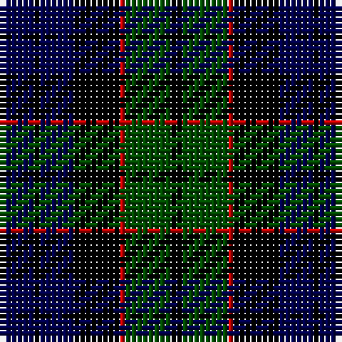

This page is one **sett** — a single exact thread-count. It belongs to the [tartan](/tartans/db6k1db6k8r1dg8k2/)
(the same proportion at any scale), whose colour order is pattern [BKBKRGK](/stripes/bkbkrgk/).

Sourced from weddslist.  It is a [7 stripe tartan](/stripes/stripes7/).

Original link http://www.weddslist.com/cgi-bin/tartans/pg.pl?source=rb

2 attestations — the source records this cloth was collapsed from (oldest owns this page)

<ul>
<li>undated — Fletcher (weddslist, <a href="http://www.weddslist.com/cgi-bin/tartans/pg.pl?source=rb">record</a>)</li>
<li>undated — Fletcher (weddslist, <a href="http://www.weddslist.com/cgi-bin/tartans/pg.pl?source=x">record</a>)</li>
</ul>

## Thread count
DB/6 K1 DB6 K8 R1 G8 K/2

## Palette

Palette: <strong>Tartan Register</strong> <small style="color:#888">(3 of 4 colours)</small>
<table><thead><tr><th>Colour</th><th>Threads</th><th>Shade</th><th>Base</th><th>OKLCh</th></tr></thead><tbody><tr><td>DB/</td><td style="text-align:right;font-variant-numeric:tabular-nums">6</td><td><code style="background-color:#00004C;">#00004C</code> <small style="color:#888">#00004C</small></td><td>B <code style="background-color:#2A418A;">#2A418A</code></td><td><small style="color:#888">oklch(18.8% 0.130 264.1)</small></td></tr><tr><td>K</td><td style="text-align:right;font-variant-numeric:tabular-nums">1</td><td><code style="background-color:#000000;">#000000</code> <small style="color:#888">#000000</small></td><td>K <code style="background-color:#000000;">#000000</code></td><td><small style="color:#888">oklch(0.0% 0.000 0.0)</small></td></tr><tr><td>DB</td><td style="text-align:right;font-variant-numeric:tabular-nums">6</td><td><code style="background-color:#00004C;">#00004C</code> <small style="color:#888">#00004C</small></td><td>B <code style="background-color:#2A418A;">#2A418A</code></td><td><small style="color:#888">oklch(18.8% 0.130 264.1)</small></td></tr><tr><td>K</td><td style="text-align:right;font-variant-numeric:tabular-nums">8</td><td><code style="background-color:#000000;">#000000</code> <small style="color:#888">#000000</small></td><td>K <code style="background-color:#000000;">#000000</code></td><td><small style="color:#888">oklch(0.0% 0.000 0.0)</small></td></tr><tr><td>R</td><td style="text-align:right;font-variant-numeric:tabular-nums">1</td><td><code style="background-color:#C80000;">#C80000</code> <small style="color:#888">#C80000</small></td><td>R <code style="background-color:#CC0000;">#CC0000</code></td><td><small style="color:#888">oklch(52.3% 0.215 29.2)</small></td></tr><tr><td>G</td><td style="text-align:right;font-variant-numeric:tabular-nums">8</td><td><code style="background-color:#004C00;">#004C00</code> <small style="color:#888">#004C00</small></td><td>G <code style="background-color:#006100;">#006100</code></td><td><small style="color:#888">oklch(36.1% 0.123 142.5)</small></td></tr><tr><td>K/</td><td style="text-align:right;font-variant-numeric:tabular-nums">2</td><td><code style="background-color:#000000;">#000000</code> <small style="color:#888">#000000</small></td><td>K <code style="background-color:#000000;">#000000</code></td><td><small style="color:#888">oklch(0.0% 0.000 0.0)</small></td></tr></tbody></table>

# Sample pattern

## Nearest tartans

The nearest existing variants by ΔTartan distance, with this tartan at the top so the swatches line up against it.

ΔTartan

Tartan

Sett

—

<a href="/ttd/edit/#slug=db6k1db6k8r1dg8k2">Fletcher</a> <a class="nn-out" href="/setts/s7/db6k1db6k8r1dg8k2/" title="open its dictionary page">↗</a>

0.31

<a href="/ttd/edit/#slug=db6k1db6k8r1dg8k2~x2">Fletcher</a> <a class="nn-out" href="/setts/s7/db6k1db6k8r1dg8k2~x2/" title="open its dictionary page">↗</a>

0.48

<a href="/ttd/edit/#slug=db6k1db6k8r1dg8r2~x2">Fletcher C</a> <a class="nn-out" href="/setts/s7/db6k1db6k8r1dg8r2~x2/" title="open its dictionary page">↗</a>

0.63

<a href="/ttd/edit/#slug=k3dg14k14dg2db14r3~x2">Morrison</a> <a class="nn-out" href="/setts/s6/k3dg14k14dg2db14r3~x2/" title="open its dictionary page">↗</a>

0.72

<a href="/ttd/edit/#slug=dg8k2b1dg4k6db6k1~x2">MacCallum</a> <a class="nn-out" href="/setts/s7/dg8k2b1dg4k6db6k1~x2/" title="open its dictionary page">↗</a>

0.77

<a href="/ttd/edit/#slug=db3k2db8k8dg8n1dg1n3~x2">Baird</a> <a class="nn-out" href="/setts/s8/db3k2db8k8dg8n1dg1n3~x2/" title="open its dictionary page">↗</a>

0.79

<a href="/ttd/edit/#slug=db6k1db6k8r1dg8r2">Fletcher C</a> <a class="nn-out" href="/setts/s7/db6k1db6k8r1dg8r2/" title="open its dictionary page">↗</a>

0.84

<a href="/ttd/edit/#slug=k3dg14k14dg2db14r3">Morrison</a> <a class="nn-out" href="/setts/s6/k3dg14k14dg2db14r3/" title="open its dictionary page">↗</a>

0.91

<a href="/ttd/edit/#slug=db3k2db8k8dg8dp1dg1dp3~x2">Baird</a> <a class="nn-out" href="/setts/s8/db3k2db8k8dg8dp1dg1dp3~x2/" title="open its dictionary page">↗</a>

0.93

<a href="/ttd/edit/#slug=dg2db12dg1k12dg12r2~x2">Gunn</a> <a class="nn-out" href="/setts/s6/dg2db12dg1k12dg12r2~x2/" title="open its dictionary page">↗</a>

1.05

<a href="/ttd/edit/#slug=db1k6db6k6dg6k1lr1~x2">Forbes LC</a> <a class="nn-out" href="/setts/s7/db1k6db6k6dg6k1lr1~x2/" title="open its dictionary page">↗</a>

## Neighbour map

Every grey dot is one of 14359 variants placed by the first two principal components of the ΔTartan feature space (44% of its variance). Red is this tartan; blue dots are its nearest — click one to open its page.

<svg viewBox="0 0 640 380" role="img" style="max-width:100%;height:auto;border:1px solid #e0e0e0;border-radius:4px;display:block" xmlns="http://www.w3.org/2000/svg"><image href="/nn/cloud.v1.png" width="640" height="380"/><a href="/setts/s7/db6k1db6k8r1dg8k2~x2/"><circle cx="205.6" cy="262.4" r="4" fill="#3465a4"><title>Fletcher</title></circle></a><a href="/setts/s7/db6k1db6k8r1dg8r2~x2/"><circle cx="183.5" cy="252.5" r="4" fill="#3465a4"><title>Fletcher C</title></circle></a><a href="/setts/s6/k3dg14k14dg2db14r3~x2/"><circle cx="178.6" cy="261.4" r="4" fill="#3465a4"><title>Morrison</title></circle></a><a href="/setts/s7/dg8k2b1dg4k6db6k1~x2/"><circle cx="216.6" cy="257.5" r="4" fill="#3465a4"><title>MacCallum</title></circle></a><a href="/setts/s8/db3k2db8k8dg8n1dg1n3~x2/"><circle cx="167.4" cy="243.2" r="4" fill="#3465a4"><title>Baird</title></circle></a><a href="/setts/s7/db6k1db6k8r1dg8r2/"><circle cx="168.3" cy="244.5" r="4" fill="#3465a4"><title>Fletcher C</title></circle></a><a href="/setts/s6/k3dg14k14dg2db14r3/"><circle cx="164.4" cy="254.2" r="4" fill="#3465a4"><title>Morrison</title></circle></a><a href="/setts/s8/db3k2db8k8dg8dp1dg1dp3~x2/"><circle cx="159.7" cy="240.0" r="4" fill="#3465a4"><title>Baird</title></circle></a><a href="/setts/s6/dg2db12dg1k12dg12r2~x2/"><circle cx="218.3" cy="236.7" r="4" fill="#3465a4"><title>Gunn</title></circle></a><a href="/setts/s7/db1k6db6k6dg6k1lr1~x2/"><circle cx="223.1" cy="265.3" r="4" fill="#3465a4"><title>Forbes LC</title></circle></a><circle cx="197.5" cy="258.5" r="5" fill="#c00000"/></svg>

ID: /setts/s7/db6k1db6k8r1dg8k2/
