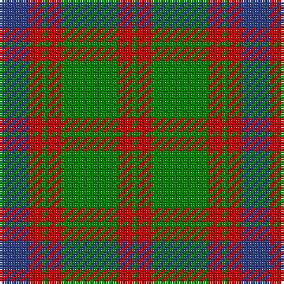

In pattern [BRGRGRG](/stripes/brgrgrg/).

This was sourced from weddslist.  It is a [7 stripe tartan](/stripes/stripes7/).

Original link http://www.weddslist.com/cgi-bin/tartans/pg.pl?source=sts

## Thread count
B/12 R6 G2 R6 G24 R6 G/2

## Palette
Each colour and the base-6 reference it is a variant of.

| Colour | Shade | Base |
|---|---|---|
| B | <code style="background-color:#304080;">#304080</code> `oklch(39.4% 0.109 270.2)` <small>#304080</small> | B <code style="background-color:#2A418A;">#2A418A</code> |
| G | <code style="background-color:#008000;">#008000</code> `oklch(52.0% 0.177 142.5)` <small>#008000</small> | G <code style="background-color:#006100;">#006100</code> |
| R | <code style="background-color:#C00000;">#C00000</code> `oklch(50.7% 0.208 29.2)` <small>#C00000</small> | R <code style="background-color:#CC0000;">#CC0000</code> |

# Sample pattern

## Nearest tartans

The nearest existing variants by ΔTartan distance.

1. [Skene - 1831 (Clan)](/setts/s7/db6r3g1r3g12r3g1~x4/) — ΔT 0.62
1. [Logan](/setts/s7/db8r3db1r3g14r3db1~x4/) — ΔT 0.75
1. [Nithsdale](/setts/s10/db10r2g2r6g16r1g2r1g3r6~x2/) — ΔT 0.89
1. [Glasgow](/setts/s7/g25r4db24r21g25r3db4~x2/) — ΔT 1.00
1. [Heil, Rudiger (Personal)](/setts/s8/lo6n2lo2n2lo18n13dt13n2~x2/) — ΔT 1.00
1. [Robertson of Struan](/setts/s7/r6db2r2db21g20r4g4~x2/) — ΔT 1.08
1. [Nithsdale (3 colours) (District)](/setts/s10/db10r2g2r6g16r1g2r1g3r6~x4/) — ΔT 1.11
1. [Unidentified Plaid 6](/setts/s10/r4t3r32db30r4g32r3g32r3g3~x2/) — ΔT 1.19
1. [Glasgow, City of](/setts/s7/g28r4dp25r22g27r4dp2~x2/) — ΔT 1.20
1. [Glasgow, Rock and Wheel](/setts/s7/g25m4db24m21g25m4db2~x2/) — ΔT 1.22

## Neighbour map

Every grey dot is one of 14299 variants placed by the first two principal components of the ΔTartan feature space (44% of its variance). Red is this tartan; blue dots are its nearest — click one to open its page.

<svg viewBox="0 0 640 380" role="img" style="max-width:100%;height:auto;border:1px solid #e0e0e0;border-radius:4px;display:block" xmlns="http://www.w3.org/2000/svg"><image href="/nn/cloud.v1.png" width="640" height="380"/><a href="/setts/s7/db6r3g1r3g12r3g1~x4/"><circle cx="298.8" cy="216.7" r="4" fill="#3465a4"><title>Skene - 1831 (Clan)</title></circle></a><a href="/setts/s7/db8r3db1r3g14r3db1~x4/"><circle cx="280.0" cy="206.4" r="4" fill="#3465a4"><title>Logan</title></circle></a><a href="/setts/s10/db10r2g2r6g16r1g2r1g3r6~x2/"><circle cx="301.7" cy="184.7" r="4" fill="#3465a4"><title>Nithsdale</title></circle></a><a href="/setts/s7/g25r4db24r21g25r3db4~x2/"><circle cx="257.0" cy="247.8" r="4" fill="#3465a4"><title>Glasgow</title></circle></a><a href="/setts/s8/lo6n2lo2n2lo18n13dt13n2~x2/"><circle cx="279.5" cy="227.5" r="4" fill="#3465a4"><title>Heil, Rudiger (Personal)</title></circle></a><a href="/setts/s7/r6db2r2db21g20r4g4~x2/"><circle cx="269.3" cy="221.4" r="4" fill="#3465a4"><title>Robertson of Struan</title></circle></a><a href="/setts/s10/db10r2g2r6g16r1g2r1g3r6~x4/"><circle cx="302.5" cy="184.7" r="4" fill="#3465a4"><title>Nithsdale (3 colours) (District)</title></circle></a><a href="/setts/s10/r4t3r32db30r4g32r3g32r3g3~x2/"><circle cx="261.3" cy="183.0" r="4" fill="#3465a4"><title>Unidentified Plaid 6</title></circle></a><a href="/setts/s7/g28r4dp25r22g27r4dp2~x2/"><circle cx="298.8" cy="223.8" r="4" fill="#3465a4"><title>Glasgow, City of</title></circle></a><a href="/setts/s7/g25m4db24m21g25m4db2~x2/"><circle cx="291.4" cy="245.1" r="4" fill="#3465a4"><title>Glasgow, Rock and Wheel</title></circle></a><circle cx="297.8" cy="216.5" r="5" fill="#c00000"/></svg>

ID: /setts/s7/db6r3g1r3g12r3g1~x2/
