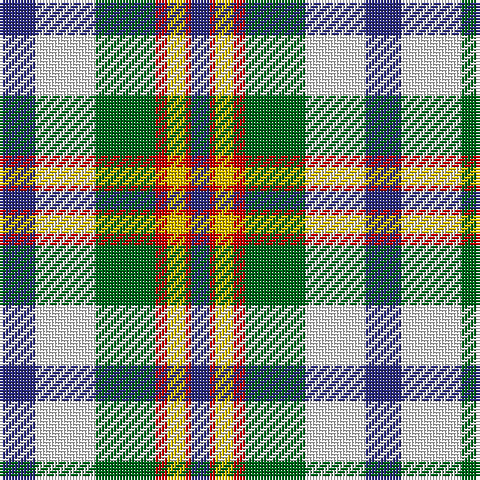

In pattern [BRYRGWB](/stripes/bryrgwb/).

This was sourced from register-of-tartans.  It is a [7 stripe tartan](/stripes/stripes7/).

Original link https://www.tartanregister.gov.uk/tartanDetails.aspx?ref=30

## Also known as

This cloth is also recorded under:

- Ainslie, Lake

## Attestations

This cloth appears in 3 source records; the oldest owns this page.

- 01/01/1985 — Ainslie, Lake (register-of-tartans, [record](https://www.tartanregister.gov.uk/tartanDetails.aspx?ref=30))
- undated — Ainslie, Lake (weddslist, [record](http://www.weddslist.com/cgi-bin/tartans/pg.pl?source=sts))
- undated — Ainslie Lake.. District Tartan Tartan Number: 586. Earliest known date: 1985 On the occasion of the Cape Breton Bicentennial. See products available Copyright © Blair Urquhart, Comrie, 2015 (house-of-tartan, [record](http://www.house-of-tartan.scotland.net/house/TartanViewjs.asp?colr=Def&tnam=586))

## Register references

External register numbers recorded for this tartan.

- Scottish Register of Tartans: [30](https://www.tartanregister.gov.uk/tartanDetails.aspx?ref=30)
- Scottish Tartans Authority (ITI): 586
- Scottish Tartans World Register: 586

## Thread count
DB/12 W20 G20 R4 Y6 R2 DB/6

## Palette
Each colour and the base-6 reference it is a variant of.

| Colour | Shade | Base |
|---|---|---|
| DB | <code style="background-color:#2C2C80;">#2C2C80</code> `oklch(35.0% 0.138 276.6)` <small>#2C2C80</small> | B <code style="background-color:#2A418A;">#2A418A</code> |
| G | <code style="background-color:#006818;">#006818</code> `oklch(45.0% 0.142 145.0)` <small>#006818</small> | G <code style="background-color:#006100;">#006100</code> |
| R | <code style="background-color:#C80000;">#C80000</code> `oklch(52.3% 0.215 29.2)` <small>#C80000</small> | R <code style="background-color:#CC0000;">#CC0000</code> |
| W | <code style="background-color:#FCFCFC;">#FCFCFC</code> `oklch(99.1% 0.000 89.9)` <small>#FCFCFC</small> | W <code style="background-color:#F7F7F7;">#F7F7F7</code> |
| Y | <code style="background-color:#E8C000;">#E8C000</code> `oklch(81.9% 0.168 93.7)` <small>#E8C000</small> | Y <code style="background-color:#F2BF00;">#F2BF00</code> |

# Sample pattern

## Nearest tartans

The nearest existing variants by ΔTartan distance.

1. [Northern Ontario](/setts/s7/dy17g5db2w12db2ly4g7~x4/) — ΔT 0.82
1. [Gray, Sir John Hamilton (Commem)](/setts/s10/w4dt6r3dt10n14lo6w18lo6n4lo2~x2/) — ΔT 0.85
1. [MacRobart Dress (Personal)](/setts/s7/db8w33k15dg17t3dg17t3~x2/) — ΔT 0.94
1. [Alexander Brothers - 2007? (Corp.)](/setts/s8/g5ly2t20w2k20w20k2w5~x2/) — ΔT 1.01
1. [Fraser, Red dress](/setts/s7/r4db18r4g19w25r10w4~x2/) — ΔT 1.04
1. [Ailsa Craig (District)](/setts/s8/r5w2t20ly2k16w18k2w5~x2/) — ΔT 1.04
1. [Ailsa Craig](/setts/s8/r5w2o20ly2k16w18k2w5~x2/) — ΔT 1.08
1. [John, Hamilton Gray](/setts/s10/w8g14r6g24db30ly10w40ly10db7ly4/) — ΔT 1.09
1. [Womble](/setts/s9/w4db8w1db1g6db3r6db1w4~x2/) — ΔT 1.15
1. [Coulter Dress (Personal)](/setts/s8/r6w20g12o3g8t20k2t3~x2/) — ΔT 1.16

## Neighbour map

Every grey dot is one of 14299 variants placed by the first two principal components of the ΔTartan feature space (44% of its variance). Red is this tartan; blue dots are its nearest — click one to open its page.

<svg viewBox="0 0 640 380" role="img" style="max-width:100%;height:auto;border:1px solid #e0e0e0;border-radius:4px;display:block" xmlns="http://www.w3.org/2000/svg"><image href="/nn/cloud.v1.png" width="640" height="380"/><a href="/setts/s7/dy17g5db2w12db2ly4g7~x4/"><circle cx="103.4" cy="175.6" r="4" fill="#3465a4"><title>Northern Ontario</title></circle></a><a href="/setts/s10/w4dt6r3dt10n14lo6w18lo6n4lo2~x2/"><circle cx="65.8" cy="162.0" r="4" fill="#3465a4"><title>Gray, Sir John Hamilton (Commem)</title></circle></a><a href="/setts/s7/db8w33k15dg17t3dg17t3~x2/"><circle cx="114.9" cy="174.8" r="4" fill="#3465a4"><title>MacRobart Dress (Personal)</title></circle></a><a href="/setts/s8/g5ly2t20w2k20w20k2w5~x2/"><circle cx="120.7" cy="153.5" r="4" fill="#3465a4"><title>Alexander Brothers - 2007? (Corp.)</title></circle></a><a href="/setts/s7/r4db18r4g19w25r10w4~x2/"><circle cx="86.6" cy="192.6" r="4" fill="#3465a4"><title>Fraser, Red dress</title></circle></a><a href="/setts/s8/r5w2t20ly2k16w18k2w5~x2/"><circle cx="116.4" cy="147.8" r="4" fill="#3465a4"><title>Ailsa Craig (District)</title></circle></a><a href="/setts/s8/r5w2o20ly2k16w18k2w5~x2/"><circle cx="117.9" cy="146.9" r="4" fill="#3465a4"><title>Ailsa Craig</title></circle></a><a href="/setts/s10/w8g14r6g24db30ly10w40ly10db7ly4/"><circle cx="89.5" cy="156.2" r="4" fill="#3465a4"><title>John, Hamilton Gray</title></circle></a><a href="/setts/s9/w4db8w1db1g6db3r6db1w4~x2/"><circle cx="43.5" cy="178.6" r="4" fill="#3465a4"><title>Womble</title></circle></a><a href="/setts/s8/r6w20g12o3g8t20k2t3~x2/"><circle cx="82.4" cy="153.0" r="4" fill="#3465a4"><title>Coulter Dress (Personal)</title></circle></a><circle cx="72.8" cy="171.0" r="5" fill="#c00000"/></svg>

ID: /setts/s7/db6w10g10r2ly3r1db3~x2/
