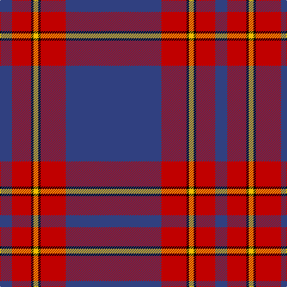

In pattern [BRKYKRB](/stripes/brkykrb/).

This was sourced from weddslist.  It is a [7 stripe tartan](/stripes/stripes7/).

Original link http://www.weddslist.com/cgi-bin/tartans/pg.pl?source=sts

## Also known as

This cloth is also recorded under:

- Salvation Army, dress

## Attestations

This cloth appears in 2 source records; the oldest owns this page.

- undated — Salvation Army, dress (weddslist, [record](http://www.weddslist.com/cgi-bin/tartans/pg.pl?source=sts))
- undated — Salvation Army Dress Corporate Tartan Tartan Number: 546. Earliest known date: 1983 The colours chosen are the same as those for the flag. Red for the Blood of Christ, blue for the Heavenly Father, yellow for Fire of the Holy Spirit when tongues of fire symbolized his presence at Penticost. See products available Copyright © Blair Urquhart, Comrie, 2015 (house-of-tartan, [record](http://www.house-of-tartan.scotland.net/house/TartanViewjs.asp?colr=Def&tnam=546))

## Thread count
B/160 R42 K4 Y8 K4 R32 B/20

## Palette
Each colour and the base-6 reference it is a variant of.

| Colour | Shade | Base |
|---|---|---|
| B | <code style="background-color:#304080;">#304080</code> `oklch(39.4% 0.109 270.2)` <small>#304080</small> | B <code style="background-color:#2A418A;">#2A418A</code> |
| K | <code style="background-color:#000000;">#000000</code> `oklch(0.0% 0.000 0.0)` <small>#000000</small> | K <code style="background-color:#000000;">#000000</code> |
| R | <code style="background-color:#C00000;">#C00000</code> `oklch(50.7% 0.208 29.2)` <small>#C00000</small> | R <code style="background-color:#CC0000;">#CC0000</code> |
| Y | <code style="background-color:#F0C000;">#F0C000</code> `oklch(82.7% 0.169 90.5)` <small>#F0C000</small> | Y <code style="background-color:#F2BF00;">#F2BF00</code> |

# Sample pattern

## Nearest tartans

The nearest existing variants by ΔTartan distance.

1. [Salvation Army Dress (Corporate)](/setts/s8/db74k2r15k2ly4k2r16db10~x2/) — ΔT 0.66
1. [McBrayer Blue (Personal)](/setts/s8/db57k1r12db1g12r14db1r2~x2/) — ΔT 1.09
1. [Clan Gregor Tartan Tartan Number: 3089. Earliest known date: See products available Copyright © Blair Urquhart, Comrie, 2015](/setts/s6/db25r8db3r4k1w3~x2/) — ΔT 1.16
1. [Falkirk Football Club (Corporate)](/setts/s9/db5r16db4k3db4k3db43r15w1~x2/) — ΔT 1.22
1. [Ahmlaigh (Corporate)](/setts/s7/dp50k8g4k1g4k1g14/) — ΔT 1.28
1. [Michie, Andrew (Personal)](/setts/s5/dp62g5g20lb5k1~x2/) — ΔT 1.30
1. [Auchtermuchty Tartan Army](/setts/s6/db80r8w1r8ly20db15~x2/) — ΔT 1.41
1. [Baker](/setts/s8/db28o3w1o3db4w2p1w5~x4/) — ΔT 1.46
1. [Auchtermuchty Tartan Army (Corp)](/setts/s6/db80r7w1r7ly20db15~x2/) — ΔT 1.48
1. [Lochnagar Dress (Fashion)](/setts/s10/y5k1y33dp1y9k9dp5k1r2k4~x2/) — ΔT 1.48

## Neighbour map

Every grey dot is one of 14299 variants placed by the first two principal components of the ΔTartan feature space (44% of its variance). Red is this tartan; blue dots are its nearest — click one to open its page.

<svg viewBox="0 0 640 380" role="img" style="max-width:100%;height:auto;border:1px solid #e0e0e0;border-radius:4px;display:block" xmlns="http://www.w3.org/2000/svg"><image href="/nn/cloud.v1.png" width="640" height="380"/><a href="/setts/s8/db74k2r15k2ly4k2r16db10~x2/"><circle cx="472.3" cy="122.3" r="4" fill="#3465a4"><title>Salvation Army Dress (Corporate)</title></circle></a><a href="/setts/s8/db57k1r12db1g12r14db1r2~x2/"><circle cx="433.3" cy="115.1" r="4" fill="#3465a4"><title>McBrayer Blue (Personal)</title></circle></a><a href="/setts/s6/db25r8db3r4k1w3~x2/"><circle cx="416.5" cy="157.8" r="4" fill="#3465a4"><title>Clan Gregor Tartan Tartan Number: 3089. Earliest known date: See products available Copyright © Blair Urquhart, Comrie, 2015</title></circle></a><a href="/setts/s9/db5r16db4k3db4k3db43r15w1~x2/"><circle cx="419.8" cy="121.1" r="4" fill="#3465a4"><title>Falkirk Football Club (Corporate)</title></circle></a><a href="/setts/s7/dp50k8g4k1g4k1g14/"><circle cx="470.8" cy="138.6" r="4" fill="#3465a4"><title>Ahmlaigh (Corporate)</title></circle></a><a href="/setts/s5/dp62g5g20lb5k1~x2/"><circle cx="452.8" cy="121.5" r="4" fill="#3465a4"><title>Michie, Andrew (Personal)</title></circle></a><a href="/setts/s6/db80r8w1r8ly20db15~x2/"><circle cx="476.5" cy="125.3" r="4" fill="#3465a4"><title>Auchtermuchty Tartan Army</title></circle></a><a href="/setts/s8/db28o3w1o3db4w2p1w5~x4/"><circle cx="435.7" cy="125.1" r="4" fill="#3465a4"><title>Baker</title></circle></a><a href="/setts/s6/db80r7w1r7ly20db15~x2/"><circle cx="487.0" cy="125.0" r="4" fill="#3465a4"><title>Auchtermuchty Tartan Army (Corp)</title></circle></a><a href="/setts/s10/y5k1y33dp1y9k9dp5k1r2k4~x2/"><circle cx="468.2" cy="137.2" r="4" fill="#3465a4"><title>Lochnagar Dress (Fashion)</title></circle></a><circle cx="475.8" cy="132.3" r="5" fill="#c00000"/></svg>

ID: /setts/s7/db80r21k2ly4k2r16db10~x2/
