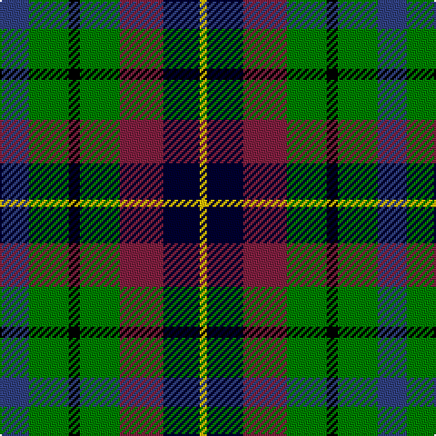

In pattern [BGKGRKY](/stripes/bgkgrky/).

This was sourced from weddslist.  It is a [7 stripe tartan](/stripes/stripes7/).

Original link http://www.weddslist.com/cgi-bin/tartans/pg.pl?source=sts

## Thread count
B/16 G22 K6 G22 DR24 DB20 Y/4

## Palette
Each colour and the base-6 reference it is a variant of.

| Colour | Shade | Base |
|---|---|---|
| B | <code style="background-color:#304080;">#304080</code> `oklch(39.4% 0.109 270.2)` <small>#304080</small> | B <code style="background-color:#2A418A;">#2A418A</code> |
| DB | <code style="background-color:#000030;">#000030</code> `oklch(14.0% 0.097 264.1)` <small>#000030</small> | K <code style="background-color:#000000;">#000000</code> |
| DR | <code style="background-color:#802040;">#802040</code> `oklch(40.8% 0.132 5.2)` <small>#802040</small> | R <code style="background-color:#CC0000;">#CC0000</code> |
| G | <code style="background-color:#008000;">#008000</code> `oklch(52.0% 0.177 142.5)` <small>#008000</small> | G <code style="background-color:#006100;">#006100</code> |
| K | <code style="background-color:#000000;">#000000</code> `oklch(0.0% 0.000 0.0)` <small>#000000</small> | K <code style="background-color:#000000;">#000000</code> |
| Y | <code style="background-color:#F0C000;">#F0C000</code> `oklch(82.7% 0.169 90.5)` <small>#F0C000</small> | Y <code style="background-color:#F2BF00;">#F2BF00</code> |

# Sample pattern

## Nearest tartans

The nearest existing variants by ΔTartan distance.

1. [Wilson's No.217](/setts/s8/dp11t2k10g10ly3~x2/) — ΔT 1.18
1. [Pollard (2014)](/setts/s7/g5dg5g5db5db5dg10w2~x8/) — ΔT 1.22
1. [Gallowater, Original](/setts/s6/r10k17t10dp17g40ly10~x2/) — ΔT 1.25
1. [Selkirk (Personal) Original](/setts/s8/dp11y2k10g10lo2~x2/) — ΔT 1.29
1. [Scottish Odyssey Commemorative Tartan Tartan Number: 4071. Earliest known date: 01/01/2002 The Scottish Odyssey tartan from Lochcarron is a 'celebration of the wonderful experiences to be gained' from a visit to Scotland and some of the most spectacularly contrasting landscapes to be seen in Europe. See products available Copyright © Blair Urquhart, Comrie, 2015](/setts/s7/k7db11k3db11dy11g22db3~x2/) — ΔT 1.29
1. [Gallowater](/setts/s6/r10k18t10db18g40ly5/) — ΔT 1.30
1. [Cunningham / Wilson's No 120](/setts/s7/k11g12w2g12k12dp12r3~x2/) — ΔT 1.30
1. [Friebe (2014)](/setts/s5/g15dg18db23w4r8~x2/) — ΔT 1.33
1. [Casely](/setts/s6/r4g11k11g2db11y3~x4/) — ΔT 1.33
1. [Brodie Hunting](/setts/s7/r2k8lo1k8g8t8r2~x4/) — ΔT 1.34

## Neighbour map

Every grey dot is one of 14299 variants placed by the first two principal components of the ΔTartan feature space (44% of its variance). Red is this tartan; blue dots are its nearest — click one to open its page.

<svg viewBox="0 0 640 380" role="img" style="max-width:100%;height:auto;border:1px solid #e0e0e0;border-radius:4px;display:block" xmlns="http://www.w3.org/2000/svg"><image href="/nn/cloud.v1.png" width="640" height="380"/><a href="/setts/s8/dp11t2k10g10ly3~x2/"><circle cx="106.5" cy="240.9" r="4" fill="#3465a4"><title>Wilson's No.217</title></circle></a><a href="/setts/s7/g5dg5g5db5db5dg10w2~x8/"><circle cx="67.9" cy="250.1" r="4" fill="#3465a4"><title>Pollard (2014)</title></circle></a><a href="/setts/s6/r10k17t10dp17g40ly10~x2/"><circle cx="75.0" cy="223.0" r="4" fill="#3465a4"><title>Gallowater, Original</title></circle></a><a href="/setts/s8/dp11y2k10g10lo2~x2/"><circle cx="119.0" cy="236.2" r="4" fill="#3465a4"><title>Selkirk (Personal) Original</title></circle></a><a href="/setts/s7/k7db11k3db11dy11g22db3~x2/"><circle cx="127.9" cy="223.8" r="4" fill="#3465a4"><title>Scottish Odyssey Commemorative Tartan Tartan Number: 4071. Earliest known date: 01/01/2002 The Scottish Odyssey tartan from Lochcarron is a 'celebration of the wonderful experiences to be gained' from a visit to Scotland and some of the most spectacularly contrasting landscapes to be seen in Europe. See products available Copyright © Blair Urquhart, Comrie, 2015</title></circle></a><a href="/setts/s6/r10k18t10db18g40ly5/"><circle cx="99.4" cy="192.1" r="4" fill="#3465a4"><title>Gallowater</title></circle></a><a href="/setts/s7/k11g12w2g12k12dp12r3~x2/"><circle cx="131.2" cy="255.0" r="4" fill="#3465a4"><title>Cunningham / Wilson's No 120</title></circle></a><a href="/setts/s5/g15dg18db23w4r8~x2/"><circle cx="91.2" cy="249.9" r="4" fill="#3465a4"><title>Friebe (2014)</title></circle></a><a href="/setts/s6/r4g11k11g2db11y3~x4/"><circle cx="73.5" cy="236.1" r="4" fill="#3465a4"><title>Casely</title></circle></a><a href="/setts/s7/r2k8lo1k8g8t8r2~x4/"><circle cx="155.6" cy="218.0" r="4" fill="#3465a4"><title>Brodie Hunting</title></circle></a><circle cx="74.6" cy="227.3" r="5" fill="#c00000"/></svg>

ID: /setts/s7/db8g11k3g11m12k10ly2~x2/
