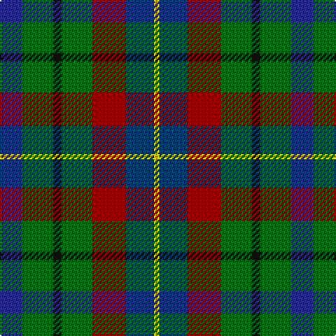

In pattern [BGKGRBY](/stripes/bgkgrby/).

This was sourced from house-of-tartan.  It is a [7 stripe tartan](/stripes/stripes7/).

Original link http://www.house-of-tartan.scotland.net/house/TartanViewjs.asp?colr=Def&tnam=2477

## Thread count
DB/16 G22 K6 G22 DR24 DBa20 Y/4

## Palette
Each colour and the base-6 reference it is a variant of.

| Colour | Shade | Base |
|---|---|---|
| DB | <code style="background-color:#2C2C80;">#2C2C80</code> `oklch(35.0% 0.138 276.6)` <small>#2C2C80</small> | B <code style="background-color:#2A418A;">#2A418A</code> |
| DBa | <code style="background-color:#003C64;">#003C64</code> `oklch(34.5% 0.089 246.0)` <small>#003C64</small> | B <code style="background-color:#2A418A;">#2A418A</code> |
| DR | <code style="background-color:#880000;">#880000</code> `oklch(39.4% 0.162 29.2)` <small>#880000</small> | R <code style="background-color:#CC0000;">#CC0000</code> |
| G | <code style="background-color:#006818;">#006818</code> `oklch(45.0% 0.142 145.0)` <small>#006818</small> | G <code style="background-color:#006100;">#006100</code> |
| K | <code style="background-color:#101010;">#101010</code> `oklch(17.3% 0.000 89.9)` <small>#101010</small> | K <code style="background-color:#000000;">#000000</code> |
| Y | <code style="background-color:#E8C000;">#E8C000</code> `oklch(81.9% 0.168 93.7)` <small>#E8C000</small> | Y <code style="background-color:#F2BF00;">#F2BF00</code> |

# Sample pattern

## Nearest tartans

The nearest existing variants by ΔTartan distance.

1. [Tennant (Clan)](/setts/s7/r1dy7g7k7b7dy7r1~x4/) — ΔT 0.97
1. [Scottish Parliament (unofficial)](/setts/s7/db14g18k3g18r20k14lo3~x2/) — ΔT 1.19
1. [Tennant Family Tartan Tartan Number: 1653. Earliest known date: 1930 MacGregor-Hastie made few notes about his sample collection. In December 1967, Captain Tennant wrote to the Scottish Tartans Society, saying, ".. and I have no objection to other Tennants wearing it (Tennant tartan) but their problem will be to get hold of it ... I don't know of any other Tennant tartan and that is why I think my father designed this one." The head of the Tennant family is Lord Glenconner, descended from John Tennant of Blairston, Ayr. (1635). See products available Copyright © Blair Urquhart, Comrie, 2015](/setts/s7/r1dy7db7k7g7dy7r1~x4/) — ΔT 1.26
1. [Game Fair](/setts/s7/r3db12k12dg12b2dg12w3~x2/) — ΔT 1.27
1. [Casely](/setts/s6/r4g11k11g2n11y3~x4/) — ΔT 1.34
1. [Forres](/setts/s6/g2lo1g5k4do5r1~x4/) — ΔT 1.40
1. [New York City](/setts/s7/b2db3k1db3o3g4r1~x8/) — ΔT 1.42
1. [Birse](/setts/s6/k4g16k14lo3n16r4~x2/) — ΔT 1.42
1. [Smith of Pennilands (Clan)](/setts/s11/r2k1g7k6n7db2n7k6g7k1lo2~x4/) — ΔT 1.42
1. [Glen Chalmadale](/setts/s9/g13w2g10k5r13k3r5dt15o5~x2/) — ΔT 1.43

## Neighbour map

Every grey dot is one of 14299 variants placed by the first two principal components of the ΔTartan feature space (44% of its variance). Red is this tartan; blue dots are its nearest — click one to open its page.

<svg viewBox="0 0 640 380" role="img" style="max-width:100%;height:auto;border:1px solid #e0e0e0;border-radius:4px;display:block" xmlns="http://www.w3.org/2000/svg"><image href="/nn/cloud.v1.png" width="640" height="380"/><a href="/setts/s7/r1dy7g7k7b7dy7r1~x4/"><circle cx="151.6" cy="253.3" r="4" fill="#3465a4"><title>Tennant (Clan)</title></circle></a><a href="/setts/s7/db14g18k3g18r20k14lo3~x2/"><circle cx="143.3" cy="245.8" r="4" fill="#3465a4"><title>Scottish Parliament (unofficial)</title></circle></a><a href="/setts/s7/r1dy7db7k7g7dy7r1~x4/"><circle cx="167.6" cy="261.1" r="4" fill="#3465a4"><title>Tennant Family Tartan Tartan Number: 1653. Earliest known date: 1930 MacGregor-Hastie made few notes about his sample collection. In December 1967, Captain Tennant wrote to the Scottish Tartans Society, saying, &quot;.. and I have no objection to other Tennants wearing it (Tennant tartan) but their problem will be to get hold of it ... I don't know of any other Tennant tartan and that is why I think my father designed this one.&quot; The head of the Tennant family is Lord Glenconner, descended from John Tennant of Blairston, Ayr. (1635). See products available Copyright © Blair Urquhart, Comrie, 2015</title></circle></a><a href="/setts/s7/r3db12k12dg12b2dg12w3~x2/"><circle cx="149.9" cy="236.3" r="4" fill="#3465a4"><title>Game Fair</title></circle></a><a href="/setts/s6/r4g11k11g2n11y3~x4/"><circle cx="132.9" cy="263.6" r="4" fill="#3465a4"><title>Casely</title></circle></a><a href="/setts/s6/g2lo1g5k4do5r1~x4/"><circle cx="166.4" cy="268.6" r="4" fill="#3465a4"><title>Forres</title></circle></a><a href="/setts/s7/b2db3k1db3o3g4r1~x8/"><circle cx="76.4" cy="263.7" r="4" fill="#3465a4"><title>New York City</title></circle></a><a href="/setts/s6/k4g16k14lo3n16r4~x2/"><circle cx="127.2" cy="254.5" r="4" fill="#3465a4"><title>Birse</title></circle></a><a href="/setts/s11/r2k1g7k6n7db2n7k6g7k1lo2~x4/"><circle cx="93.5" cy="206.7" r="4" fill="#3465a4"><title>Smith of Pennilands (Clan)</title></circle></a><a href="/setts/s9/g13w2g10k5r13k3r5dt15o5~x2/"><circle cx="91.3" cy="197.2" r="4" fill="#3465a4"><title>Glen Chalmadale</title></circle></a><circle cx="115.4" cy="247.2" r="5" fill="#c00000"/></svg>

ID: /setts/s7/db8g11k3g11r12dt10ly2~x2/
