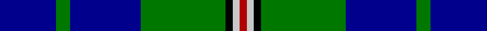

In pattern [BGBGKWR](/stripes/bgbgkwr/).

This was sourced from register-of-tartans.  It is a [7 stripe tartan](/stripes/stripes7/).

Original link https://www.tartanregister.gov.uk/tartanDetails.aspx?ref=3206

## Register references

External register numbers recorded for this tartan.

- Scottish Register of Tartans: [3206](https://www.tartanregister.gov.uk/tartanDetails.aspx?ref=3206)
- Scottish Tartans Authority (ITI): 4108

## Thread count
DB/32 G8 DB40 G48 K4 N4 DR/4

## Palette
Each colour and the base-6 reference it is a variant of.

| Colour | Shade | Base |
|---|---|---|
| B | <code style="background-color:#788CB4;">#788CB4</code> `oklch(63.9% 0.065 264.0)` <small>#788CB4</small> | B <code style="background-color:#2A418A;">#2A418A</code> |
| DB | <code style="background-color:#00008C;">#00008C</code> `oklch(28.9% 0.200 264.1)` <small>#00008C</small> | B <code style="background-color:#2A418A;">#2A418A</code> |
| DR | <code style="background-color:#B00000;">#B00000</code> `oklch(47.5% 0.195 29.2)` <small>#B00000</small> | R <code style="background-color:#CC0000;">#CC0000</code> |
| DY | <code style="background-color:#C88C00;">#C88C00</code> `oklch(68.2% 0.142 78.2)` <small>#C88C00</small> | Y <code style="background-color:#F2BF00;">#F2BF00</code> |
| G | <code style="background-color:#007800;">#007800</code> `oklch(49.6% 0.169 142.5)` <small>#007800</small> | G <code style="background-color:#006100;">#006100</code> |
| K | <code style="background-color:#000000;">#000000</code> `oklch(0.0% 0.000 0.0)` <small>#000000</small> | K <code style="background-color:#000000;">#000000</code> |
| N | <code style="background-color:#C8C8C8;">#C8C8C8</code> `oklch(83.3% 0.000 89.9)` <small>#C8C8C8</small> | W <code style="background-color:#F7F7F7;">#F7F7F7</code> |
| P | <code style="background-color:#64008C;">#64008C</code> `oklch(38.5% 0.193 311.3)` <small>#64008C</small> | B <code style="background-color:#2A418A;">#2A418A</code> |

# Sample pattern

## Nearest tartans

The nearest existing variants by ΔTartan distance.

1. [Vance (Family Association) Corporate Family Tartan Tartan Number: 2208. Earliest known date: December 1994 Designed and Copyrighted in the US by Mark W. Vance. Details from Vance Family Association website. See products available Copyright © Blair Urquhart, Comrie, 2015](/setts/s6/k4t24k2g13t2k3~x4/) — ΔT 1.04
1. [Miller](/setts/s8/r2db6g15b9db30b9g6lo2~x2/) — ΔT 1.28
1. [Vance (Family Association)](/setts/s6/r4db24w2g13db2k3~x4/) — ΔT 1.39
1. [Greenways Marketing Intl (Corporate)](/setts/s7/db24g3db3g3lo2g18r2~x2/) — ΔT 1.40
1. [Nowell/Noel (Name)](/setts/s7/db3g4db20g24k2lb3r1~x2/) — ΔT 1.41
1. [Carmichael](/setts/s6/k5g32db32r3db3ly3~x2/) — ΔT 1.43
1. [Lee (Personal)](/setts/s7/dg2k1dg12r4dg3db9lb2~x4/) — ΔT 1.44
1. [Isle of Harris (District)](/setts/s6/t3k2g2k1db10w1~x8/) — ΔT 1.44
1. [Wishart Htg (Clan)](/setts/s7/k7db4dg31db3ly2db27lb4~x2/) — ΔT 1.44
1. [MacIntyre L](/setts/s6/dg4db12r3db12dg32lb4/) — ΔT 1.45

## Neighbour map

Every grey dot is one of 14299 variants placed by the first two principal components of the ΔTartan feature space (44% of its variance). Red is this tartan; blue dots are its nearest — click one to open its page.

<svg viewBox="0 0 640 380" role="img" style="max-width:100%;height:auto;border:1px solid #e0e0e0;border-radius:4px;display:block" xmlns="http://www.w3.org/2000/svg"><image href="/nn/cloud.v1.png" width="640" height="380"/><a href="/setts/s6/k4t24k2g13t2k3~x4/"><circle cx="261.1" cy="178.2" r="4" fill="#3465a4"><title>Vance (Family Association) Corporate Family Tartan Tartan Number: 2208. Earliest known date: December 1994 Designed and Copyrighted in the US by Mark W. Vance. Details from Vance Family Association website. See products available Copyright © Blair Urquhart, Comrie, 2015</title></circle></a><a href="/setts/s8/r2db6g15b9db30b9g6lo2~x2/"><circle cx="230.0" cy="180.7" r="4" fill="#3465a4"><title>Miller</title></circle></a><a href="/setts/s6/r4db24w2g13db2k3~x4/"><circle cx="277.3" cy="178.6" r="4" fill="#3465a4"><title>Vance (Family Association)</title></circle></a><a href="/setts/s7/db24g3db3g3lo2g18r2~x2/"><circle cx="312.4" cy="196.9" r="4" fill="#3465a4"><title>Greenways Marketing Intl (Corporate)</title></circle></a><a href="/setts/s7/db3g4db20g24k2lb3r1~x2/"><circle cx="283.7" cy="146.2" r="4" fill="#3465a4"><title>Nowell/Noel (Name)</title></circle></a><a href="/setts/s6/k5g32db32r3db3ly3~x2/"><circle cx="250.9" cy="188.4" r="4" fill="#3465a4"><title>Carmichael</title></circle></a><a href="/setts/s7/dg2k1dg12r4dg3db9lb2~x4/"><circle cx="248.5" cy="194.8" r="4" fill="#3465a4"><title>Lee (Personal)</title></circle></a><a href="/setts/s6/t3k2g2k1db10w1~x8/"><circle cx="243.4" cy="184.7" r="4" fill="#3465a4"><title>Isle of Harris (District)</title></circle></a><a href="/setts/s7/k7db4dg31db3ly2db27lb4~x2/"><circle cx="246.9" cy="169.1" r="4" fill="#3465a4"><title>Wishart Htg (Clan)</title></circle></a><a href="/setts/s6/dg4db12r3db12dg32lb4/"><circle cx="301.3" cy="218.4" r="4" fill="#3465a4"><title>MacIntyre L</title></circle></a><circle cx="264.6" cy="188.1" r="5" fill="#c00000"/></svg>

ID: /setts/s7/db8g2db10g12k1lb1r1~x4/
