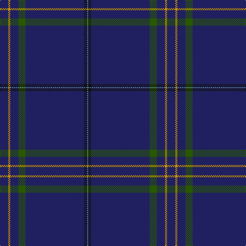

In pattern [BKBGBYB](/stripes/bkbgbyb/).

This was sourced from tartans-authority.  It is a [7 stripe tartan](/stripes/stripes7/).

Original link http://www.tartansauthority.com/tartan-ferret/display/10858/

## Thread count
DB/16 DY4 DB16 G14 DB114 K6 B/2

## Palette
Each colour and its ΔE from the base-6 reference it is a variant of.

| Colour | Shade | Base | ΔE (OKLab) |
|---|---|---|---|
| B | <code style="background-color:#5C8CA8;">#5C8CA8</code> `#5C8CA8` | B <code style="background-color:#2A418A;">#2A418A</code> | 0.23 |
| DB | <code style="background-color:#202060;">#202060</code> `#202060` | B <code style="background-color:#2A418A;">#2A418A</code> | 0.11 |
| DY | <code style="background-color:#D09800;">#D09800</code> `#D09800` | Y <code style="background-color:#F2BF00;">#F2BF00</code> | 0.12 |
| G | <code style="background-color:#285800;">#285800</code> `#285800` | G <code style="background-color:#006100;">#006100</code> | 0.03 |
| K | <code style="background-color:#101010;">#101010</code> `#101010` | K <code style="background-color:#000000;">#000000</code> | 0.17 |

# Sample pattern

## Nearest tartans

The nearest existing variants by ΔTartan distance.

1. [Callaghan](/setts/s7/k5o1k41dg8k8ly1k5~x2/) — ΔT 1.62
1. [Scotch Whisky Heritage Centre](/setts/s8/db73g16db10r8db10k4db10w2~x2/) — ΔT 1.92
1. [Crichton (Clan)](/setts/s9/db80dg1db2r4lr1n5db8lo2dg2~x2/) — ΔT 1.92
1. [London Scottish Rugby Club Corporate Sport Tartan Tartan Number: 2360. Earliest known date: May 1998 For the use of staff and club members. Blue should be almost blue/black. See products available Copyright © Blair Urquhart, Comrie, 2015](/setts/s10/g8dt13w1dt40r5dt40w1dt13g8k4~x2/) — ΔT 2.00
1. [Cullen (Christian Hill) (Personal)](/setts/s7/t8lo2t8dg7t57k3lb1~x2/) — ΔT 2.07
1. [Visit Scotland](/setts/s10/db51b4db7m2db2g2db2dg10db13w2~x2/) — ΔT 2.10
1. [Easton (2014)](/setts/s7/r3db2ly1db50w1db2t3~x2/) — ΔT 2.10
1. [Laird (Restricted)](/setts/s9/k75g2k4dp10db1dp4db1dp4k4~x2/) — ΔT 2.21
1. [United States Trade sett Tartan Tartan Number: 2126. Earliest known date: 1989 This design is different in warp and weft. The display gives the general appearance only. Produced to celebrate American tourism is Scotland. The colours are taken from the flags of the two nations and the Atlantic Ocean that separates them. See products available Copyright © Blair Urquhart, Comrie, 2015](/setts/s9/db7dt5lr6dt5r7dt2db2dt70lr2/) — ΔT 2.26
1. [Norwich No.030](/setts/s6/db33g3r1~x2/) — ΔT 2.36

## Neighbour map

Every grey dot is one of 14299 variants placed by the first two principal components of the ΔTartan feature space (44% of its variance). Red is this tartan; blue dots are its nearest — click one to open its page.

<svg viewBox="0 0 640 380" role="img" style="max-width:100%;height:auto;border:1px solid #e0e0e0;border-radius:4px;display:block" xmlns="http://www.w3.org/2000/svg"><image href="/nn/cloud.v1.png" width="640" height="380"/><a href="/setts/s7/k5o1k41dg8k8ly1k5~x2/"><circle cx="626.0" cy="196.0" r="4" fill="#3465a4"><title>Callaghan</title></circle></a><a href="/setts/s8/db73g16db10r8db10k4db10w2~x2/"><circle cx="541.2" cy="142.5" r="4" fill="#3465a4"><title>Scotch Whisky Heritage Centre</title></circle></a><a href="/setts/s9/db80dg1db2r4lr1n5db8lo2dg2~x2/"><circle cx="626.0" cy="96.5" r="4" fill="#3465a4"><title>Crichton (Clan)</title></circle></a><a href="/setts/s10/g8dt13w1dt40r5dt40w1dt13g8k4~x2/"><circle cx="567.8" cy="164.3" r="4" fill="#3465a4"><title>London Scottish Rugby Club Corporate Sport Tartan Tartan Number: 2360. Earliest known date: May 1998 For the use of staff and club members. Blue should be almost blue/black. See products available Copyright © Blair Urquhart, Comrie, 2015</title></circle></a><a href="/setts/s7/t8lo2t8dg7t57k3lb1~x2/"><circle cx="626.0" cy="132.9" r="4" fill="#3465a4"><title>Cullen (Christian Hill) (Personal)</title></circle></a><a href="/setts/s10/db51b4db7m2db2g2db2dg10db13w2~x2/"><circle cx="562.6" cy="140.7" r="4" fill="#3465a4"><title>Visit Scotland</title></circle></a><a href="/setts/s7/r3db2ly1db50w1db2t3~x2/"><circle cx="626.0" cy="108.7" r="4" fill="#3465a4"><title>Easton (2014)</title></circle></a><a href="/setts/s9/k75g2k4dp10db1dp4db1dp4k4~x2/"><circle cx="626.0" cy="131.8" r="4" fill="#3465a4"><title>Laird (Restricted)</title></circle></a><a href="/setts/s9/db7dt5lr6dt5r7dt2db2dt70lr2/"><circle cx="571.8" cy="136.2" r="4" fill="#3465a4"><title>United States Trade sett Tartan Tartan Number: 2126. Earliest known date: 1989 This design is different in warp and weft. The display gives the general appearance only. Produced to celebrate American tourism is Scotland. The colours are taken from the flags of the two nations and the Atlantic Ocean that separates them. See products available Copyright © Blair Urquhart, Comrie, 2015</title></circle></a><a href="/setts/s6/db33g3r1~x2/"><circle cx="626.0" cy="225.9" r="4" fill="#3465a4"><title>Norwich No.030</title></circle></a><circle cx="626.0" cy="152.1" r="5" fill="#c00000"/></svg>

ID: /setts/s7/db8lo2db8dg7db57k3t1~x2/
