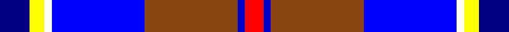
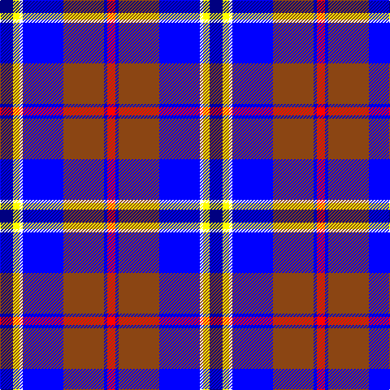

This page is one **sett** — a single exact thread-count. It belongs to the [tartan](/tartans/db8ly4w2b25o25dbi2r5/)
(the same proportion at any scale), whose colour order is pattern [BYWBRBR](/stripes/bywbrbr/).

Sourced from register-of-tartans.  It is a [7 stripe tartan](/stripes/stripes7/).

Original link https://www.tartanregister.gov.uk/tartanDetails.aspx?ref=10048

## Register references

External register numbers recorded for this tartan.

- Scottish Register of Tartans: [10048](https://www.tartanregister.gov.uk/tartanDetails.aspx?ref=10048)

## Thread count
DB/16 Y8 W4 B50 T50 Ba4 R/10

## Palette

Palette: <strong>Tartan Register</strong> <small style="color:#888">(5 of 7 colours)</small>
<table><thead><tr><th>Colour</th><th>Threads</th><th>Shade</th><th>Base</th><th>OKLCh</th></tr></thead><tbody><tr><td>DB/</td><td style="text-align:right;font-variant-numeric:tabular-nums">16</td><td><code style="background-color:#000080;">#000080</code> <small style="color:#888">#000080</small></td><td>B <code style="background-color:#2A418A;">#2A418A</code></td><td><small style="color:#888">oklch(27.1% 0.188 264.1)</small></td></tr><tr><td>Y</td><td style="text-align:right;font-variant-numeric:tabular-nums">8</td><td><code style="background-color:#FFFF00;">#FFFF00</code> <small style="color:#888">#FFFF00</small></td><td>Y <code style="background-color:#F2BF00;">#F2BF00</code></td><td><small style="color:#888">oklch(96.8% 0.211 109.8)</small></td></tr><tr><td>W</td><td style="text-align:right;font-variant-numeric:tabular-nums">4</td><td><code style="background-color:#FFFFFF;">#FFFFFF</code> <small style="color:#888">#FFFFFF</small></td><td>W <code style="background-color:#F7F7F7;">#F7F7F7</code></td><td><small style="color:#888">oklch(100.0% 0.000 89.9)</small></td></tr><tr><td>B</td><td style="text-align:right;font-variant-numeric:tabular-nums">50</td><td><code style="background-color:#0000FF;">#0000FF</code> <small style="color:#888">#0000FF</small></td><td>B <code style="background-color:#2A418A;">#2A418A</code></td><td><small style="color:#888">oklch(45.2% 0.313 264.1)</small></td></tr><tr><td>T</td><td style="text-align:right;font-variant-numeric:tabular-nums">50</td><td><code style="background-color:#8B4513;">#8B4513</code> <small style="color:#888">#8B4513</small></td><td>R <code style="background-color:#CC0000;">#CC0000</code></td><td><small style="color:#888">oklch(47.1% 0.112 50.8)</small></td></tr><tr><td>Ba</td><td style="text-align:right;font-variant-numeric:tabular-nums">4</td><td><code style="background-color:#0000CD;">#0000CD</code> <small style="color:#888">#0000CD</small></td><td>B <code style="background-color:#2A418A;">#2A418A</code></td><td><small style="color:#888">oklch(38.3% 0.266 264.1)</small></td></tr><tr><td>R/</td><td style="text-align:right;font-variant-numeric:tabular-nums">10</td><td><code style="background-color:#FF0000;">#FF0000</code> <small style="color:#888">#FF0000</small></td><td>R <code style="background-color:#CC0000;">#CC0000</code></td><td><small style="color:#888">oklch(62.8% 0.258 29.2)</small></td></tr></tbody></table>

# Sample pattern

## Nearest tartans

The nearest existing variants by ΔTartan distance, with this tartan at the top so the swatches line up against it.

ΔTartan

Tartan

Sett

—

<a href="/ttd/edit/#slug=db8ly4w2b25o25dbi2r5~x2">Kildrummie</a> <a class="nn-out" href="/setts/s7/db8ly4w2b25o25dbi2r5~x2/" title="open its dictionary page">↗</a>

1.17

<a href="/ttd/edit/#slug=r3lr25dbi6db3r2t5db18w3~x2">Fulbright Foundation</a> <a class="nn-out" href="/setts/s8/r3lr25dbi6db3r2t5db18w3~x2/" title="open its dictionary page">↗</a>

1.39

<a href="/ttd/edit/#slug=g5m2g2m9k9lr9db30w5~x2">Alexander of Menstry</a> <a class="nn-out" href="/setts/s8/g5m2g2m9k9lr9db30w5~x2/" title="open its dictionary page">↗</a>

1.41

<a href="/ttd/edit/#slug=db28r3w3r3w3r3db14k12t38ly8">GYL (Personal)</a> <a class="nn-out" href="/setts/s10/db28r3w3r3w3r3db14k12t38ly8/" title="open its dictionary page">↗</a>

1.45

<a href="/ttd/edit/#slug=lo4r2b32k10dp4lb21dp2~x2">Dignan School of Dancing</a> <a class="nn-out" href="/setts/s7/lo4r2b32k10dp4lb21dp2~x2/" title="open its dictionary page">↗</a>

1.54

<a href="/ttd/edit/#slug=db4w3db17lb10k1dp5k1lb6dg3~x2">Queen Margaret University</a> <a class="nn-out" href="/setts/s9/db4w3db17lb10k1dp5k1lb6dg3~x2/" title="open its dictionary page">↗</a>

1.54

<a href="/ttd/edit/#slug=r3w2db27k19w27dp2ly3~x2">Christian Dress (Personal)</a> <a class="nn-out" href="/setts/s7/r3w2db27k19w27dp2ly3~x2/" title="open its dictionary page">↗</a>

1.57

<a href="/ttd/edit/#slug=p2g6r1y1db3b10w1~x2">Manx National</a> <a class="nn-out" href="/setts/s7/p2g6r1y1db3b10w1~x2/" title="open its dictionary page">↗</a>

1.58

<a href="/ttd/edit/#slug=db1lb12p6w1ly3db14b18w1~x2">Ancient Gathering</a> <a class="nn-out" href="/setts/s8/db1lb12p6w1ly3db14b18w1~x2/" title="open its dictionary page">↗</a>

1.60

<a href="/ttd/edit/#slug=k16w6k4b64m19k8g42ly6">Unidentified (Woven sample)</a> <a class="nn-out" href="/setts/s8/k16w6k4b64m19k8g42ly6/" title="open its dictionary page">↗</a>

1.63

<a href="/ttd/edit/#slug=w8dbi5db30lr4dbi13lr13g5lo5~x2">Waterford County Crest (Fashion)</a> <a class="nn-out" href="/setts/s8/w8dbi5db30lr4dbi13lr13g5lo5~x2/" title="open its dictionary page">↗</a>

## Neighbour map

Every grey dot is one of 14359 variants placed by the first two principal components of the ΔTartan feature space (44% of its variance). Red is this tartan; blue dots are its nearest — click one to open its page.

<svg viewBox="0 0 640 380" role="img" style="max-width:100%;height:auto;border:1px solid #e0e0e0;border-radius:4px;display:block" xmlns="http://www.w3.org/2000/svg"><image href="/nn/cloud.v1.png" width="640" height="380"/><a href="/setts/s8/r3lr25dbi6db3r2t5db18w3~x2/"><circle cx="152.7" cy="134.4" r="4" fill="#3465a4"><title>Fulbright Foundation</title></circle></a><a href="/setts/s8/g5m2g2m9k9lr9db30w5~x2/"><circle cx="163.7" cy="135.9" r="4" fill="#3465a4"><title>Alexander of Menstry</title></circle></a><a href="/setts/s10/db28r3w3r3w3r3db14k12t38ly8/"><circle cx="144.0" cy="128.6" r="4" fill="#3465a4"><title>GYL (Personal)</title></circle></a><a href="/setts/s7/lo4r2b32k10dp4lb21dp2~x2/"><circle cx="177.7" cy="129.3" r="4" fill="#3465a4"><title>Dignan School of Dancing</title></circle></a><a href="/setts/s9/db4w3db17lb10k1dp5k1lb6dg3~x2/"><circle cx="169.2" cy="128.3" r="4" fill="#3465a4"><title>Queen Margaret University</title></circle></a><a href="/setts/s7/r3w2db27k19w27dp2ly3~x2/"><circle cx="118.8" cy="125.1" r="4" fill="#3465a4"><title>Christian Dress (Personal)</title></circle></a><a href="/setts/s7/p2g6r1y1db3b10w1~x2/"><circle cx="137.8" cy="142.4" r="4" fill="#3465a4"><title>Manx National</title></circle></a><a href="/setts/s8/db1lb12p6w1ly3db14b18w1~x2/"><circle cx="125.1" cy="131.2" r="4" fill="#3465a4"><title>Ancient Gathering</title></circle></a><a href="/setts/s8/k16w6k4b64m19k8g42ly6/"><circle cx="161.5" cy="136.4" r="4" fill="#3465a4"><title>Unidentified (Woven sample)</title></circle></a><a href="/setts/s8/w8dbi5db30lr4dbi13lr13g5lo5~x2/"><circle cx="99.2" cy="172.9" r="4" fill="#3465a4"><title>Waterford County Crest (Fashion)</title></circle></a><circle cx="113.4" cy="123.9" r="5" fill="#c00000"/></svg>

ID: /setts/s7/db8ly4w2b25o25dbi2r5~x2/
