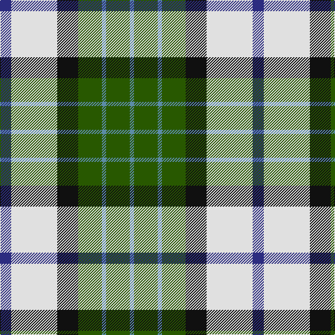

In pattern [BGBGKWB](/stripes/bgbgkwb/).

This was sourced from register-of-tartans.  It is a [7 stripe tartan](/stripes/stripes7/).

Original link https://www.tartanregister.gov.uk/tartanDetails.aspx?ref=2761

## Attestations

This cloth appears in 2 source records; the oldest owns this page.

- 01/06/1997 — MacRobart Dress (Personal) (register-of-tartans, [record](https://www.tartanregister.gov.uk/tartanDetails.aspx?ref=2761))
- June 1997 — MacRobart Dress (Personal) (tartans-authority, [record](http://www.tartansauthority.com/tartan-ferret/display/2399/))

## Register references

External register numbers recorded for this tartan.

- Scottish Register of Tartans: [2761](https://www.tartanregister.gov.uk/tartanDetails.aspx?ref=2761)
- Scottish Tartans Authority (ITI): 2399
- Scottish Tartans World Register: 2399

## Thread count
DB/16 LN66 K30 G34 B6 G34 B/6

## Palette
Each colour and the base-6 reference it is a variant of.

| Colour | Shade | Base |
|---|---|---|
| B | <code style="background-color:#5C8CA8;">#5C8CA8</code> `oklch(61.7% 0.067 235.0)` <small>#5C8CA8</small> | B <code style="background-color:#2A418A;">#2A418A</code> |
| DB | <code style="background-color:#2C2C80;">#2C2C80</code> `oklch(35.0% 0.138 276.6)` <small>#2C2C80</small> | B <code style="background-color:#2A418A;">#2A418A</code> |
| G | <code style="background-color:#285800;">#285800</code> `oklch(41.0% 0.122 135.8)` <small>#285800</small> | G <code style="background-color:#006100;">#006100</code> |
| K | <code style="background-color:#101010;">#101010</code> `oklch(17.3% 0.000 89.9)` <small>#101010</small> | K <code style="background-color:#000000;">#000000</code> |
| LN | <code style="background-color:#E0E0E0;">#E0E0E0</code> `oklch(90.7% 0.000 89.9)` <small>#E0E0E0</small> | W <code style="background-color:#F7F7F7;">#F7F7F7</code> |

# Sample pattern

## Nearest tartans

The nearest existing variants by ΔTartan distance.

1. [MacRobart, dress](/setts/s7/db8w33k15g17t3g17t3~x2/) — ΔT 0.52
1. [Inverary](/setts/s6/dg10k1db13k3w9ly3~x2/) — ΔT 0.84
1. [Hackett, William (Coatbridge) (Personal)](/setts/s8/k20w4r4w20dg20w5dg2g2~x2/) — ΔT 0.84
1. [Alexander Brothers - 2007? (Corp.)](/setts/s8/g5ly2t20w2k20w20k2w5~x2/) — ΔT 0.88
1. [Northern Ontario](/setts/s7/dy17g5db2w12db2ly4g7~x4/) — ΔT 0.92
1. [Inverary Clan Tartan Tartan Number: 772. Earliest known date: pre 2003 From a miniature of Elizabeth Innes at (sic) Edingight from Adam See products available Copyright © Blair Urquhart, Comrie, 2015](/setts/s6/g10k1db13k3w9ly3~x2/) — ΔT 0.92
1. [Ainslie, Lake](/setts/s7/db6w10g10r2ly3r1db3~x2/) — ΔT 0.94
1. [MacLaren Dress](/setts/s8/db2w12k8g8r2g8k1lo2~x2/) — ΔT 1.01
1. [Bannockbane Dark Green](/setts/s7/dg4g3dg24w15lo21g3lo4~x2/) — ΔT 1.03
1. [National Trust Corporate Tartan Tartan Number: 2117. Earliest known date: pre 1991 Sent in by Tweedmill for information. See products available Copyright © Blair Urquhart, Comrie, 2015](/setts/s8/dg2do8dg8r3do1w12dg2y1~x2/) — ΔT 1.05

## Neighbour map

Every grey dot is one of 14299 variants placed by the first two principal components of the ΔTartan feature space (44% of its variance). Red is this tartan; blue dots are its nearest — click one to open its page.

<svg viewBox="0 0 640 380" role="img" style="max-width:100%;height:auto;border:1px solid #e0e0e0;border-radius:4px;display:block" xmlns="http://www.w3.org/2000/svg"><image href="/nn/cloud.v1.png" width="640" height="380"/><a href="/setts/s7/db8w33k15g17t3g17t3~x2/"><circle cx="105.4" cy="172.8" r="4" fill="#3465a4"><title>MacRobart, dress</title></circle></a><a href="/setts/s6/dg10k1db13k3w9ly3~x2/"><circle cx="103.3" cy="179.7" r="4" fill="#3465a4"><title>Inverary</title></circle></a><a href="/setts/s8/k20w4r4w20dg20w5dg2g2~x2/"><circle cx="122.6" cy="152.3" r="4" fill="#3465a4"><title>Hackett, William (Coatbridge) (Personal)</title></circle></a><a href="/setts/s8/g5ly2t20w2k20w20k2w5~x2/"><circle cx="120.7" cy="153.5" r="4" fill="#3465a4"><title>Alexander Brothers - 2007? (Corp.)</title></circle></a><a href="/setts/s7/dy17g5db2w12db2ly4g7~x4/"><circle cx="103.4" cy="175.6" r="4" fill="#3465a4"><title>Northern Ontario</title></circle></a><a href="/setts/s6/g10k1db13k3w9ly3~x2/"><circle cx="106.9" cy="181.0" r="4" fill="#3465a4"><title>Inverary Clan Tartan Tartan Number: 772. Earliest known date: pre 2003 From a miniature of Elizabeth Innes at (sic) Edingight from Adam See products available Copyright © Blair Urquhart, Comrie, 2015</title></circle></a><a href="/setts/s7/db6w10g10r2ly3r1db3~x2/"><circle cx="72.8" cy="171.0" r="4" fill="#3465a4"><title>Ainslie, Lake</title></circle></a><a href="/setts/s8/db2w12k8g8r2g8k1lo2~x2/"><circle cx="98.0" cy="144.7" r="4" fill="#3465a4"><title>MacLaren Dress</title></circle></a><a href="/setts/s7/dg4g3dg24w15lo21g3lo4~x2/"><circle cx="144.8" cy="184.5" r="4" fill="#3465a4"><title>Bannockbane Dark Green</title></circle></a><a href="/setts/s8/dg2do8dg8r3do1w12dg2y1~x2/"><circle cx="123.0" cy="151.9" r="4" fill="#3465a4"><title>National Trust Corporate Tartan Tartan Number: 2117. Earliest known date: pre 1991 Sent in by Tweedmill for information. See products available Copyright © Blair Urquhart, Comrie, 2015</title></circle></a><circle cx="114.9" cy="174.8" r="5" fill="#c00000"/></svg>

ID: /setts/s7/db8w33k15dg17t3dg17t3~x2/
