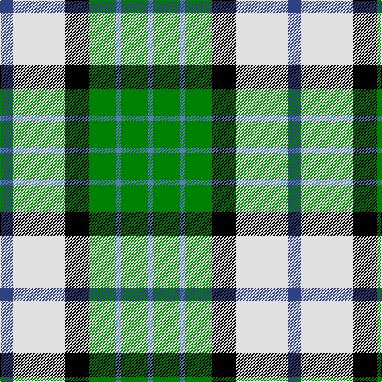

This page is one **sett** — a single exact thread-count. It belongs to the [tartan](/tartans/db8w33k15g17t3g17t3/)
(the same proportion at any scale), whose colour order is pattern [BGBGKWB](/stripes/bgbgkwb/).

Sourced from weddslist.  It is a [7 stripe tartan](/stripes/stripes7/).

Original link http://www.weddslist.com/cgi-bin/tartans/pg.pl?source=sts

## Thread count
B/16 LN66 K30 G34 Ba6 G34 Ba/6

## Palette

Palette: <strong>Tartan Register</strong> <small style="color:#888">(2 of 5 colours)</small>
<table><thead><tr><th>Colour</th><th>Threads</th><th>Shade</th><th>Base</th><th>OKLCh</th></tr></thead><tbody><tr><td>B/</td><td style="text-align:right;font-variant-numeric:tabular-nums">16</td><td><code style="background-color:#304080;">#304080</code> <small style="color:#888">#304080</small></td><td>B <code style="background-color:#2A418A;">#2A418A</code></td><td><small style="color:#888">oklch(39.4% 0.109 270.2)</small></td></tr><tr><td>LN</td><td style="text-align:right;font-variant-numeric:tabular-nums">66</td><td><code style="background-color:#E0E0E0;">#E0E0E0</code> <small style="color:#888">#E0E0E0</small></td><td>W <code style="background-color:#F7F7F7;">#F7F7F7</code></td><td><small style="color:#888">oklch(90.7% 0.000 89.9)</small></td></tr><tr><td>K</td><td style="text-align:right;font-variant-numeric:tabular-nums">30</td><td><code style="background-color:#000000;">#000000</code> <small style="color:#888">#000000</small></td><td>K <code style="background-color:#000000;">#000000</code></td><td><small style="color:#888">oklch(0.0% 0.000 0.0)</small></td></tr><tr><td>G</td><td style="text-align:right;font-variant-numeric:tabular-nums">34</td><td><code style="background-color:#008000;">#008000</code> <small style="color:#888">#008000</small></td><td>G <code style="background-color:#006100;">#006100</code></td><td><small style="color:#888">oklch(52.0% 0.177 142.5)</small></td></tr><tr><td>Ba</td><td style="text-align:right;font-variant-numeric:tabular-nums">6</td><td><code style="background-color:#5480B0;">#5480B0</code> <small style="color:#888">#5480B0</small></td><td>B <code style="background-color:#2A418A;">#2A418A</code></td><td><small style="color:#888">oklch(58.8% 0.089 251.5)</small></td></tr><tr><td>G</td><td style="text-align:right;font-variant-numeric:tabular-nums">34</td><td><code style="background-color:#008000;">#008000</code> <small style="color:#888">#008000</small></td><td>G <code style="background-color:#006100;">#006100</code></td><td><small style="color:#888">oklch(52.0% 0.177 142.5)</small></td></tr><tr><td>Ba/</td><td style="text-align:right;font-variant-numeric:tabular-nums">6</td><td><code style="background-color:#5480B0;">#5480B0</code> <small style="color:#888">#5480B0</small></td><td>B <code style="background-color:#2A418A;">#2A418A</code></td><td><small style="color:#888">oklch(58.8% 0.089 251.5)</small></td></tr></tbody></table>

# Sample pattern

## Nearest tartans

The nearest existing variants by ΔTartan distance, with this tartan at the top so the swatches line up against it.

ΔTartan

Tartan

Sett

—

<a href="/ttd/edit/#slug=db8w33k15g17t3g17t3~x2">MacRobart, dress</a> <a class="nn-out" href="/setts/s7/db8w33k15g17t3g17t3~x2/" title="open its dictionary page">↗</a>

0.52

<a href="/ttd/edit/#slug=db8w33k15dg17t3dg17t3~x2">MacRobart Dress (Personal)</a> <a class="nn-out" href="/setts/s7/db8w33k15dg17t3dg17t3~x2/" title="open its dictionary page">↗</a>

0.89

<a href="/ttd/edit/#slug=k20w4r4w20dg20w5dg2g2~x2">Hackett, William (Coatbridge) (Personal)</a> <a class="nn-out" href="/setts/s8/k20w4r4w20dg20w5dg2g2~x2/" title="open its dictionary page">↗</a>

1.08

<a href="/ttd/edit/#slug=w7r1w14k6lo2k6g14r2g10lo1~x2">Spanish shirt</a> <a class="nn-out" href="/setts/s10/w7r1w14k6lo2k6g14r2g10lo1~x2/" title="open its dictionary page">↗</a>

1.11

<a href="/ttd/edit/#slug=g5ly2t20w2k20w20k2w5~x2">Alexander Brothers - 2007? (Corp.)</a> <a class="nn-out" href="/setts/s8/g5ly2t20w2k20w20k2w5~x2/" title="open its dictionary page">↗</a>

1.14

<a href="/ttd/edit/#slug=t13r1g13w1k1w7k3~x2">Chambers, Christopher J (Personal)</a> <a class="nn-out" href="/setts/s7/t13r1g13w1k1w7k3~x2/" title="open its dictionary page">↗</a>

1.16

<a href="/ttd/edit/#slug=dg4g3dg24w15lo21gi3lo4~x2">Bannockbane Dark Green</a> <a class="nn-out" href="/setts/s7/dg4g3dg24w15lo21gi3lo4~x2/" title="open its dictionary page">↗</a>

1.16

<a href="/ttd/edit/#slug=dg10k1db13k3w9ly3~x2">Inverary</a> <a class="nn-out" href="/setts/s6/dg10k1db13k3w9ly3~x2/" title="open its dictionary page">↗</a>

1.16

<a href="/ttd/edit/#slug=db6w10g10r2ly3r1db3~x2">Ainslie, Lake</a> <a class="nn-out" href="/setts/s7/db6w10g10r2ly3r1db3~x2/" title="open its dictionary page">↗</a>

1.17

<a href="/ttd/edit/#slug=k4g23k23g2w23b4~x2">MacKay Dress</a> <a class="nn-out" href="/setts/s6/k4g23k23g2w23b4~x2/" title="open its dictionary page">↗</a>

1.19

<a href="/ttd/edit/#slug=db4w2db1w18dg18g18ly3g4~x2">Gigha, Green (Dance)</a> <a class="nn-out" href="/setts/s8/db4w2db1w18dg18g18ly3g4~x2/" title="open its dictionary page">↗</a>

## Neighbour map

Every grey dot is one of 14359 variants placed by the first two principal components of the ΔTartan feature space (44% of its variance). Red is this tartan; blue dots are its nearest — click one to open its page.

<svg viewBox="0 0 640 380" role="img" style="max-width:100%;height:auto;border:1px solid #e0e0e0;border-radius:4px;display:block" xmlns="http://www.w3.org/2000/svg"><image href="/nn/cloud.v1.png" width="640" height="380"/><a href="/setts/s7/db8w33k15dg17t3dg17t3~x2/"><circle cx="114.3" cy="175.9" r="4" fill="#3465a4"><title>MacRobart Dress (Personal)</title></circle></a><a href="/setts/s8/k20w4r4w20dg20w5dg2g2~x2/"><circle cx="121.9" cy="153.3" r="4" fill="#3465a4"><title>Hackett, William (Coatbridge) (Personal)</title></circle></a><a href="/setts/s10/w7r1w14k6lo2k6g14r2g10lo1~x2/"><circle cx="126.9" cy="144.2" r="4" fill="#3465a4"><title>Spanish shirt</title></circle></a><a href="/setts/s8/g5ly2t20w2k20w20k2w5~x2/"><circle cx="120.1" cy="154.5" r="4" fill="#3465a4"><title>Alexander Brothers - 2007? (Corp.)</title></circle></a><a href="/setts/s7/t13r1g13w1k1w7k3~x2/"><circle cx="138.5" cy="157.0" r="4" fill="#3465a4"><title>Chambers, Christopher J (Personal)</title></circle></a><a href="/setts/s7/dg4g3dg24w15lo21gi3lo4~x2/"><circle cx="144.3" cy="185.5" r="4" fill="#3465a4"><title>Bannockbane Dark Green</title></circle></a><a href="/setts/s6/dg10k1db13k3w9ly3~x2/"><circle cx="102.9" cy="180.8" r="4" fill="#3465a4"><title>Inverary</title></circle></a><a href="/setts/s7/db6w10g10r2ly3r1db3~x2/"><circle cx="72.2" cy="172.2" r="4" fill="#3465a4"><title>Ainslie, Lake</title></circle></a><a href="/setts/s6/k4g23k23g2w23b4~x2/"><circle cx="144.1" cy="196.0" r="4" fill="#3465a4"><title>MacKay Dress</title></circle></a><a href="/setts/s8/db4w2db1w18dg18g18ly3g4~x2/"><circle cx="136.1" cy="141.1" r="4" fill="#3465a4"><title>Gigha, Green (Dance)</title></circle></a><circle cx="104.9" cy="173.9" r="5" fill="#c00000"/></svg>

ID: /setts/s7/db8w33k15g17t3g17t3~x2/
