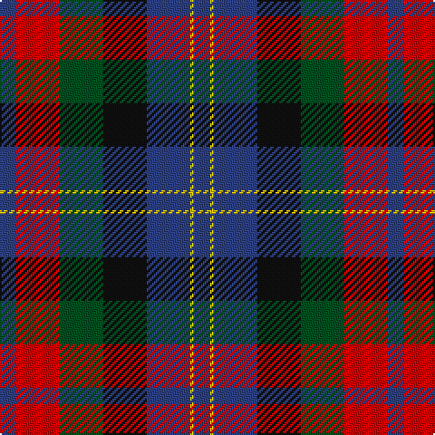

In pattern [BRGKBYB](/stripes/brgkbyb/).

This was sourced from register-of-tartans.  It is a [7 stripe tartan](/stripes/stripes7/).

Original link https://www.tartanregister.gov.uk/tartanDetails.aspx?ref=1026

## Register references

External register numbers recorded for this tartan.

- Scottish Register of Tartans: [1026](https://www.tartanregister.gov.uk/tartanDetails.aspx?ref=1026)
- Scottish Tartans World Register: 501

## Thread count
B/9 R24 G24 K24 B24 Y2 B/9

## Palette
Each colour and the base-6 reference it is a variant of.

| Colour | Shade | Base |
|---|---|---|
| B | <code style="background-color:#2C4084;">#2C4084</code> `oklch(39.4% 0.117 268.3)` <small>#2C4084</small> | B <code style="background-color:#2A418A;">#2A418A</code> |
| G | <code style="background-color:#005020;">#005020</code> `oklch(37.7% 0.105 149.6)` <small>#005020</small> | G <code style="background-color:#006100;">#006100</code> |
| K | <code style="background-color:#101010;">#101010</code> `oklch(17.3% 0.000 89.9)` <small>#101010</small> | K <code style="background-color:#000000;">#000000</code> |
| R | <code style="background-color:#DC0000;">#DC0000</code> `oklch(56.2% 0.230 29.2)` <small>#DC0000</small> | R <code style="background-color:#CC0000;">#CC0000</code> |
| Y | <code style="background-color:#E8C000;">#E8C000</code> `oklch(81.9% 0.168 93.7)` <small>#E8C000</small> | Y <code style="background-color:#F2BF00;">#F2BF00</code> |

# Sample pattern

## Nearest tartans

The nearest existing variants by ΔTartan distance.

1. [MacLaren #2](/setts/s7/dp9k7dg5r4dg7k1ly1~x2/) — ΔT 0.57
1. [St. Clement of Rome (Corporate)](/setts/s8/db18k5r26k5g25k5db18ly2~x2/) — ΔT 0.91
1. [Patterson, John (Personal)](/setts/s6/g3db12w1dg12r12dg2~x2/) — ΔT 0.96
1. [Martin Hunting](/setts/s5/dp20k5k19g19ly2~x2/) — ΔT 1.04
1. [Patterson, John (Personal)](/setts/s6/dg3db12w1dg12r12dg2~x2/) — ΔT 1.04
1. [Patterson (Red) Clan Tartan Tartan Number: 2191. Earliest known date: 1993 A personal tartan designed by Marge Warren for a John Patterson. No other details known. See products available Copyright © Blair Urquhart, Comrie, 2015](/setts/s10/db12w1dg12r12dg2r12dg12w1db12g3~x2/) — ΔT 1.04
1. [Dundas](/setts/s7/db9r24g24k24db24ly2db9/) — ΔT 1.06
1. [Thompson's Fancy Personal Tartan Tartan Number: 286. Earliest known date: pre 2003 Designed for his own use. See products available Copyright © Blair Urquhart, Comrie, 2015](/setts/s6/r2dy8db2t4k4t1~x6/) — ΔT 1.07
1. [Thom(p)son's, Fancy](/setts/s6/r2o8db2t4k4t1~x6/) — ΔT 1.11
1. [Rose Hunting Clan Tartan Tartan Number: 1226. Earliest known date: 1831 First recorded in James Logan's, 'The Scottish Gael' in 1831. See products available Copyright © Blair Urquhart, Comrie, 2015](/setts/s6/k4w1g10k10db10r2~x2/) — ΔT 1.19

## Neighbour map

Every grey dot is one of 14299 variants placed by the first two principal components of the ΔTartan feature space (44% of its variance). Red is this tartan; blue dots are its nearest — click one to open its page.

<svg viewBox="0 0 640 380" role="img" style="max-width:100%;height:auto;border:1px solid #e0e0e0;border-radius:4px;display:block" xmlns="http://www.w3.org/2000/svg"><image href="/nn/cloud.v1.png" width="640" height="380"/><a href="/setts/s7/dp9k7dg5r4dg7k1ly1~x2/"><circle cx="143.7" cy="220.9" r="4" fill="#3465a4"><title>MacLaren #2</title></circle></a><a href="/setts/s8/db18k5r26k5g25k5db18ly2~x2/"><circle cx="158.9" cy="185.2" r="4" fill="#3465a4"><title>St. Clement of Rome (Corporate)</title></circle></a><a href="/setts/s6/g3db12w1dg12r12dg2~x2/"><circle cx="169.2" cy="199.7" r="4" fill="#3465a4"><title>Patterson, John (Personal)</title></circle></a><a href="/setts/s5/dp20k5k19g19ly2~x2/"><circle cx="138.1" cy="228.6" r="4" fill="#3465a4"><title>Martin Hunting</title></circle></a><a href="/setts/s6/dg3db12w1dg12r12dg2~x2/"><circle cx="163.3" cy="195.6" r="4" fill="#3465a4"><title>Patterson, John (Personal)</title></circle></a><a href="/setts/s10/db12w1dg12r12dg2r12dg12w1db12g3~x2/"><circle cx="154.6" cy="185.2" r="4" fill="#3465a4"><title>Patterson (Red) Clan Tartan Tartan Number: 2191. Earliest known date: 1993 A personal tartan designed by Marge Warren for a John Patterson. No other details known. See products available Copyright © Blair Urquhart, Comrie, 2015</title></circle></a><a href="/setts/s7/db9r24g24k24db24ly2db9/"><circle cx="119.8" cy="202.6" r="4" fill="#3465a4"><title>Dundas</title></circle></a><a href="/setts/s6/r2dy8db2t4k4t1~x6/"><circle cx="163.3" cy="225.3" r="4" fill="#3465a4"><title>Thompson's Fancy Personal Tartan Tartan Number: 286. Earliest known date: pre 2003 Designed for his own use. See products available Copyright © Blair Urquhart, Comrie, 2015</title></circle></a><a href="/setts/s6/r2o8db2t4k4t1~x6/"><circle cx="135.4" cy="210.8" r="4" fill="#3465a4"><title>Thom(p)son's, Fancy</title></circle></a><a href="/setts/s6/k4w1g10k10db10r2~x2/"><circle cx="170.6" cy="225.3" r="4" fill="#3465a4"><title>Rose Hunting Clan Tartan Tartan Number: 1226. Earliest known date: 1831 First recorded in James Logan's, 'The Scottish Gael' in 1831. See products available Copyright © Blair Urquhart, Comrie, 2015</title></circle></a><circle cx="148.2" cy="215.0" r="5" fill="#c00000"/></svg>

ID: /setts/s7/db9r24dg24k24db24ly2db9/
