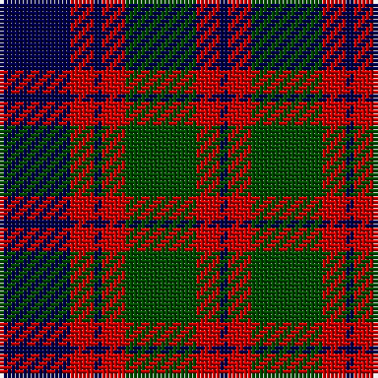

**Bands:** [BRGRBRB](/stripes/brgrbrb/) · **Stripes:** [DB R DG R DB R DB](/stripes/stripes7/) DB R DG R DB R DB

This was sourced from weddslist.  It is a [7 band tartan](/bands/bands7/).

Original link http://www.weddslist.com/cgi-bin/tartans/pg.pl?source=rb

## Attestations

This cloth appears in 3 source records; the oldest owns this page.

- undated — Skene (weddslist, [record](http://www.weddslist.com/cgi-bin/tartans/pg.pl?source=rb))
- undated — Skene (weddslist, [record](http://www.weddslist.com/cgi-bin/tartans/pg.pl?source=tinsel))
- undated — Skene (weddslist, [record](http://www.weddslist.com/cgi-bin/tartans/pg.pl?source=x))

## Register references

External register numbers recorded for this tartan.

- Scottish Register of Tartans: [1166](https://www.tartanregister.gov.uk/tartanDetails.aspx?ref=1166)
- Scottish Register of Tartans: [1510](https://www.tartanregister.gov.uk/tartanDetails.aspx?ref=1510)
- Scottish Register of Tartans: [1758](https://www.tartanregister.gov.uk/tartanDetails.aspx?ref=1758)
- Scottish Register of Tartans: [2307](https://www.tartanregister.gov.uk/tartanDetails.aspx?ref=2307)
- Scottish Register of Tartans: [2349](https://www.tartanregister.gov.uk/tartanDetails.aspx?ref=2349)
- Scottish Register of Tartans: [2540](https://www.tartanregister.gov.uk/tartanDetails.aspx?ref=2540)
- Scottish Register of Tartans: [2582](https://www.tartanregister.gov.uk/tartanDetails.aspx?ref=2582)
- Scottish Register of Tartans: [2585](https://www.tartanregister.gov.uk/tartanDetails.aspx?ref=2585)
- Scottish Register of Tartans: [2625](https://www.tartanregister.gov.uk/tartanDetails.aspx?ref=2625)
- Scottish Register of Tartans: [2666](https://www.tartanregister.gov.uk/tartanDetails.aspx?ref=2666)
- Scottish Register of Tartans: [2730](https://www.tartanregister.gov.uk/tartanDetails.aspx?ref=2730)
- Scottish Register of Tartans: [2862](https://www.tartanregister.gov.uk/tartanDetails.aspx?ref=2862)
- Scottish Register of Tartans: [3072](https://www.tartanregister.gov.uk/tartanDetails.aspx?ref=3072)
- Scottish Register of Tartans: [3555](https://www.tartanregister.gov.uk/tartanDetails.aspx?ref=3555)
- Scottish Register of Tartans: [3808](https://www.tartanregister.gov.uk/tartanDetails.aspx?ref=3808)
- Scottish Register of Tartans: [4925](https://www.tartanregister.gov.uk/tartanDetails.aspx?ref=4925)
- Scottish Register of Tartans: [696](https://www.tartanregister.gov.uk/tartanDetails.aspx?ref=696)
- Scottish Register of Tartans: [697](https://www.tartanregister.gov.uk/tartanDetails.aspx?ref=697)
- Scottish Register of Tartans: [982](https://www.tartanregister.gov.uk/tartanDetails.aspx?ref=982)
- Scottish Tartans Authority (ITI): 1277
- Scottish Tartans Authority (ITI): 1429
- Scottish Tartans Authority (ITI): 218
- Scottish Tartans Authority (ITI): 977
- Scottish Tartans World Register: 1010
- Scottish Tartans World Register: 1042
- Scottish Tartans World Register: 127
- Scottish Tartans World Register: 1277
- Scottish Tartans World Register: 1399
- Scottish Tartans World Register: 1429
- Scottish Tartans World Register: 1585
- Scottish Tartans World Register: 1593
- Scottish Tartans World Register: 218
- Scottish Tartans World Register: 2218
- Scottish Tartans World Register: 3061
- Scottish Tartans World Register: 441
- Scottish Tartans World Register: 737
- Scottish Tartans World Register: 858
- Scottish Tartans World Register: 864
- Scottish Tartans World Register: 873
- Scottish Tartans World Register: 897
- Scottish Tartans World Register: 977
- Scottish Tartans World Register: 978

## Variants

Other setts woven to the same stripe pattern.

- [Logan](/setts/s7/db8r3db1r3dg14r3db1~x4/)

## Thread count
DB/18 R6 DB2 R6 G18 R6 DB/2

## Palette
Each colour and its ΔE from the base-6 reference it is a variant of.

| Colour | Shade | Base | ΔE (OKLab) |
|---|---|---|---|
| DB | <code style="background-color:#00004C;">#00004C</code> `#00004C` | B <code style="background-color:#2A418A;">#2A418A</code> | 0.21 |
| G | <code style="background-color:#004C00;">#004C00</code> `#004C00` | G <code style="background-color:#006100;">#006100</code> | 0.07 |
| R | <code style="background-color:#C80000;">#C80000</code> `#C80000` | R <code style="background-color:#CC0000;">#CC0000</code> | 0.01 |

# Sample pattern

## Nearest tartans

The nearest existing variants by ΔTartan distance.

1. [Logan - 1810 (Cockburn Collection)](/setts/s7/k14r6k2r6dg25r6k2~x2/) — ΔT 0.95
1. [Unidentified #61](/setts/s8/db3db1g5db3r9db1r1db2~x4/) — ΔT 1.06
1. [MacKay, Plaid](/setts/s6/k14g80k80g9p82g14/) — ΔT 1.09
1. [Remony (Red)](/setts/s8/r17db2r2db13r2db2g17db2~x2/) — ΔT 1.10
1. [Skene D](/setts/s7/db9r6dg2r6dg18r6dg2/) — ΔT 1.16
1. [Utah (US State)](/setts/s8/w2r3dg9r3db2r3db3w1~x6/) — ΔT 1.17
1. [Edinburgh International Conference Centre](/setts/s6/o4db19o3k20o24db3~x2/) — ΔT 1.18
1. [Logan #5](/setts/s6/db9r3db1g9r3db1~x2/) — ΔT 1.20
1. [Gordon of Esslemont](/setts/s7/ly6dg3ly3dg22k23dp23k4~x2/) — ΔT 1.26
1. [Logan (Dark)](/setts/s7/k15r4k1r4dg15r4k1~x4/) — ΔT 1.27

## Neighbour map

Every grey dot is one of 14299 variants placed by the first two principal components of the ΔTartan feature space (44% of its variance). Red is this tartan; blue dots are its nearest — click one to open its page.

<svg viewBox="0 0 640 380" role="img" style="max-width:100%;height:auto;border:1px solid #e0e0e0;border-radius:4px;display:block" xmlns="http://www.w3.org/2000/svg"><image href="/nn/cloud.v1.png" width="640" height="380"/><a href="/setts/s7/k14r6k2r6dg25r6k2~x2/"><circle cx="250.3" cy="206.4" r="4" fill="#3465a4"><title>Logan - 1810 (Cockburn Collection)</title></circle></a><a href="/setts/s8/db3db1g5db3r9db1r1db2~x4/"><circle cx="217.9" cy="207.9" r="4" fill="#3465a4"><title>Unidentified #61</title></circle></a><a href="/setts/s6/k14g80k80g9p82g14/"><circle cx="190.2" cy="230.3" r="4" fill="#3465a4"><title>MacKay, Plaid</title></circle></a><a href="/setts/s8/r17db2r2db13r2db2g17db2~x2/"><circle cx="248.3" cy="222.1" r="4" fill="#3465a4"><title>Remony (Red)</title></circle></a><a href="/setts/s7/db9r6dg2r6dg18r6dg2/"><circle cx="256.1" cy="233.3" r="4" fill="#3465a4"><title>Skene D</title></circle></a><a href="/setts/s8/w2r3dg9r3db2r3db3w1~x6/"><circle cx="158.7" cy="206.3" r="4" fill="#3465a4"><title>Utah (US State)</title></circle></a><a href="/setts/s6/o4db19o3k20o24db3~x2/"><circle cx="153.4" cy="222.8" r="4" fill="#3465a4"><title>Edinburgh International Conference Centre</title></circle></a><a href="/setts/s6/db9r3db1g9r3db1~x2/"><circle cx="260.7" cy="242.6" r="4" fill="#3465a4"><title>Logan #5</title></circle></a><a href="/setts/s7/ly6dg3ly3dg22k23dp23k4~x2/"><circle cx="148.7" cy="217.0" r="4" fill="#3465a4"><title>Gordon of Esslemont</title></circle></a><a href="/setts/s7/k15r4k1r4dg15r4k1~x4/"><circle cx="268.6" cy="207.0" r="4" fill="#3465a4"><title>Logan (Dark)</title></circle></a><circle cx="219.0" cy="228.4" r="5" fill="#c00000"/></svg>

ID: /setts/s7/db9r3db1r3dg9r3db1~x2/
