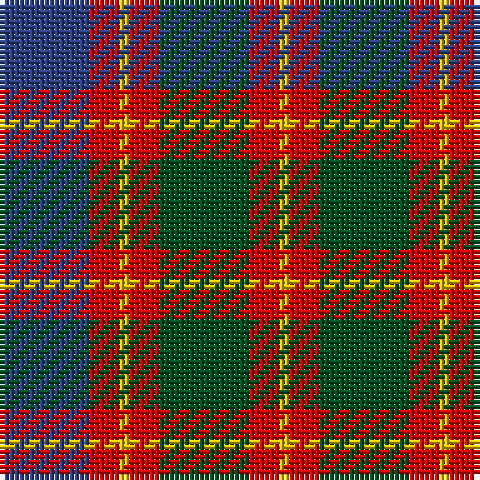

This page is one **sett** — a single exact thread-count. It belongs to the [tartan](/tartans/b9r3y1r3g9r3y1/)
(the same proportion at any scale), whose colour order is pattern [BRYRGRY](/stripes/bryrgry/).

Sourced from register-of-tartans.  It is a [7 stripe tartan](/stripes/stripes7/).

Original link https://www.tartanregister.gov.uk/tartanDetails.aspx?ref=2182

## Also known as

This cloth is also recorded under:

- Logan #2

## Register references

External register numbers recorded for this tartan.

- Scottish Register of Tartans: [2182](https://www.tartanregister.gov.uk/tartanDetails.aspx?ref=2182)
- Scottish Tartans World Register: 591

## Thread count
B/18 R6 Y2 R6 G18 R6 Y/2

## Palette
Each colour and the base-6 reference it is a variant of.

| Colour | Shade | Base |
|---|---|---|
| B | <code style="background-color:#2C4084;">#2C4084</code> `oklch(39.4% 0.117 268.3)` <small>#2C4084</small> | B <code style="background-color:#2A418A;">#2A418A</code> |
| G | <code style="background-color:#005020;">#005020</code> `oklch(37.7% 0.105 149.6)` <small>#005020</small> | G <code style="background-color:#006100;">#006100</code> |
| R | <code style="background-color:#DC0000;">#DC0000</code> `oklch(56.2% 0.230 29.2)` <small>#DC0000</small> | R <code style="background-color:#CC0000;">#CC0000</code> |
| Y | <code style="background-color:#E8C000;">#E8C000</code> `oklch(81.9% 0.168 93.7)` <small>#E8C000</small> | Y <code style="background-color:#F2BF00;">#F2BF00</code> |

# Sample pattern

## Nearest tartans

The nearest existing variants by ΔTartan distance, with this tartan at the top so the swatches line up against it.

ΔTartan

Tartan

Sett

—

<a href="/ttd/edit/#slug=db9r3ly1r3dg9r3ly1~x2">Logan #2</a> <a class="nn-out" href="/setts/s7/db9r3ly1r3dg9r3ly1~x2/" title="open its dictionary page">↗</a>

0.59

<a href="/ttd/edit/#slug=db9r3ly1r3g9r3ly1~x2">Logan</a> <a class="nn-out" href="/setts/s7/db9r3ly1r3g9r3ly1~x2/" title="open its dictionary page">↗</a>

0.74

<a href="/ttd/edit/#slug=r33g17db50g17r11g17r9k7">Carnegie</a> <a class="nn-out" href="/setts/s8/r33g17db50g17r11g17r9k7/" title="open its dictionary page">↗</a>

0.80

<a href="/ttd/edit/#slug=r33dg17db50dg17r11dg17r9k7">Carnegie #3</a> <a class="nn-out" href="/setts/s8/r33dg17db50dg17r11dg17r9k7/" title="open its dictionary page">↗</a>

0.97

<a href="/ttd/edit/#slug=r3y27k6lo13k14r3~x2">Thompson/Thomson/MacTavish special grey</a> <a class="nn-out" href="/setts/s6/r3y27k6lo13k14r3~x2/" title="open its dictionary page">↗</a>

0.97

<a href="/ttd/edit/#slug=p11o2p2o2p2o11g14w2~x2">Lamont</a> <a class="nn-out" href="/setts/s8/p11o2p2o2p2o11g14w2~x2/" title="open its dictionary page">↗</a>

1.01

<a href="/ttd/edit/#slug=w2r3dg9r3db2r3db3w1~x6">Utah (US State)</a> <a class="nn-out" href="/setts/s8/w2r3dg9r3db2r3db3w1~x6/" title="open its dictionary page">↗</a>

1.03

<a href="/ttd/edit/#slug=db1o8w1db4r8w1~x6">Little's (Corporate)</a> <a class="nn-out" href="/setts/s6/db1o8w1db4r8w1~x6/" title="open its dictionary page">↗</a>

1.07

<a href="/ttd/edit/#slug=o2dr14o1k14o14ly2~x2">United Distillers</a> <a class="nn-out" href="/setts/s6/o2dr14o1k14o14ly2~x2/" title="open its dictionary page">↗</a>

1.08

<a href="/ttd/edit/#slug=r3db12r4g18r6k2~x2">Eyre (Personal)</a> <a class="nn-out" href="/setts/s6/r3db12r4g18r6k2~x2/" title="open its dictionary page">↗</a>

1.10

<a href="/ttd/edit/#slug=ly5g22dp15dp11dp5g2~x2">Scottish Ballet</a> <a class="nn-out" href="/setts/s6/ly5g22dp15dp11dp5g2~x2/" title="open its dictionary page">↗</a>

## Neighbour map

Every grey dot is one of 14299 variants placed by the first two principal components of the ΔTartan feature space (44% of its variance). Red is this tartan; blue dots are its nearest — click one to open its page.

<svg viewBox="0 0 640 380" role="img" style="max-width:100%;height:auto;border:1px solid #e0e0e0;border-radius:4px;display:block" xmlns="http://www.w3.org/2000/svg"><image href="/nn/cloud.v1.png" width="640" height="380"/><a href="/setts/s7/db9r3ly1r3g9r3ly1~x2/"><circle cx="166.9" cy="207.0" r="4" fill="#3465a4"><title>Logan</title></circle></a><a href="/setts/s8/r33g17db50g17r11g17r9k7/"><circle cx="158.1" cy="221.0" r="4" fill="#3465a4"><title>Carnegie</title></circle></a><a href="/setts/s8/r33dg17db50dg17r11dg17r9k7/"><circle cx="171.9" cy="226.0" r="4" fill="#3465a4"><title>Carnegie #3</title></circle></a><a href="/setts/s6/r3y27k6lo13k14r3~x2/"><circle cx="192.4" cy="206.6" r="4" fill="#3465a4"><title>Thompson/Thomson/MacTavish special grey</title></circle></a><a href="/setts/s8/p11o2p2o2p2o11g14w2~x2/"><circle cx="187.2" cy="211.2" r="4" fill="#3465a4"><title>Lamont</title></circle></a><a href="/setts/s8/w2r3dg9r3db2r3db3w1~x6/"><circle cx="158.7" cy="206.3" r="4" fill="#3465a4"><title>Utah (US State)</title></circle></a><a href="/setts/s6/db1o8w1db4r8w1~x6/"><circle cx="183.9" cy="208.6" r="4" fill="#3465a4"><title>Little's (Corporate)</title></circle></a><a href="/setts/s6/o2dr14o1k14o14ly2~x2/"><circle cx="204.5" cy="193.2" r="4" fill="#3465a4"><title>United Distillers</title></circle></a><a href="/setts/s6/r3db12r4g18r6k2~x2/"><circle cx="215.7" cy="223.8" r="4" fill="#3465a4"><title>Eyre (Personal)</title></circle></a><a href="/setts/s6/ly5g22dp15dp11dp5g2~x2/"><circle cx="194.9" cy="212.8" r="4" fill="#3465a4"><title>Scottish Ballet</title></circle></a><circle cx="168.2" cy="206.1" r="5" fill="#c00000"/></svg>

ID: /setts/s7/db9r3ly1r3dg9r3ly1~x2/
