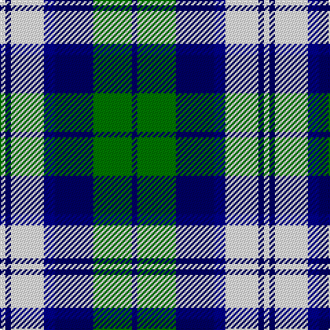

This page is one **sett** — a single exact thread-count. It belongs to the [tartan](/tartans/dbi1g7dbi7db2w6dbi1w1/)
(the same proportion at any scale), whose colour order is pattern [BGBBWBW](/stripes/bgbbwbw/).

Sourced from tartans-authority.  It is a [7 stripe tartan](/stripes/stripes7/).

Original link http://www.tartansauthority.com/tartan-ferret/display/3705/

2 attestations — the source records this cloth was collapsed from (oldest owns this page)

<ul>
<li>1972 — Blue Boy, The (Fashion) (tartans-authority, <a href="http://www.tartansauthority.com/tartan-ferret/display/3705/">record</a>)</li>
<li>undated — Blue Boy, The (register-of-tartans, <a href="https://www.tartanregister.gov.uk/tartanDetails.aspx?ref=5371">record</a>)</li>
</ul>

## Register references

External register numbers recorded for this tartan.

- Scottish Register of Tartans: [5371](https://www.tartanregister.gov.uk/tartanDetails.aspx?ref=5371)
- Scottish Tartans Authority (ITI): 3705

## Thread count
W/4 DBa4 W24 DB8 DBa28 G28 DBa/4

## Palette

Palette: <strong>Tartan Register</strong>
<table><thead><tr><th>Colour</th><th>Threads</th><th>Shade</th><th>Base</th><th>OKLCh</th></tr></thead><tbody><tr><td>W/</td><td style="text-align:right;font-variant-numeric:tabular-nums">4</td><td><code style="background-color:#FCFCFC;">#FCFCFC</code> <small style="color:#888">#FCFCFC</small></td><td>W <code style="background-color:#F7F7F7;">#F7F7F7</code></td><td><small style="color:#888">oklch(99.1% 0.000 89.9)</small></td></tr><tr><td>DBa</td><td style="text-align:right;font-variant-numeric:tabular-nums">4</td><td><code style="background-color:#000064;">#000064</code> <small style="color:#888">#000064</small></td><td>B <code style="background-color:#2A418A;">#2A418A</code></td><td><small style="color:#888">oklch(22.7% 0.158 264.1)</small></td></tr><tr><td>W</td><td style="text-align:right;font-variant-numeric:tabular-nums">24</td><td><code style="background-color:#FCFCFC;">#FCFCFC</code> <small style="color:#888">#FCFCFC</small></td><td>W <code style="background-color:#F7F7F7;">#F7F7F7</code></td><td><small style="color:#888">oklch(99.1% 0.000 89.9)</small></td></tr><tr><td>DB</td><td style="text-align:right;font-variant-numeric:tabular-nums">8</td><td><code style="background-color:#00008C;">#00008C</code> <small style="color:#888">#00008C</small></td><td>B <code style="background-color:#2A418A;">#2A418A</code></td><td><small style="color:#888">oklch(28.9% 0.200 264.1)</small></td></tr><tr><td>DBa</td><td style="text-align:right;font-variant-numeric:tabular-nums">28</td><td><code style="background-color:#000064;">#000064</code> <small style="color:#888">#000064</small></td><td>B <code style="background-color:#2A418A;">#2A418A</code></td><td><small style="color:#888">oklch(22.7% 0.158 264.1)</small></td></tr><tr><td>G</td><td style="text-align:right;font-variant-numeric:tabular-nums">28</td><td><code style="background-color:#007800;">#007800</code> <small style="color:#888">#007800</small></td><td>G <code style="background-color:#006100;">#006100</code></td><td><small style="color:#888">oklch(49.6% 0.169 142.5)</small></td></tr><tr><td>DBa/</td><td style="text-align:right;font-variant-numeric:tabular-nums">4</td><td><code style="background-color:#000064;">#000064</code> <small style="color:#888">#000064</small></td><td>B <code style="background-color:#2A418A;">#2A418A</code></td><td><small style="color:#888">oklch(22.7% 0.158 264.1)</small></td></tr></tbody></table>

# Sample pattern

## Nearest tartans

The nearest existing variants by ΔTartan distance, with this tartan at the top so the swatches line up against it.

ΔTartan

Tartan

Sett

—

<a href="/ttd/edit/#slug=dbi1g7dbi7db2w6dbi1w1~x4">Blue Boy, The (Fashion)</a> <a class="nn-out" href="/setts/s7/dbi1g7dbi7db2w6dbi1w1~x4/" title="open its dictionary page">↗</a>

0.95

<a href="/setts/s7/k2b16w2ki16w15k2w2~x2/">Strathclyde</a>

1.02

<a href="/ttd/edit/#slug=k2g13k11t4w9k2~x2">Loch Leven, Check</a> <a class="nn-out" href="/setts/s6/k2g13k11t4w9k2~x2/" title="open its dictionary page">↗</a>

1.05

<a href="/ttd/edit/#slug=db2g13db11t4w9db2~x2">Loch Leven Check Trade Tartan Tartan Number: 108. Earliest known date: 1976 Sample presented by Clan Crest Textiles Ltd in 1976. See products available Copyright © Blair Urquhart, Comrie, 2015</a> <a class="nn-out" href="/setts/s6/db2g13db11t4w9db2~x2/" title="open its dictionary page">↗</a>

1.21

<a href="/ttd/edit/#slug=b4ly2b16db15g16w3g3w4~x2">Business Air</a> <a class="nn-out" href="/setts/s8/b4ly2b16db15g16w3g3w4~x2/" title="open its dictionary page">↗</a>

1.23

<a href="/ttd/edit/#slug=k4lo2k13lo1w8b13lo2b4~x2">Bannockbane Blue #1</a> <a class="nn-out" href="/setts/s8/k4lo2k13lo1w8b13lo2b4~x2/" title="open its dictionary page">↗</a>

1.28

<a href="/ttd/edit/#slug=b1lb6db1b3k3b1~x8">Thompson (Dance)</a> <a class="nn-out" href="/setts/s6/b1lb6db1b3k3b1~x8/" title="open its dictionary page">↗</a>

1.31

<a href="/ttd/edit/#slug=k4db2k15w10b15db2b4~x2">Strathclyde</a> <a class="nn-out" href="/setts/s7/k4db2k15w10b15db2b4~x2/" title="open its dictionary page">↗</a>

1.40

<a href="/ttd/edit/#slug=lb7k2w2k2w2k2lb7t4k10w2~x4">Investors Group</a> <a class="nn-out" href="/setts/s10/lb7k2w2k2w2k2lb7t4k10w2~x4/" title="open its dictionary page">↗</a>

1.41

<a href="/ttd/edit/#slug=g6db11w8k4w8k4w8k27w4~x2">Breton District Tartan Tartan Number: 3902. Earliest known date: 2001 Commissioned by Richard Duclos of Le Coudray-Montceaux, France and produced by House of Tartan. See products available Copyright © Blair Urquhart, Comrie, 2015</a> <a class="nn-out" href="/setts/s9/g6db11w8k4w8k4w8k27w4~x2/" title="open its dictionary page">↗</a>

1.43

<a href="/ttd/edit/#slug=dg4db22dt6w10db3w6dp4dt3w4~x2">Sibbald Blue (2014)</a> <a class="nn-out" href="/setts/s9/dg4db22dt6w10db3w6dp4dt3w4~x2/" title="open its dictionary page">↗</a>

## Neighbour map

Every grey dot is one of 14359 variants placed by the first two principal components of the ΔTartan feature space (44% of its variance). Red is this tartan; blue dots are its nearest — click one to open its page.

<svg viewBox="0 0 640 380" role="img" style="max-width:100%;height:auto;border:1px solid #e0e0e0;border-radius:4px;display:block" xmlns="http://www.w3.org/2000/svg"><image href="/nn/cloud.v1.png" width="640" height="380"/><a href="/setts/s7/k2b16w2ki16w15k2w2~x2/"><circle cx="128.7" cy="189.2" r="4" fill="#3465a4"><title>Strathclyde</title></circle></a><a href="/setts/s6/k2g13k11t4w9k2~x2/"><circle cx="112.8" cy="229.3" r="4" fill="#3465a4"><title>Loch Leven, Check</title></circle></a><a href="/setts/s6/db2g13db11t4w9db2~x2/"><circle cx="131.0" cy="233.8" r="4" fill="#3465a4"><title>Loch Leven Check Trade Tartan Tartan Number: 108. Earliest known date: 1976 Sample presented by Clan Crest Textiles Ltd in 1976. See products available Copyright © Blair Urquhart, Comrie, 2015</title></circle></a><a href="/setts/s8/b4ly2b16db15g16w3g3w4~x2/"><circle cx="95.1" cy="182.8" r="4" fill="#3465a4"><title>Business Air</title></circle></a><a href="/setts/s8/k4lo2k13lo1w8b13lo2b4~x2/"><circle cx="148.8" cy="173.3" r="4" fill="#3465a4"><title>Bannockbane Blue #1</title></circle></a><a href="/setts/s6/b1lb6db1b3k3b1~x8/"><circle cx="134.2" cy="216.0" r="4" fill="#3465a4"><title>Thompson (Dance)</title></circle></a><a href="/setts/s7/k4db2k15w10b15db2b4~x2/"><circle cx="129.3" cy="209.0" r="4" fill="#3465a4"><title>Strathclyde</title></circle></a><a href="/setts/s10/lb7k2w2k2w2k2lb7t4k10w2~x4/"><circle cx="118.9" cy="201.5" r="4" fill="#3465a4"><title>Investors Group</title></circle></a><a href="/setts/s9/g6db11w8k4w8k4w8k27w4~x2/"><circle cx="158.4" cy="192.4" r="4" fill="#3465a4"><title>Breton District Tartan Tartan Number: 3902. Earliest known date: 2001 Commissioned by Richard Duclos of Le Coudray-Montceaux, France and produced by House of Tartan. See products available Copyright © Blair Urquhart, Comrie, 2015</title></circle></a><a href="/setts/s9/dg4db22dt6w10db3w6dp4dt3w4~x2/"><circle cx="122.9" cy="166.1" r="4" fill="#3465a4"><title>Sibbald Blue (2014)</title></circle></a><circle cx="115.9" cy="203.8" r="5" fill="#c00000"/></svg>

ID: /setts/s7/dbi1g7dbi7db2w6dbi1w1~x4/
