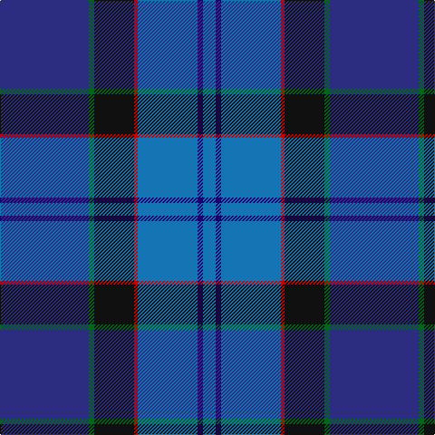

This page is one **sett** — a single exact thread-count. It belongs to the [tartan](/tartans/dbi49g3k22r2b33db3b7/)
(the same proportion at any scale), whose colour order is pattern [BBBRKGB](/stripes/bbbrkgb/).

Sourced from tartans-authority.  It is a [7 stripe tartan](/stripes/stripes7/).

Original link http://www.tartansauthority.com/tartan-ferret/display/4089/

## Register references

External register numbers recorded for this tartan.

- Scottish Tartans Authority (ITI): 4089

## Thread count
DB/98 G6 K44 R4 B66 DBa6 B/14

## Palette

Palette: <strong>Tartan Register</strong>
<table><thead><tr><th>Colour</th><th>Threads</th><th>Shade</th><th>Base</th><th>OKLCh</th></tr></thead><tbody><tr><td>DB/</td><td style="text-align:right;font-variant-numeric:tabular-nums">98</td><td><code style="background-color:#2C2C80;">#2C2C80</code> <small style="color:#888">#2C2C80</small></td><td>B <code style="background-color:#2A418A;">#2A418A</code></td><td><small style="color:#888">oklch(35.0% 0.138 276.6)</small></td></tr><tr><td>G</td><td style="text-align:right;font-variant-numeric:tabular-nums">6</td><td><code style="background-color:#006818;">#006818</code> <small style="color:#888">#006818</small></td><td>G <code style="background-color:#006100;">#006100</code></td><td><small style="color:#888">oklch(45.0% 0.142 145.0)</small></td></tr><tr><td>K</td><td style="text-align:right;font-variant-numeric:tabular-nums">44</td><td><code style="background-color:#101010;">#101010</code> <small style="color:#888">#101010</small></td><td>K <code style="background-color:#000000;">#000000</code></td><td><small style="color:#888">oklch(17.3% 0.000 89.9)</small></td></tr><tr><td>R</td><td style="text-align:right;font-variant-numeric:tabular-nums">4</td><td><code style="background-color:#C80000;">#C80000</code> <small style="color:#888">#C80000</small></td><td>R <code style="background-color:#CC0000;">#CC0000</code></td><td><small style="color:#888">oklch(52.3% 0.215 29.2)</small></td></tr><tr><td>B</td><td style="text-align:right;font-variant-numeric:tabular-nums">66</td><td><code style="background-color:#1474B4;">#1474B4</code> <small style="color:#888">#1474B4</small></td><td>B <code style="background-color:#2A418A;">#2A418A</code></td><td><small style="color:#888">oklch(54.0% 0.129 245.1)</small></td></tr><tr><td>DBa</td><td style="text-align:right;font-variant-numeric:tabular-nums">6</td><td><code style="background-color:#1C0070;">#1C0070</code> <small style="color:#888">#1C0070</small></td><td>B <code style="background-color:#2A418A;">#2A418A</code></td><td><small style="color:#888">oklch(26.3% 0.162 277.1)</small></td></tr><tr><td>B/</td><td style="text-align:right;font-variant-numeric:tabular-nums">14</td><td><code style="background-color:#1474B4;">#1474B4</code> <small style="color:#888">#1474B4</small></td><td>B <code style="background-color:#2A418A;">#2A418A</code></td><td><small style="color:#888">oklch(54.0% 0.129 245.1)</small></td></tr></tbody></table>

# Sample pattern

## Nearest tartans

The nearest existing variants by ΔTartan distance, with this tartan at the top so the swatches line up against it.

ΔTartan

Tartan

Sett

—

<a href="/ttd/edit/#slug=dbi49g3k22r2b33db3b7~x2">U.S. 2001 Air Force (Military?)</a> <a class="nn-out" href="/setts/s7/dbi49g3k22r2b33db3b7~x2/" title="open its dictionary page">↗</a>

1.26

<a href="/ttd/edit/#slug=b33db3b7db3b33r2k22g3dbi49g3k22r2~x2">U.S. 2001 Air Force</a> <a class="nn-out" href="/setts/s12/b33db3b7db3b33r2k22g3dbi49g3k22r2~x2/" title="open its dictionary page">↗</a>

1.35

<a href="/ttd/edit/#slug=lo4b8dp4k53db54w2">Pipers' Trail (Corporate)</a> <a class="nn-out" href="/setts/s6/lo4b8dp4k53db54w2/" title="open its dictionary page">↗</a>

1.37

<a href="/ttd/edit/#slug=db40b16k5bi16w2dp6~x2">MacFarland-Collins (Name)</a> <a class="nn-out" href="/setts/s6/db40b16k5bi16w2dp6~x2/" title="open its dictionary page">↗</a>

1.40

<a href="/ttd/edit/#slug=w4b44db19dbi44r2~x2">World Federation of Building Contractors</a> <a class="nn-out" href="/setts/s5/w4b44db19dbi44r2~x2/" title="open its dictionary page">↗</a>

1.43

<a href="/ttd/edit/#slug=dg24b4dg3db11dp8db37k3db2lr4~x2">Stewmann (2009) (Personal)</a> <a class="nn-out" href="/setts/s9/dg24b4dg3db11dp8db37k3db2lr4~x2/" title="open its dictionary page">↗</a>

1.45

<a href="/ttd/edit/#slug=t2g13r2k6db23w1~x4">Gamblin Thompson (Personal)</a> <a class="nn-out" href="/setts/s6/t2g13r2k6db23w1~x4/" title="open its dictionary page">↗</a>

1.45

<a href="/ttd/edit/#slug=b17lb2b3db16t28db2t3lo2~x2">Banff &amp; Buchan (District)</a> <a class="nn-out" href="/setts/s8/b17lb2b3db16t28db2t3lo2~x2/" title="open its dictionary page">↗</a>

1.46

<a href="/ttd/edit/#slug=t27db9lb3g6db33lb3dr3ly2~x2">Blue Ridge Highlands Heritage</a> <a class="nn-out" href="/setts/s8/t27db9lb3g6db33lb3dr3ly2~x2/" title="open its dictionary page">↗</a>

1.49

<a href="/ttd/edit/#slug=dp2dg8r1lo1db4dbi16lb1~x4">Ellan Vannin (1958)</a> <a class="nn-out" href="/setts/s7/dp2dg8r1lo1db4dbi16lb1~x4/" title="open its dictionary page">↗</a>

1.52

<a href="/ttd/edit/#slug=dg24t4dg3db11dp8db37k3db2r4~x2">Stewmann (Personal)</a> <a class="nn-out" href="/setts/s9/dg24t4dg3db11dp8db37k3db2r4~x2/" title="open its dictionary page">↗</a>

## Neighbour map

Every grey dot is one of 14359 variants placed by the first two principal components of the ΔTartan feature space (44% of its variance). Red is this tartan; blue dots are its nearest — click one to open its page.

<svg viewBox="0 0 640 380" role="img" style="max-width:100%;height:auto;border:1px solid #e0e0e0;border-radius:4px;display:block" xmlns="http://www.w3.org/2000/svg"><image href="/nn/cloud.v1.png" width="640" height="380"/><a href="/setts/s12/b33db3b7db3b33r2k22g3dbi49g3k22r2~x2/"><circle cx="225.4" cy="126.6" r="4" fill="#3465a4"><title>U.S. 2001 Air Force</title></circle></a><a href="/setts/s6/lo4b8dp4k53db54w2/"><circle cx="295.1" cy="149.9" r="4" fill="#3465a4"><title>Pipers' Trail (Corporate)</title></circle></a><a href="/setts/s6/db40b16k5bi16w2dp6~x2/"><circle cx="278.3" cy="186.0" r="4" fill="#3465a4"><title>MacFarland-Collins (Name)</title></circle></a><a href="/setts/s5/w4b44db19dbi44r2~x2/"><circle cx="264.9" cy="202.9" r="4" fill="#3465a4"><title>World Federation of Building Contractors</title></circle></a><a href="/setts/s9/dg24b4dg3db11dp8db37k3db2lr4~x2/"><circle cx="287.8" cy="150.8" r="4" fill="#3465a4"><title>Stewmann (2009) (Personal)</title></circle></a><a href="/setts/s6/t2g13r2k6db23w1~x4/"><circle cx="268.1" cy="149.6" r="4" fill="#3465a4"><title>Gamblin Thompson (Personal)</title></circle></a><a href="/setts/s8/b17lb2b3db16t28db2t3lo2~x2/"><circle cx="257.9" cy="185.6" r="4" fill="#3465a4"><title>Banff &amp; Buchan (District)</title></circle></a><a href="/setts/s8/t27db9lb3g6db33lb3dr3ly2~x2/"><circle cx="263.3" cy="146.6" r="4" fill="#3465a4"><title>Blue Ridge Highlands Heritage</title></circle></a><a href="/setts/s7/dp2dg8r1lo1db4dbi16lb1~x4/"><circle cx="248.1" cy="141.5" r="4" fill="#3465a4"><title>Ellan Vannin (1958)</title></circle></a><a href="/setts/s9/dg24t4dg3db11dp8db37k3db2r4~x2/"><circle cx="325.8" cy="165.8" r="4" fill="#3465a4"><title>Stewmann (Personal)</title></circle></a><circle cx="262.6" cy="159.3" r="5" fill="#c00000"/></svg>

ID: /setts/s7/dbi49g3k22r2b33db3b7~x2/
