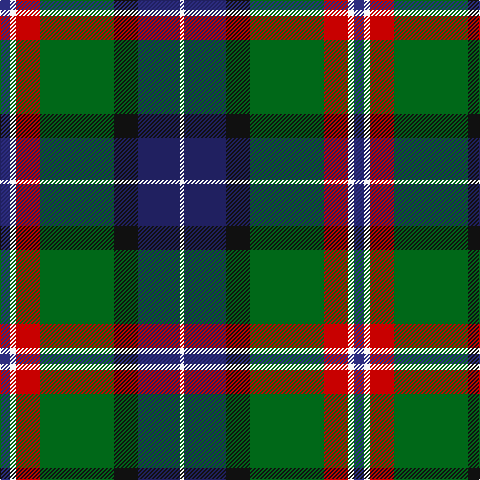

This page is one **sett** — a single exact thread-count. It belongs to the [tartan](/tartans/dbi5w3r12g37k12db21w2/)
(the same proportion at any scale), whose colour order is pattern [BWRGKBW](/stripes/bwrgkbw/).

Sourced from register-of-tartans.  It is a [7 stripe tartan](/stripes/stripes7/).

Original link https://www.tartanregister.gov.uk/tartanDetails.aspx?ref=252

2 attestations — the source records this cloth was collapsed from (oldest owns this page)

<ul>
<li>01/10/2005 — Bergen Scottish (register-of-tartans, <a href="https://www.tartanregister.gov.uk/tartanDetails.aspx?ref=252">record</a>)</li>
<li>October 2005 — Bergen Scottish (Corporate) (tartans-authority, <a href="http://www.tartansauthority.com/tartan-ferret/display/6791/">record</a>)</li>
</ul>

## Register references

External register numbers recorded for this tartan.

- Scottish Register of Tartans: [252](https://www.tartanregister.gov.uk/tartanDetails.aspx?ref=252)
- Scottish Tartans Authority (ITI): 6791

## Thread count
DBa/10 W6 R24 G74 K24 DB42 W/4

## Palette

Palette: <strong>Tartan Register</strong>
<table><thead><tr><th>Colour</th><th>Threads</th><th>Shade</th><th>Base</th><th>OKLCh</th></tr></thead><tbody><tr><td>DBa/</td><td style="text-align:right;font-variant-numeric:tabular-nums">10</td><td><code style="background-color:#2C2C80;">#2C2C80</code> <small style="color:#888">#2C2C80</small></td><td>B <code style="background-color:#2A418A;">#2A418A</code></td><td><small style="color:#888">oklch(35.0% 0.138 276.6)</small></td></tr><tr><td>W</td><td style="text-align:right;font-variant-numeric:tabular-nums">6</td><td><code style="background-color:#F8F8F8;">#F8F8F8</code> <small style="color:#888">#F8F8F8</small></td><td>W <code style="background-color:#F7F7F7;">#F7F7F7</code></td><td><small style="color:#888">oklch(97.9% 0.000 89.9)</small></td></tr><tr><td>R</td><td style="text-align:right;font-variant-numeric:tabular-nums">24</td><td><code style="background-color:#C80000;">#C80000</code> <small style="color:#888">#C80000</small></td><td>R <code style="background-color:#CC0000;">#CC0000</code></td><td><small style="color:#888">oklch(52.3% 0.215 29.2)</small></td></tr><tr><td>G</td><td style="text-align:right;font-variant-numeric:tabular-nums">74</td><td><code style="background-color:#006818;">#006818</code> <small style="color:#888">#006818</small></td><td>G <code style="background-color:#006100;">#006100</code></td><td><small style="color:#888">oklch(45.0% 0.142 145.0)</small></td></tr><tr><td>K</td><td style="text-align:right;font-variant-numeric:tabular-nums">24</td><td><code style="background-color:#101010;">#101010</code> <small style="color:#888">#101010</small></td><td>K <code style="background-color:#000000;">#000000</code></td><td><small style="color:#888">oklch(17.3% 0.000 89.9)</small></td></tr><tr><td>DB</td><td style="text-align:right;font-variant-numeric:tabular-nums">42</td><td><code style="background-color:#202060;">#202060</code> <small style="color:#888">#202060</small></td><td>B <code style="background-color:#2A418A;">#2A418A</code></td><td><small style="color:#888">oklch(28.9% 0.111 276.9)</small></td></tr><tr><td>W/</td><td style="text-align:right;font-variant-numeric:tabular-nums">4</td><td><code style="background-color:#F8F8F8;">#F8F8F8</code> <small style="color:#888">#F8F8F8</small></td><td>W <code style="background-color:#F7F7F7;">#F7F7F7</code></td><td><small style="color:#888">oklch(97.9% 0.000 89.9)</small></td></tr></tbody></table>

# Sample pattern

## Nearest tartans

The nearest existing variants by ΔTartan distance, with this tartan at the top so the swatches line up against it.

ΔTartan

Tartan

Sett

—

<a href="/ttd/edit/#slug=dbi5w3r12g37k12db21w2~x2">Bergen Scottish</a> <a class="nn-out" href="/setts/s7/dbi5w3r12g37k12db21w2~x2/" title="open its dictionary page">↗</a>

0.82

<a href="/ttd/edit/#slug=r2k6ly1dg12ly1db6lr2~x4">James (Personal)</a> <a class="nn-out" href="/setts/s7/r2k6ly1dg12ly1db6lr2~x4/" title="open its dictionary page">↗</a>

0.83

<a href="/ttd/edit/#slug=k2w2k8lo8db24dg13k3m1~x2">Froben, Christian (Personal)</a> <a class="nn-out" href="/setts/s8/k2w2k8lo8db24dg13k3m1~x2/" title="open its dictionary page">↗</a>

0.85

<a href="/ttd/edit/#slug=k6w3k2db30r9k4g20ly3~x2">Minnesota (District)</a> <a class="nn-out" href="/setts/s8/k6w3k2db30r9k4g20ly3~x2/" title="open its dictionary page">↗</a>

0.86

<a href="/ttd/edit/#slug=g3dp4g23k10r2k10t18k1w3~x2">Birch Family Tartan Tartan Number: 2157. Earliest known date: 1993 The Birch family tartan was designed and produced by Mr Robin Birch of Connell Reid kiltmaker, Blairgowrie. The new sett has been recorded by the Scottish Tartans Society. See products available Copyright © Blair Urquhart, Comrie, 2015</a> <a class="nn-out" href="/setts/s9/g3dp4g23k10r2k10t18k1w3~x2/" title="open its dictionary page">↗</a>

0.87

<a href="/ttd/edit/#slug=k2w2k8ly8db24g13k3r1~x2">Froben, Christian (Personal)</a> <a class="nn-out" href="/setts/s8/k2w2k8ly8db24g13k3r1~x2/" title="open its dictionary page">↗</a>

0.95

<a href="/ttd/edit/#slug=t6db17p4db2k11g33ly4~x2">East Lothian</a> <a class="nn-out" href="/setts/s7/t6db17p4db2k11g33ly4~x2/" title="open its dictionary page">↗</a>

0.96

<a href="/ttd/edit/#slug=lo3k2o15k10dt23r2dt1w2~x2">Vienna Highlander (Fashion)</a> <a class="nn-out" href="/setts/s8/lo3k2o15k10dt23r2dt1w2~x2/" title="open its dictionary page">↗</a>

0.97

<a href="/ttd/edit/#slug=w1r2b16k14g15k3ly1~x2">Macneil of Barra - Chief (Personal)</a> <a class="nn-out" href="/setts/s7/w1r2b16k14g15k3ly1~x2/" title="open its dictionary page">↗</a>

1.00

<a href="/ttd/edit/#slug=r4lb1y6g25k8db15lb2~x2">Jones (Name)</a> <a class="nn-out" href="/setts/s7/r4lb1y6g25k8db15lb2~x2/" title="open its dictionary page">↗</a>

1.03

<a href="/ttd/edit/#slug=r2k1lo2g3lo4g3db12k1lb2~x4">Federated Women's Institutes of</a> <a class="nn-out" href="/setts/s9/r2k1lo2g3lo4g3db12k1lb2~x4/" title="open its dictionary page">↗</a>

## Neighbour map

Every grey dot is one of 14359 variants placed by the first two principal components of the ΔTartan feature space (44% of its variance). Red is this tartan; blue dots are its nearest — click one to open its page.

<svg viewBox="0 0 640 380" role="img" style="max-width:100%;height:auto;border:1px solid #e0e0e0;border-radius:4px;display:block" xmlns="http://www.w3.org/2000/svg"><image href="/nn/cloud.v1.png" width="640" height="380"/><a href="/setts/s7/r2k6ly1dg12ly1db6lr2~x4/"><circle cx="163.4" cy="170.7" r="4" fill="#3465a4"><title>James (Personal)</title></circle></a><a href="/setts/s8/k2w2k8lo8db24dg13k3m1~x2/"><circle cx="187.6" cy="131.2" r="4" fill="#3465a4"><title>Froben, Christian (Personal)</title></circle></a><a href="/setts/s8/k6w3k2db30r9k4g20ly3~x2/"><circle cx="154.3" cy="133.7" r="4" fill="#3465a4"><title>Minnesota (District)</title></circle></a><a href="/setts/s9/g3dp4g23k10r2k10t18k1w3~x2/"><circle cx="160.6" cy="129.2" r="4" fill="#3465a4"><title>Birch Family Tartan Tartan Number: 2157. Earliest known date: 1993 The Birch family tartan was designed and produced by Mr Robin Birch of Connell Reid kiltmaker, Blairgowrie. The new sett has been recorded by the Scottish Tartans Society. See products available Copyright © Blair Urquhart, Comrie, 2015</title></circle></a><a href="/setts/s8/k2w2k8ly8db24g13k3r1~x2/"><circle cx="167.1" cy="119.1" r="4" fill="#3465a4"><title>Froben, Christian (Personal)</title></circle></a><a href="/setts/s7/t6db17p4db2k11g33ly4~x2/"><circle cx="170.3" cy="145.3" r="4" fill="#3465a4"><title>East Lothian</title></circle></a><a href="/setts/s8/lo3k2o15k10dt23r2dt1w2~x2/"><circle cx="201.4" cy="120.0" r="4" fill="#3465a4"><title>Vienna Highlander (Fashion)</title></circle></a><a href="/setts/s7/w1r2b16k14g15k3ly1~x2/"><circle cx="152.1" cy="156.6" r="4" fill="#3465a4"><title>Macneil of Barra - Chief (Personal)</title></circle></a><a href="/setts/s7/r4lb1y6g25k8db15lb2~x2/"><circle cx="209.4" cy="147.7" r="4" fill="#3465a4"><title>Jones (Name)</title></circle></a><a href="/setts/s9/r2k1lo2g3lo4g3db12k1lb2~x4/"><circle cx="141.6" cy="137.8" r="4" fill="#3465a4"><title>Federated Women's Institutes of</title></circle></a><circle cx="169.7" cy="147.0" r="5" fill="#c00000"/></svg>

ID: /setts/s7/dbi5w3r12g37k12db21w2~x2/
