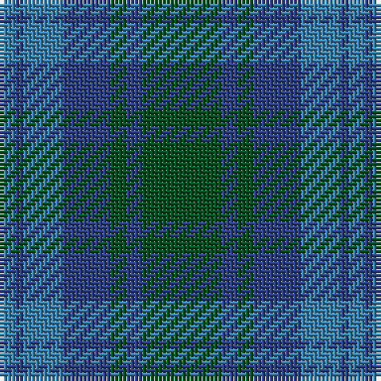

**Bands:** [GBGBBBB](/stripes/gbgbbbb/) · **Stripes:** [DG DB DG DB T DB T](/stripes/stripes7/) DG DB DG DB T DB T

This was sourced from register-of-tartans.  It is a [7 band tartan](/bands/bands7/).

Original link https://www.tartanregister.gov.uk/tartanDetails.aspx?ref=4315

## Register references

External register numbers recorded for this tartan.

- Scottish Register of Tartans: [4315](https://www.tartanregister.gov.uk/tartanDetails.aspx?ref=4315)
- Scottish Tartans World Register: 35

## Thread count
G/20 Ba4 G4 Ba12 B10 Ba2 B/4

## Palette
Each colour and its ΔE from the base-6 reference it is a variant of.

| Colour | Shade | Base | ΔE (OKLab) |
|---|---|---|---|
| B | <code style="background-color:#3C82AF;">#3C82AF</code> `#3C82AF` | B <code style="background-color:#2A418A;">#2A418A</code> | 0.19 |
| Ba | <code style="background-color:#2C4084;">#2C4084</code> `#2C4084` | B <code style="background-color:#2A418A;">#2A418A</code> | 0.01 |
| G | <code style="background-color:#005020;">#005020</code> `#005020` | G <code style="background-color:#006100;">#006100</code> | 0.07 |

# Sample pattern

## Nearest tartans

The nearest existing variants by ΔTartan distance.

1. [Sugiyama](/setts/s6/db7db2db25db10g21db2~x2/) — ΔT 1.13
1. [Unnamed, No 17](/setts/s7/g10db2g2db6t5db1t2~x2/) — ΔT 1.35
1. [Gammell (Brown) (Personal)](/setts/s8/db20dy2db2dy2db2dy6g15dy2~x2/) — ΔT 1.44
1. [Sutherland #3](/setts/s13/t11db1t1db1t1db8dg8db1dg8db8t8db1t1~x2/) — ΔT 1.48
1. [Unidentified Tweed](/setts/s6/dg4db1dg12db12w1db4~x2/) — ΔT 1.49
1. [Manx Centenary](/setts/s9/db22g3db3g3db3g9y28g3y6~x2/) — ΔT 1.54
1. [Skibo (Corporate)](/setts/s5/r2y23db11b22r2~x2/) — ΔT 1.56
1. [Black Watch (Aljean)](/setts/s6/db1g10db9b10db1b1~x4/) — ΔT 1.56
1. [St. Andrews New Golf Club](/setts/s9/dp4dt18r2dt2r2dt9g20dt3g4~x2/) — ΔT 1.58
1. [Montmorency Family Tartan Tartan Number: 103. Earliest known date: pre 2003 Canadian fancy. Presented by Mrs K Sinclair See products available Copyright © Blair Urquhart, Comrie, 2015](/setts/s13/db21g2db3g2db2g14dy15g4dy15g14db14g2db3~x2/) — ΔT 1.64

## Neighbour map

Every grey dot is one of 14299 variants placed by the first two principal components of the ΔTartan feature space (44% of its variance). Red is this tartan; blue dots are its nearest — click one to open its page.

<svg viewBox="0 0 640 380" role="img" style="max-width:100%;height:auto;border:1px solid #e0e0e0;border-radius:4px;display:block" xmlns="http://www.w3.org/2000/svg"><image href="/nn/cloud.v1.png" width="640" height="380"/><a href="/setts/s6/db7db2db25db10g21db2~x2/"><circle cx="345.6" cy="267.2" r="4" fill="#3465a4"><title>Sugiyama</title></circle></a><a href="/setts/s7/g10db2g2db6t5db1t2~x2/"><circle cx="276.6" cy="258.1" r="4" fill="#3465a4"><title>Unnamed, No 17</title></circle></a><a href="/setts/s8/db20dy2db2dy2db2dy6g15dy2~x2/"><circle cx="340.6" cy="238.9" r="4" fill="#3465a4"><title>Gammell (Brown) (Personal)</title></circle></a><a href="/setts/s13/t11db1t1db1t1db8dg8db1dg8db8t8db1t1~x2/"><circle cx="288.6" cy="236.0" r="4" fill="#3465a4"><title>Sutherland #3</title></circle></a><a href="/setts/s6/dg4db1dg12db12w1db4~x2/"><circle cx="385.7" cy="269.5" r="4" fill="#3465a4"><title>Unidentified Tweed</title></circle></a><a href="/setts/s9/db22g3db3g3db3g9y28g3y6~x2/"><circle cx="303.7" cy="229.3" r="4" fill="#3465a4"><title>Manx Centenary</title></circle></a><a href="/setts/s5/r2y23db11b22r2~x2/"><circle cx="291.0" cy="268.0" r="4" fill="#3465a4"><title>Skibo (Corporate)</title></circle></a><a href="/setts/s6/db1g10db9b10db1b1~x4/"><circle cx="250.9" cy="258.3" r="4" fill="#3465a4"><title>Black Watch (Aljean)</title></circle></a><a href="/setts/s9/dp4dt18r2dt2r2dt9g20dt3g4~x2/"><circle cx="341.2" cy="233.2" r="4" fill="#3465a4"><title>St. Andrews New Golf Club</title></circle></a><a href="/setts/s13/db21g2db3g2db2g14dy15g4dy15g14db14g2db3~x2/"><circle cx="279.8" cy="238.2" r="4" fill="#3465a4"><title>Montmorency Family Tartan Tartan Number: 103. Earliest known date: pre 2003 Canadian fancy. Presented by Mrs K Sinclair See products available Copyright © Blair Urquhart, Comrie, 2015</title></circle></a><circle cx="309.3" cy="277.2" r="5" fill="#c00000"/></svg>

ID: /setts/s7/dg10db2dg2db6t5db1t2~x2/
