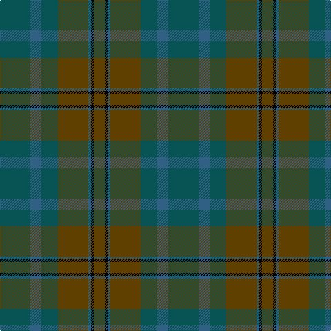

In pattern [GBGGBKG](/stripes/gbggbkg/).

This was sourced from tartans-authority.  It is a [7 stripe tartan](/stripes/stripes7/).

Original link http://www.tartansauthority.com/tartan-ferret/display/3779/

## Attestations

This cloth appears in 2 source records; the oldest owns this page.

- pre 2002 — Calais (Fashion) (tartans-authority, [record](http://www.tartansauthority.com/tartan-ferret/display/3779/))
- undated — Calais (Fashion) (register-of-tartans, [record](https://www.tartanregister.gov.uk/tartanDetails.aspx?ref=5032))

## Register references

External register numbers recorded for this tartan.

- Scottish Register of Tartans: [5032](https://www.tartanregister.gov.uk/tartanDetails.aspx?ref=5032)
- Scottish Tartans Authority (ITI): 3779

## Thread count
G/44 B16 G24 T44 B4 K4 T/16

## Palette
Each colour and the base-6 reference it is a variant of.

| Colour | Shade | Base |
|---|---|---|
| B | <code style="background-color:#306084;">#306084</code> `oklch(47.2% 0.079 243.2)` <small>#306084</small> | B <code style="background-color:#2A418A;">#2A418A</code> |
| G | <code style="background-color:#085454;">#085454</code> `oklch(40.5% 0.066 194.8)` <small>#085454</small> | G <code style="background-color:#006100;">#006100</code> |
| K | <code style="background-color:#000000;">#000000</code> `oklch(0.0% 0.000 0.0)` <small>#000000</small> | K <code style="background-color:#000000;">#000000</code> |
| T | <code style="background-color:#604000;">#604000</code> `oklch(39.8% 0.083 76.8)` <small>#604000</small> | G <code style="background-color:#006100;">#006100</code> |

# Sample pattern

## Nearest tartans

The nearest existing variants by ΔTartan distance, with this tartan at the top so the swatches line up against it.

ΔTartan

Tartan

Sett

—

<a href="/ttd/edit/#slug=dg11n4dg6dy11n1k1dy4~x4">Calais (Fashion)</a> <a class="nn-out" href="/setts/s7/dg11n4dg6dy11n1k1dy4~x4/" title="open its dictionary page">↗</a>

1.13

<a href="/ttd/edit/#slug=dg5k2dg28k10dy26db4dg4~x2">John Telfar Dunbar Hunting</a> <a class="nn-out" href="/setts/s7/dg5k2dg28k10dy26db4dg4~x2/" title="open its dictionary page">↗</a>

1.52

<a href="/ttd/edit/#slug=dg1dy8dg8r1dg8dy8w1~x2">MacKinnon Hunting</a> <a class="nn-out" href="/setts/s7/dg1dy8dg8r1dg8dy8w1~x2/" title="open its dictionary page">↗</a>

1.66

<a href="/ttd/edit/#slug=y4dg18dg6dg6dg24ly3~x2">Park (Estate Check)</a> <a class="nn-out" href="/setts/s6/y4dg18dg6dg6dg24ly3~x2/" title="open its dictionary page">↗</a>

1.67

<a href="/ttd/edit/#slug=dg4db2dg17dg2r4dg2dg3dg11dg2~x2">Conlon</a> <a class="nn-out" href="/setts/s9/dg4db2dg17dg2r4dg2dg3dg11dg2~x2/" title="open its dictionary page">↗</a>

1.69

<a href="/ttd/edit/#slug=dg1r1dg22dy21dg12r11dg22r1dg1~x2">MacNaughton Htg</a> <a class="nn-out" href="/setts/s9/dg1r1dg22dy21dg12r11dg22r1dg1~x2/" title="open its dictionary page">↗</a>

1.70

<a href="/ttd/edit/#slug=dg7db1dg1k4dp4k1~x4">MacArthur of Milton Hunting</a> <a class="nn-out" href="/setts/s6/dg7db1dg1k4dp4k1~x4/" title="open its dictionary page">↗</a>

1.75

<a href="/ttd/edit/#slug=y4dg18dg6dg6dg24k3~x2">Park Estate</a> <a class="nn-out" href="/setts/s6/y4dg18dg6dg6dg24k3~x2/" title="open its dictionary page">↗</a>

1.77

<a href="/ttd/edit/#slug=db3dy14dg14dy2db14dy2db14dy2dg14dy14r3~x2">Buchanan Hunting</a> <a class="nn-out" href="/setts/s11/db3dy14dg14dy2db14dy2db14dy2dg14dy14r3~x2/" title="open its dictionary page">↗</a>

1.78

<a href="/ttd/edit/#slug=dy8dg20db15dy6dg4dy8db4dy6dg20dy8db6dy4b2dy4db6">Unidentified Fragment #2</a> <a class="nn-out" href="/setts/s15/dy8dg20db15dy6dg4dy8db4dy6dg20dy8db6dy4b2dy4db6/" title="open its dictionary page">↗</a>

1.79

<a href="/ttd/edit/#slug=do10k4do16k4do10k16do8k24do28r3do4r3">St. Mirren (Corporate)</a> <a class="nn-out" href="/setts/s12/do10k4do16k4do10k16do8k24do28r3do4r3/" title="open its dictionary page">↗</a>

## Neighbour map

Every grey dot is one of 14299 variants placed by the first two principal components of the ΔTartan feature space (44% of its variance). Red is this tartan; blue dots are its nearest — click one to open its page.

<svg viewBox="0 0 640 380" role="img" style="max-width:100%;height:auto;border:1px solid #e0e0e0;border-radius:4px;display:block" xmlns="http://www.w3.org/2000/svg"><image href="/nn/cloud.v1.png" width="640" height="380"/><a href="/setts/s7/dg5k2dg28k10dy26db4dg4~x2/"><circle cx="392.1" cy="269.1" r="4" fill="#3465a4"><title>John Telfar Dunbar Hunting</title></circle></a><a href="/setts/s7/dg1dy8dg8r1dg8dy8w1~x2/"><circle cx="371.2" cy="295.8" r="4" fill="#3465a4"><title>MacKinnon Hunting</title></circle></a><a href="/setts/s6/y4dg18dg6dg6dg24ly3~x2/"><circle cx="377.3" cy="303.3" r="4" fill="#3465a4"><title>Park (Estate Check)</title></circle></a><a href="/setts/s9/dg4db2dg17dg2r4dg2dg3dg11dg2~x2/"><circle cx="444.1" cy="288.8" r="4" fill="#3465a4"><title>Conlon</title></circle></a><a href="/setts/s9/dg1r1dg22dy21dg12r11dg22r1dg1~x2/"><circle cx="401.8" cy="242.5" r="4" fill="#3465a4"><title>MacNaughton Htg</title></circle></a><a href="/setts/s6/dg7db1dg1k4dp4k1~x4/"><circle cx="345.2" cy="314.0" r="4" fill="#3465a4"><title>MacArthur of Milton Hunting</title></circle></a><a href="/setts/s6/y4dg18dg6dg6dg24k3~x2/"><circle cx="369.9" cy="301.1" r="4" fill="#3465a4"><title>Park Estate</title></circle></a><a href="/setts/s11/db3dy14dg14dy2db14dy2db14dy2dg14dy14r3~x2/"><circle cx="266.8" cy="279.9" r="4" fill="#3465a4"><title>Buchanan Hunting</title></circle></a><a href="/setts/s15/dy8dg20db15dy6dg4dy8db4dy6dg20dy8db6dy4b2dy4db6/"><circle cx="298.8" cy="264.3" r="4" fill="#3465a4"><title>Unidentified Fragment #2</title></circle></a><a href="/setts/s12/do10k4do16k4do10k16do8k24do28r3do4r3/"><circle cx="390.2" cy="284.0" r="4" fill="#3465a4"><title>St. Mirren (Corporate)</title></circle></a><circle cx="369.6" cy="292.4" r="5" fill="#c00000"/></svg>

ID: /setts/s7/dg11n4dg6dy11n1k1dy4~x4/
