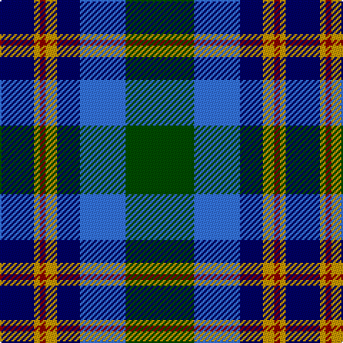

This page is one **sett** — a single exact thread-count. It belongs to the [tartan](/tartans/dg12b8db4ly2r1ly1db6/)
(the same proportion at any scale), whose colour order is pattern [BYRYBBG](/stripes/byrybbg/).

Sourced from register-of-tartans.  It is a [7 stripe tartan](/stripes/stripes7/).

Original link https://www.tartanregister.gov.uk/tartanDetails.aspx?ref=1144

## Also known as

This cloth is also recorded under:

- F.I.A.T.A. Congress of 1990

2 attestations — the source records this cloth was collapsed from (oldest owns this page)

<ul>
<li>01/01/1990 — F.I.A.T.A. Congress of 1990 (register-of-tartans, <a href="https://www.tartanregister.gov.uk/tartanDetails.aspx?ref=1144">record</a>)</li>
<li>1990 — F.I.A.T.A. Congress 1990 (Corporate) (tartans-authority, <a href="http://www.tartansauthority.com/tartan-ferret/display/4832/">record</a>)</li>
</ul>

## Register references

External register numbers recorded for this tartan.

- Scottish Register of Tartans: [1144](https://www.tartanregister.gov.uk/tartanDetails.aspx?ref=1144)
- Scottish Tartans Authority (ITI): 4832

## Thread count
G/48 B32 DB16 DY8 DR4 DY4 DB/24

## Palette

Palette: <strong>Tartan Register</strong> <small style="color:#888">(3 of 5 colours)</small>
<table><thead><tr><th>Colour</th><th>Threads</th><th>Shade</th><th>Base</th><th>OKLCh</th></tr></thead><tbody><tr><td>G/</td><td style="text-align:right;font-variant-numeric:tabular-nums">48</td><td><code style="background-color:#004C00;">#004C00</code> <small style="color:#888">#004C00</small></td><td>G <code style="background-color:#006100;">#006100</code></td><td><small style="color:#888">oklch(36.1% 0.123 142.5)</small></td></tr><tr><td>B</td><td style="text-align:right;font-variant-numeric:tabular-nums">32</td><td><code style="background-color:#3474FC;">#3474FC</code> <small style="color:#888">#3474FC</small></td><td>B <code style="background-color:#2A418A;">#2A418A</code></td><td><small style="color:#888">oklch(59.7% 0.214 262.7)</small></td></tr><tr><td>DB</td><td style="text-align:right;font-variant-numeric:tabular-nums">16</td><td><code style="background-color:#000064;">#000064</code> <small style="color:#888">#000064</small></td><td>B <code style="background-color:#2A418A;">#2A418A</code></td><td><small style="color:#888">oklch(22.7% 0.158 264.1)</small></td></tr><tr><td>DY</td><td style="text-align:right;font-variant-numeric:tabular-nums">8</td><td><code style="background-color:#C89800;">#C89800</code> <small style="color:#888">#C89800</small></td><td>Y <code style="background-color:#F2BF00;">#F2BF00</code></td><td><small style="color:#888">oklch(70.6% 0.144 85.9)</small></td></tr><tr><td>DR</td><td style="text-align:right;font-variant-numeric:tabular-nums">4</td><td><code style="background-color:#8C0000;">#8C0000</code> <small style="color:#888">#8C0000</small></td><td>R <code style="background-color:#CC0000;">#CC0000</code></td><td><small style="color:#888">oklch(40.2% 0.165 29.2)</small></td></tr><tr><td>DY</td><td style="text-align:right;font-variant-numeric:tabular-nums">4</td><td><code style="background-color:#C89800;">#C89800</code> <small style="color:#888">#C89800</small></td><td>Y <code style="background-color:#F2BF00;">#F2BF00</code></td><td><small style="color:#888">oklch(70.6% 0.144 85.9)</small></td></tr><tr><td>DB/</td><td style="text-align:right;font-variant-numeric:tabular-nums">24</td><td><code style="background-color:#000064;">#000064</code> <small style="color:#888">#000064</small></td><td>B <code style="background-color:#2A418A;">#2A418A</code></td><td><small style="color:#888">oklch(22.7% 0.158 264.1)</small></td></tr></tbody></table>

# Sample pattern

## Nearest tartans

The nearest existing variants by ΔTartan distance, with this tartan at the top so the swatches line up against it.

ΔTartan

Tartan

Sett

—

<a href="/ttd/edit/#slug=dg12b8db4ly2r1ly1db6~x4">F.I.A.T.A. Congress of 1990</a> <a class="nn-out" href="/setts/s7/dg12b8db4ly2r1ly1db6~x4/" title="open its dictionary page">↗</a>

0.96

<a href="/ttd/edit/#slug=db2b9m1db9dg9w2~x4">American Express</a> <a class="nn-out" href="/setts/s6/db2b9m1db9dg9w2~x4/" title="open its dictionary page">↗</a>

1.03

<a href="/ttd/edit/#slug=g3db12w1k12g13r2g2~x4">MacFadzean/MacPhedran</a> <a class="nn-out" href="/setts/s7/g3db12w1k12g13r2g2~x4/" title="open its dictionary page">↗</a>

1.04

<a href="/ttd/edit/#slug=w4k24ly2n24t5k4ly4~x2">Mina Perhonen</a> <a class="nn-out" href="/setts/s7/w4k24ly2n24t5k4ly4~x2/" title="open its dictionary page">↗</a>

1.07

<a href="/ttd/edit/#slug=t26db13k13w2g8k5r3t3~x2">Moran (Coilessan) (Personal)</a> <a class="nn-out" href="/setts/s8/t26db13k13w2g8k5r3t3~x2/" title="open its dictionary page">↗</a>

1.09

<a href="/ttd/edit/#slug=r2t2r2t21lg11k17lb2~x2">Loch Ness (Fashion)</a> <a class="nn-out" href="/setts/s7/r2t2r2t21lg11k17lb2~x2/" title="open its dictionary page">↗</a>

1.10

<a href="/ttd/edit/#slug=g26r2g3db15dbi26ri2dbi3db4~x2">Grampian</a> <a class="nn-out" href="/setts/s8/g26r2g3db15dbi26ri2dbi3db4~x2/" title="open its dictionary page">↗</a>

1.12

<a href="/ttd/edit/#slug=k7lb3g18db18w2~x2">Bhatti (Name)</a> <a class="nn-out" href="/setts/s5/k7lb3g18db18w2~x2/" title="open its dictionary page">↗</a>

1.13

<a href="/ttd/edit/#slug=k4w1g13k11db11lb3~x4">New York Fire Department Pipe Band</a> <a class="nn-out" href="/setts/s6/k4w1g13k11db11lb3~x4/" title="open its dictionary page">↗</a>

1.13

<a href="/ttd/edit/#slug=g12db3g3db3g3k15lg20b3~x2">Lemania</a> <a class="nn-out" href="/setts/s8/g12db3g3db3g3k15lg20b3~x2/" title="open its dictionary page">↗</a>

1.16

<a href="/ttd/edit/#slug=ly4k2b20k10g15k2r3~x2">Green MacLeod</a> <a class="nn-out" href="/setts/s7/ly4k2b20k10g15k2r3~x2/" title="open its dictionary page">↗</a>

## Neighbour map

Every grey dot is one of 14359 variants placed by the first two principal components of the ΔTartan feature space (44% of its variance). Red is this tartan; blue dots are its nearest — click one to open its page.

<svg viewBox="0 0 640 380" role="img" style="max-width:100%;height:auto;border:1px solid #e0e0e0;border-radius:4px;display:block" xmlns="http://www.w3.org/2000/svg"><image href="/nn/cloud.v1.png" width="640" height="380"/><a href="/setts/s6/db2b9m1db9dg9w2~x4/"><circle cx="126.7" cy="208.9" r="4" fill="#3465a4"><title>American Express</title></circle></a><a href="/setts/s7/g3db12w1k12g13r2g2~x4/"><circle cx="193.7" cy="188.3" r="4" fill="#3465a4"><title>MacFadzean/MacPhedran</title></circle></a><a href="/setts/s7/w4k24ly2n24t5k4ly4~x2/"><circle cx="187.2" cy="169.4" r="4" fill="#3465a4"><title>Mina Perhonen</title></circle></a><a href="/setts/s8/t26db13k13w2g8k5r3t3~x2/"><circle cx="150.7" cy="160.2" r="4" fill="#3465a4"><title>Moran (Coilessan) (Personal)</title></circle></a><a href="/setts/s7/r2t2r2t21lg11k17lb2~x2/"><circle cx="169.2" cy="171.4" r="4" fill="#3465a4"><title>Loch Ness (Fashion)</title></circle></a><a href="/setts/s8/g26r2g3db15dbi26ri2dbi3db4~x2/"><circle cx="194.9" cy="175.6" r="4" fill="#3465a4"><title>Grampian</title></circle></a><a href="/setts/s5/k7lb3g18db18w2~x2/"><circle cx="167.8" cy="221.7" r="4" fill="#3465a4"><title>Bhatti (Name)</title></circle></a><a href="/setts/s6/k4w1g13k11db11lb3~x4/"><circle cx="153.6" cy="210.3" r="4" fill="#3465a4"><title>New York Fire Department Pipe Band</title></circle></a><a href="/setts/s8/g12db3g3db3g3k15lg20b3~x2/"><circle cx="110.3" cy="198.5" r="4" fill="#3465a4"><title>Lemania</title></circle></a><a href="/setts/s7/ly4k2b20k10g15k2r3~x2/"><circle cx="148.2" cy="189.4" r="4" fill="#3465a4"><title>Green MacLeod</title></circle></a><circle cx="148.7" cy="190.0" r="5" fill="#c00000"/></svg>

ID: /setts/s7/dg12b8db4ly2r1ly1db6~x4/
