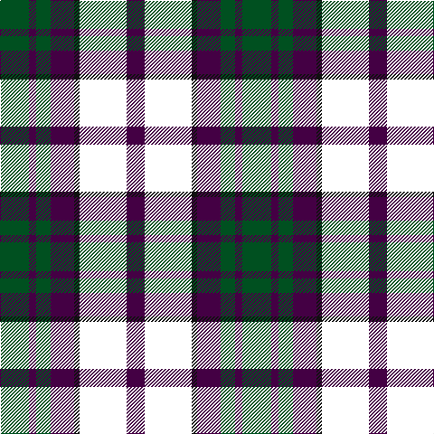

In pattern [BWKBGBG](/stripes/bwkbgbg/).

This was sourced from register-of-tartans.  It is a [7 stripe tartan](/stripes/stripes7/).

Original link https://www.tartanregister.gov.uk/tartanDetails.aspx?ref=11654

## Register references

External register numbers recorded for this tartan.

- Scottish Register of Tartans: [11654](https://www.tartanregister.gov.uk/tartanDetails.aspx?ref=11654)

## Thread count
G/32 DP8 G16 DP26 K6 W52 DP/20

## Palette
Each colour and the base-6 reference it is a variant of.

| Colour | Shade | Base |
|---|---|---|
| DP | <code style="background-color:#440044;">#440044</code> `oklch(27.1% 0.125 328.4)` <small>#440044</small> | B <code style="background-color:#2A418A;">#2A418A</code> |
| G | <code style="background-color:#005020;">#005020</code> `oklch(37.7% 0.105 149.6)` <small>#005020</small> | G <code style="background-color:#006100;">#006100</code> |
| K | <code style="background-color:#101010;">#101010</code> `oklch(17.3% 0.000 89.9)` <small>#101010</small> | K <code style="background-color:#000000;">#000000</code> |
| W | <code style="background-color:#FFFFFF;">#FFFFFF</code> `oklch(100.0% 0.000 89.9)` <small>#FFFFFF</small> | W <code style="background-color:#F7F7F7;">#F7F7F7</code> |

# Sample pattern

## Nearest tartans

The nearest existing variants by ΔTartan distance.

1. [Borthwick Dress Artifact Tartan Tartan Number: 820. Earliest known date: pre 2003 No details available. See products available Copyright © Blair Urquhart, Comrie, 2015](/setts/s9/g7k1m7k1w7k10w7k2w4~x2/) — ΔT 0.87
1. [Unidentified](/setts/s7/w8k2y12k11w1r6y4~x2/) — ΔT 0.91
1. [Borthwick Dress (Clan)](/setts/s9/g7k1r8k2w7k10w7k2w4~x4/) — ΔT 0.93
1. [Thompson Grey Family Tartan Tartan Number: 1611. Earliest known date: pre 2003 Designed for Lord Thomson of Fleet in 1958 based on a sample in the Moy Hall collection dating from the mid 19th century. The tartan is also suitable for MacTavishs and Thompsons, who claim descent from the Clan MacIntosh. See products available Copyright © Blair Urquhart, Comrie, 2015](/setts/s6/r2o20k5w10k10r2~x2/) — ΔT 0.98
1. [Borthwick Dress](/setts/s9/g12k2r12k3w7k16w7k3w6~x2/) — ΔT 1.02
1. [Borthwick, dress](/setts/s9/g7k1r7k1w7k10w7k2w4~x2/) — ΔT 1.03
1. [Fraser Dress](/setts/s6/r6k14r6dg14w27k4/) — ΔT 1.04
1. [Unidentified (ex Tony Murray)](/setts/s8/dt8w22dt5w4k24r6k2r6~x2/) — ΔT 1.04
1. [Thom(p)son, Grey](/setts/s6/r2y20k5w10k10r2~x2/) — ΔT 1.04
1. [Bannockbane Grey #1](/setts/s8/k4ly2k13ly1w8o13ly2o4~x2/) — ΔT 1.04

## Neighbour map

Every grey dot is one of 14299 variants placed by the first two principal components of the ΔTartan feature space (44% of its variance). Red is this tartan; blue dots are its nearest — click one to open its page.

<svg viewBox="0 0 640 380" role="img" style="max-width:100%;height:auto;border:1px solid #e0e0e0;border-radius:4px;display:block" xmlns="http://www.w3.org/2000/svg"><image href="/nn/cloud.v1.png" width="640" height="380"/><a href="/setts/s9/g7k1m7k1w7k10w7k2w4~x2/"><circle cx="127.4" cy="186.8" r="4" fill="#3465a4"><title>Borthwick Dress Artifact Tartan Tartan Number: 820. Earliest known date: pre 2003 No details available. See products available Copyright © Blair Urquhart, Comrie, 2015</title></circle></a><a href="/setts/s7/w8k2y12k11w1r6y4~x2/"><circle cx="143.5" cy="193.2" r="4" fill="#3465a4"><title>Unidentified</title></circle></a><a href="/setts/s9/g7k1r8k2w7k10w7k2w4~x4/"><circle cx="111.1" cy="187.5" r="4" fill="#3465a4"><title>Borthwick Dress (Clan)</title></circle></a><a href="/setts/s6/r2o20k5w10k10r2~x2/"><circle cx="174.6" cy="192.3" r="4" fill="#3465a4"><title>Thompson Grey Family Tartan Tartan Number: 1611. Earliest known date: pre 2003 Designed for Lord Thomson of Fleet in 1958 based on a sample in the Moy Hall collection dating from the mid 19th century. The tartan is also suitable for MacTavishs and Thompsons, who claim descent from the Clan MacIntosh. See products available Copyright © Blair Urquhart, Comrie, 2015</title></circle></a><a href="/setts/s9/g12k2r12k3w7k16w7k3w6~x2/"><circle cx="99.5" cy="194.7" r="4" fill="#3465a4"><title>Borthwick Dress</title></circle></a><a href="/setts/s9/g7k1r7k1w7k10w7k2w4~x2/"><circle cx="121.5" cy="187.0" r="4" fill="#3465a4"><title>Borthwick, dress</title></circle></a><a href="/setts/s6/r6k14r6dg14w27k4/"><circle cx="120.4" cy="207.7" r="4" fill="#3465a4"><title>Fraser Dress</title></circle></a><a href="/setts/s8/dt8w22dt5w4k24r6k2r6~x2/"><circle cx="140.2" cy="164.5" r="4" fill="#3465a4"><title>Unidentified (ex Tony Murray)</title></circle></a><a href="/setts/s6/r2y20k5w10k10r2~x2/"><circle cx="164.9" cy="190.5" r="4" fill="#3465a4"><title>Thom(p)son, Grey</title></circle></a><a href="/setts/s8/k4ly2k13ly1w8o13ly2o4~x2/"><circle cx="152.2" cy="166.9" r="4" fill="#3465a4"><title>Bannockbane Grey #1</title></circle></a><circle cx="119.9" cy="198.5" r="5" fill="#c00000"/></svg>

ID: /setts/s7/dg16dp4dg8dp13k3w26dp10~x2/
