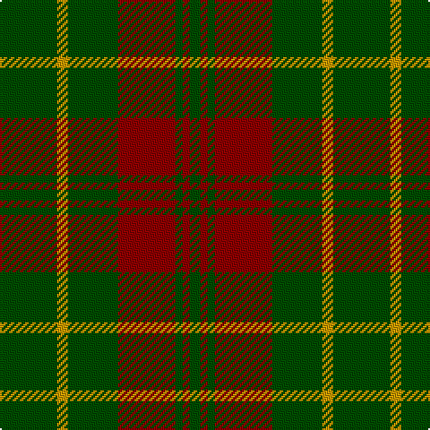

This page is one **sett** — a single exact thread-count. It belongs to the [tartan](/tartans/dg16ly3dg14r16dg2r2dg3/)
(the same proportion at any scale), whose colour order is pattern [GRGRGYG](/stripes/grgrgyg/).

Sourced from tartans-authority.  It is a [7 stripe tartan](/stripes/stripes7/).

Original link http://www.tartansauthority.com/tartan-ferret/display/5374/

## Thread count
G/32 DY6 G28 DR32 G4 DR4 G/6

## Palette

Palette: <strong>Tartan Register</strong> <small style="color:#888">(2 of 3 colours)</small>
<table><thead><tr><th>Colour</th><th>Threads</th><th>Shade</th><th>Base</th><th>OKLCh</th></tr></thead><tbody><tr><td>G/</td><td style="text-align:right;font-variant-numeric:tabular-nums">32</td><td><code style="background-color:#004C00;">#004C00</code> <small style="color:#888">#004C00</small></td><td>G <code style="background-color:#006100;">#006100</code></td><td><small style="color:#888">oklch(36.1% 0.123 142.5)</small></td></tr><tr><td>DY</td><td style="text-align:right;font-variant-numeric:tabular-nums">6</td><td><code style="background-color:#C89800;">#C89800</code> <small style="color:#888">#C89800</small></td><td>Y <code style="background-color:#F2BF00;">#F2BF00</code></td><td><small style="color:#888">oklch(70.6% 0.144 85.9)</small></td></tr><tr><td>G</td><td style="text-align:right;font-variant-numeric:tabular-nums">28</td><td><code style="background-color:#004C00;">#004C00</code> <small style="color:#888">#004C00</small></td><td>G <code style="background-color:#006100;">#006100</code></td><td><small style="color:#888">oklch(36.1% 0.123 142.5)</small></td></tr><tr><td>DR</td><td style="text-align:right;font-variant-numeric:tabular-nums">32</td><td><code style="background-color:#8C0000;">#8C0000</code> <small style="color:#888">#8C0000</small></td><td>R <code style="background-color:#CC0000;">#CC0000</code></td><td><small style="color:#888">oklch(40.2% 0.165 29.2)</small></td></tr><tr><td>G</td><td style="text-align:right;font-variant-numeric:tabular-nums">4</td><td><code style="background-color:#004C00;">#004C00</code> <small style="color:#888">#004C00</small></td><td>G <code style="background-color:#006100;">#006100</code></td><td><small style="color:#888">oklch(36.1% 0.123 142.5)</small></td></tr><tr><td>DR</td><td style="text-align:right;font-variant-numeric:tabular-nums">4</td><td><code style="background-color:#8C0000;">#8C0000</code> <small style="color:#888">#8C0000</small></td><td>R <code style="background-color:#CC0000;">#CC0000</code></td><td><small style="color:#888">oklch(40.2% 0.165 29.2)</small></td></tr><tr><td>G/</td><td style="text-align:right;font-variant-numeric:tabular-nums">6</td><td><code style="background-color:#004C00;">#004C00</code> <small style="color:#888">#004C00</small></td><td>G <code style="background-color:#006100;">#006100</code></td><td><small style="color:#888">oklch(36.1% 0.123 142.5)</small></td></tr></tbody></table>

# Sample pattern

## Nearest tartans

The nearest existing variants by ΔTartan distance, with this tartan at the top so the swatches line up against it.

ΔTartan

Tartan

Sett

—

<a href="/ttd/edit/#slug=dg16ly3dg14r16dg2r2dg3~x2">Scott Autumn (Fashion)</a> <a class="nn-out" href="/setts/s7/dg16ly3dg14r16dg2r2dg3~x2/" title="open its dictionary page">↗</a>

1.18

<a href="/ttd/edit/#slug=r6dg2db2dg17r2~x4">Loton (Personal)</a> <a class="nn-out" href="/setts/s5/r6dg2db2dg17r2~x4/" title="open its dictionary page">↗</a>

1.20

<a href="/ttd/edit/#slug=g3r16g4k6g28r2g3~x2">Maxwell Htg (Clan)</a> <a class="nn-out" href="/setts/s7/g3r16g4k6g28r2g3~x2/" title="open its dictionary page">↗</a>

1.24

<a href="/ttd/edit/#slug=dg2y14dg8y3dg12lo2~x2">Confederate Cavalry (Military)</a> <a class="nn-out" href="/setts/s6/dg2y14dg8y3dg12lo2~x2/" title="open its dictionary page">↗</a>

1.44

<a href="/ttd/edit/#slug=dg37o9dg3r9o3~x2">Glen Trool</a> <a class="nn-out" href="/setts/s5/dg37o9dg3r9o3~x2/" title="open its dictionary page">↗</a>

1.49

<a href="/ttd/edit/#slug=lo1dg11k6dg3lo1dg1lo1~x4">Angle, Green (Fashion)</a> <a class="nn-out" href="/setts/s7/lo1dg11k6dg3lo1dg1lo1~x4/" title="open its dictionary page">↗</a>

1.52

<a href="/ttd/edit/#slug=k8g3k4g20r4~x2">MacArthur-Fox (Personal)</a> <a class="nn-out" href="/setts/s5/k8g3k4g20r4~x2/" title="open its dictionary page">↗</a>

1.53

<a href="/ttd/edit/#slug=o1g1o5g8lg1g1lg1~x4">O'Neill Pipe Band 1983 (Corporate)</a> <a class="nn-out" href="/setts/s7/o1g1o5g8lg1g1lg1~x4/" title="open its dictionary page">↗</a>

1.53

<a href="/ttd/edit/#slug=o20g40w5g40o20g9~x2">O'Neill (Australia)</a> <a class="nn-out" href="/setts/s6/o20g40w5g40o20g9~x2/" title="open its dictionary page">↗</a>

1.53

<a href="/ttd/edit/#slug=g22dt5r4dt5r3~x2">Romsdal</a> <a class="nn-out" href="/setts/s5/g22dt5r4dt5r3~x2/" title="open its dictionary page">↗</a>

1.55

<a href="/ttd/edit/#slug=dg2o14dg8o3dg12r2~x2">Confederate Artillery</a> <a class="nn-out" href="/setts/s6/dg2o14dg8o3dg12r2~x2/" title="open its dictionary page">↗</a>

## Neighbour map

Every grey dot is one of 14299 variants placed by the first two principal components of the ΔTartan feature space (44% of its variance). Red is this tartan; blue dots are its nearest — click one to open its page.

<svg viewBox="0 0 640 380" role="img" style="max-width:100%;height:auto;border:1px solid #e0e0e0;border-radius:4px;display:block" xmlns="http://www.w3.org/2000/svg"><image href="/nn/cloud.v1.png" width="640" height="380"/><a href="/setts/s5/r6dg2db2dg17r2~x4/"><circle cx="453.1" cy="267.3" r="4" fill="#3465a4"><title>Loton (Personal)</title></circle></a><a href="/setts/s7/g3r16g4k6g28r2g3~x2/"><circle cx="420.1" cy="223.3" r="4" fill="#3465a4"><title>Maxwell Htg (Clan)</title></circle></a><a href="/setts/s6/dg2y14dg8y3dg12lo2~x2/"><circle cx="337.0" cy="273.8" r="4" fill="#3465a4"><title>Confederate Cavalry (Military)</title></circle></a><a href="/setts/s5/dg37o9dg3r9o3~x2/"><circle cx="441.6" cy="238.4" r="4" fill="#3465a4"><title>Glen Trool</title></circle></a><a href="/setts/s7/lo1dg11k6dg3lo1dg1lo1~x4/"><circle cx="396.8" cy="226.0" r="4" fill="#3465a4"><title>Angle, Green (Fashion)</title></circle></a><a href="/setts/s5/k8g3k4g20r4~x2/"><circle cx="355.9" cy="277.8" r="4" fill="#3465a4"><title>MacArthur-Fox (Personal)</title></circle></a><a href="/setts/s7/o1g1o5g8lg1g1lg1~x4/"><circle cx="369.1" cy="239.5" r="4" fill="#3465a4"><title>O'Neill Pipe Band 1983 (Corporate)</title></circle></a><a href="/setts/s6/o20g40w5g40o20g9~x2/"><circle cx="421.9" cy="295.0" r="4" fill="#3465a4"><title>O'Neill (Australia)</title></circle></a><a href="/setts/s5/g22dt5r4dt5r3~x2/"><circle cx="342.0" cy="256.5" r="4" fill="#3465a4"><title>Romsdal</title></circle></a><a href="/setts/s6/dg2o14dg8o3dg12r2~x2/"><circle cx="320.3" cy="262.9" r="4" fill="#3465a4"><title>Confederate Artillery</title></circle></a><circle cx="406.4" cy="262.3" r="5" fill="#c00000"/></svg>

ID: /setts/s7/dg16ly3dg14r16dg2r2dg3~x2/
