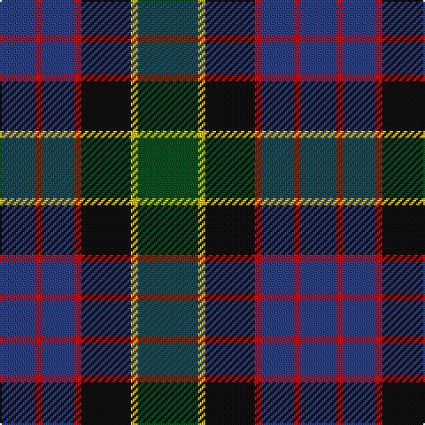

This page is one **sett** — a single exact thread-count. It belongs to the [tartan](/tartans/g17y2k14r2b9r2b10/)
(the same proportion at any scale), whose colour order is pattern [BRBRKYG](/stripes/brbrkyg/).

Sourced from register-of-tartans.  It is a [7 stripe tartan](/stripes/stripes7/).

Original link https://www.tartanregister.gov.uk/tartanDetails.aspx?ref=2342

## Also known as

This cloth is also recorded under:

- MacDonald,

## Register references

External register numbers recorded for this tartan.

- Scottish Register of Tartans: [2342](https://www.tartanregister.gov.uk/tartanDetails.aspx?ref=2342)
- Scottish Tartans World Register: 437

## Thread count
G/34 Y4 K28 R4 B18 R4 B/20

## Palette
Each colour and the base-6 reference it is a variant of.

| Colour | Shade | Base |
|---|---|---|
| B | <code style="background-color:#2C4084;">#2C4084</code> `oklch(39.4% 0.117 268.3)` <small>#2C4084</small> | B <code style="background-color:#2A418A;">#2A418A</code> |
| G | <code style="background-color:#005020;">#005020</code> `oklch(37.7% 0.105 149.6)` <small>#005020</small> | G <code style="background-color:#006100;">#006100</code> |
| K | <code style="background-color:#101010;">#101010</code> `oklch(17.3% 0.000 89.9)` <small>#101010</small> | K <code style="background-color:#000000;">#000000</code> |
| R | <code style="background-color:#DC0000;">#DC0000</code> `oklch(56.2% 0.230 29.2)` <small>#DC0000</small> | R <code style="background-color:#CC0000;">#CC0000</code> |
| Y | <code style="background-color:#E8C000;">#E8C000</code> `oklch(81.9% 0.168 93.7)` <small>#E8C000</small> | Y <code style="background-color:#F2BF00;">#F2BF00</code> |

# Sample pattern

## Nearest tartans

The nearest existing variants by ΔTartan distance, with this tartan at the top so the swatches line up against it.

ΔTartan

Tartan

Sett

—

<a href="/ttd/edit/#slug=dg17ly2k14r2db9r2db10~x2">MacDonald (Flora.. )</a> <a class="nn-out" href="/setts/s7/dg17ly2k14r2db9r2db10~x2/" title="open its dictionary page">↗</a>

0.34

<a href="/ttd/edit/#slug=r2k1db8k8g8k1t2~x2">Argyll</a> <a class="nn-out" href="/setts/s7/r2k1db8k8g8k1t2~x2/" title="open its dictionary page">↗</a>

0.34

<a href="/ttd/edit/#slug=r2k1db8k8g8k1t2~x4">Campbell of Cawdor</a> <a class="nn-out" href="/setts/s7/r2k1db8k8g8k1t2~x4/" title="open its dictionary page">↗</a>

0.36

<a href="/ttd/edit/#slug=r2k1db8k8g8k1y2~x2">Campbell of Cawdor Clan Tartan Tartan Number: 2. Earliest known date: 1798 Campbell of Cawdor is one of Wilson's variations based on the military sett. It was originally a numbered pattern, acquiring the name 'Argyle' in 1798 and 'Argylle' in 1819. It is not until W. and A. Smith's work of 1850 that the full title is given, 'Campbell of Cawdor'. This sett is authorized by the present Clan Chief, MacCailien Mor. See products available Copyright © Blair Urquhart, Comrie, 2015</a> <a class="nn-out" href="/setts/s7/r2k1db8k8g8k1y2~x2/" title="open its dictionary page">↗</a>

0.45

<a href="/ttd/edit/#slug=r4dg16k16db4dg3db12lo2~x2">Junior Chamber International (Corp)</a> <a class="nn-out" href="/setts/s7/r4dg16k16db4dg3db12lo2~x2/" title="open its dictionary page">↗</a>

0.55

<a href="/ttd/edit/#slug=db20k6o4db3k16g20w2~x2">Deloughery, Paul</a> <a class="nn-out" href="/setts/s7/db20k6o4db3k16g20w2~x2/" title="open its dictionary page">↗</a>

0.62

<a href="/ttd/edit/#slug=g11t3g5r3g5k22db22k5~x2">Wood (Personal)</a> <a class="nn-out" href="/setts/s8/g11t3g5r3g5k22db22k5~x2/" title="open its dictionary page">↗</a>

0.65

<a href="/ttd/edit/#slug=k1g8w1k8db8r1~x4">Leslie Hunting</a> <a class="nn-out" href="/setts/s6/k1g8w1k8db8r1~x4/" title="open its dictionary page">↗</a>

0.66

<a href="/ttd/edit/#slug=t4g14ly2k14db14k2db3~x2">Hogarth of Firhill (Clan)</a> <a class="nn-out" href="/setts/s7/t4g14ly2k14db14k2db3~x2/" title="open its dictionary page">↗</a>

0.67

<a href="/ttd/edit/#slug=r5g19w3k19db19k3db2~x2">Fruin Colquhoun (Commemorative?)</a> <a class="nn-out" href="/setts/s7/r5g19w3k19db19k3db2~x2/" title="open its dictionary page">↗</a>

0.69

<a href="/ttd/edit/#slug=db1r1db6k6dg6w1~x2">Wellington</a> <a class="nn-out" href="/setts/s6/db1r1db6k6dg6w1~x2/" title="open its dictionary page">↗</a>

## Neighbour map

Every grey dot is one of 14299 variants placed by the first two principal components of the ΔTartan feature space (44% of its variance). Red is this tartan; blue dots are its nearest — click one to open its page.

<svg viewBox="0 0 640 380" role="img" style="max-width:100%;height:auto;border:1px solid #e0e0e0;border-radius:4px;display:block" xmlns="http://www.w3.org/2000/svg"><image href="/nn/cloud.v1.png" width="640" height="380"/><a href="/setts/s7/r2k1db8k8g8k1t2~x2/"><circle cx="150.9" cy="216.8" r="4" fill="#3465a4"><title>Argyll</title></circle></a><a href="/setts/s7/r2k1db8k8g8k1t2~x4/"><circle cx="150.9" cy="216.8" r="4" fill="#3465a4"><title>Campbell of Cawdor</title></circle></a><a href="/setts/s7/r2k1db8k8g8k1y2~x2/"><circle cx="149.5" cy="215.8" r="4" fill="#3465a4"><title>Campbell of Cawdor Clan Tartan Tartan Number: 2. Earliest known date: 1798 Campbell of Cawdor is one of Wilson's variations based on the military sett. It was originally a numbered pattern, acquiring the name 'Argyle' in 1798 and 'Argylle' in 1819. It is not until W. and A. Smith's work of 1850 that the full title is given, 'Campbell of Cawdor'. This sett is authorized by the present Clan Chief, MacCailien Mor. See products available Copyright © Blair Urquhart, Comrie, 2015</title></circle></a><a href="/setts/s7/r4dg16k16db4dg3db12lo2~x2/"><circle cx="161.6" cy="226.9" r="4" fill="#3465a4"><title>Junior Chamber International (Corp)</title></circle></a><a href="/setts/s7/db20k6o4db3k16g20w2~x2/"><circle cx="167.2" cy="215.9" r="4" fill="#3465a4"><title>Deloughery, Paul</title></circle></a><a href="/setts/s8/g11t3g5r3g5k22db22k5~x2/"><circle cx="172.4" cy="216.8" r="4" fill="#3465a4"><title>Wood (Personal)</title></circle></a><a href="/setts/s6/k1g8w1k8db8r1~x4/"><circle cx="160.6" cy="221.4" r="4" fill="#3465a4"><title>Leslie Hunting</title></circle></a><a href="/setts/s7/t4g14ly2k14db14k2db3~x2/"><circle cx="134.8" cy="220.9" r="4" fill="#3465a4"><title>Hogarth of Firhill (Clan)</title></circle></a><a href="/setts/s7/r5g19w3k19db19k3db2~x2/"><circle cx="148.1" cy="203.1" r="4" fill="#3465a4"><title>Fruin Colquhoun (Commemorative?)</title></circle></a><a href="/setts/s6/db1r1db6k6dg6w1~x2/"><circle cx="142.2" cy="236.4" r="4" fill="#3465a4"><title>Wellington</title></circle></a><circle cx="160.9" cy="220.5" r="5" fill="#c00000"/></svg>

ID: /setts/s7/dg17ly2k14r2db9r2db10~x2/
