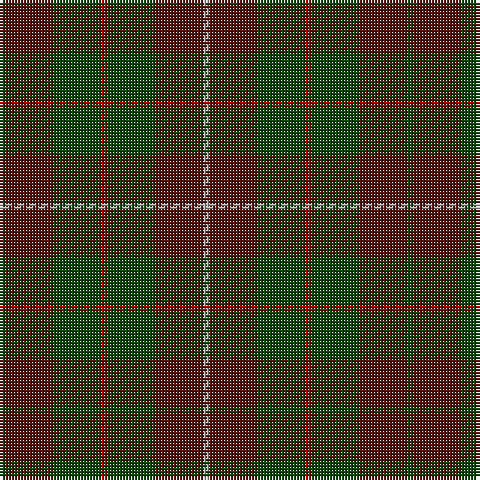

In pattern [GBGRGBY](/stripes/gbgrgby/).

This was sourced from weddslist.  It is a [7 stripe tartan](/stripes/stripes7/).

Original link http://www.weddslist.com/cgi-bin/tartans/pg.pl?source=x

## Thread count
DG/2 DRa16 DG16 DR2 DG16 DRa16 N/2

## Palette
Each colour and the base-6 reference it is a variant of.

| Colour | Shade | Base |
|---|---|---|
| DG | <code style="background-color:#11450D;">#11450D</code> `oklch(34.4% 0.101 142.1)` <small>#11450D</small> | G <code style="background-color:#006100;">#006100</code> |
| DR | <code style="background-color:#AA0000;">#AA0000</code> `oklch(46.3% 0.190 29.2)` <small>#AA0000</small> | R <code style="background-color:#CC0000;">#CC0000</code> |
| DRa | <code style="background-color:#521510;">#521510</code> `oklch(29.8% 0.092 28.5)` <small>#521510</small> | B <code style="background-color:#2A418A;">#2A418A</code> |
| N | <code style="background-color:#AAAAAA;">#AAAAAA</code> `oklch(73.8% 0.000 89.9)` <small>#AAAAAA</small> | Y <code style="background-color:#F2BF00;">#F2BF00</code> |

# Sample pattern

## Nearest tartans

The nearest existing variants by ΔTartan distance.

1. [MacKinnon Hunting](/setts/s7/dg1dr8dg8r1dg8dr8lr1~x4/) — ΔT 0.00
1. [Duchess of York](/setts/s9/db1dy9dg5dy1k5dy1dg5dy9w1~x2/) — ΔT 1.45
1. [MacKinnon Hunting Clan Tartan Tartan Number: 917. Earliest known date: 1960 The modern hunting MacKinnon is based on the sett published in the Vestiarium Scoticum in 1842. The change is simply from red in the V.S. to brown in the modern version. The result was registered with Lord Lyon in 1960. See products available Copyright © Blair Urquhart, Comrie, 2015](/setts/s7/g1dy8g8r1g8dy8w1~x2/) — ΔT 1.46
1. [McCanna NW Htg (Personal)](/setts/s7/k1dy4dg1k1dg1k1dy1~x10/) — ΔT 1.53
1. [MacNab WI 2](/setts/s4/dg15r3n11b2~x2/) — ΔT 1.55
1. [MacNab WI2](/setts/s4/dg15r3n11b2/) — ΔT 1.55
1. [Amazing Union (Personal)](/setts/s9/r2dy15dg12dy2dt12dy2dg12dy15o2~x4/) — ΔT 1.59
1. [MacKinnon Hunting](/setts/s7/dg1dy8dg8r1dg8dy8w1~x2/) — ΔT 1.61
1. [McCanna NW (Olympia, USA) Hunting (Personal)](/setts/s7/k1dy4g1k1g1k1dy1~x14/) — ΔT 1.65
1. [Dege of Saville Row](/setts/s6/dy11db1dy3db1db9r1~x4/) — ΔT 1.74

## Neighbour map

Every grey dot is one of 14299 variants placed by the first two principal components of the ΔTartan feature space (44% of its variance). Red is this tartan; blue dots are its nearest — click one to open its page.

<svg viewBox="0 0 640 380" role="img" style="max-width:100%;height:auto;border:1px solid #e0e0e0;border-radius:4px;display:block" xmlns="http://www.w3.org/2000/svg"><image href="/nn/cloud.v1.png" width="640" height="380"/><a href="/setts/s7/dg1dr8dg8r1dg8dr8lr1~x4/"><circle cx="361.8" cy="281.9" r="4" fill="#3465a4"><title>MacKinnon Hunting</title></circle></a><a href="/setts/s9/db1dy9dg5dy1k5dy1dg5dy9w1~x2/"><circle cx="327.8" cy="239.1" r="4" fill="#3465a4"><title>Duchess of York</title></circle></a><a href="/setts/s7/g1dy8g8r1g8dy8w1~x2/"><circle cx="353.1" cy="281.6" r="4" fill="#3465a4"><title>MacKinnon Hunting Clan Tartan Tartan Number: 917. Earliest known date: 1960 The modern hunting MacKinnon is based on the sett published in the Vestiarium Scoticum in 1842. The change is simply from red in the V.S. to brown in the modern version. The result was registered with Lord Lyon in 1960. See products available Copyright © Blair Urquhart, Comrie, 2015</title></circle></a><a href="/setts/s7/k1dy4dg1k1dg1k1dy1~x10/"><circle cx="328.5" cy="312.8" r="4" fill="#3465a4"><title>McCanna NW Htg (Personal)</title></circle></a><a href="/setts/s4/dg15r3n11b2~x2/"><circle cx="335.6" cy="299.8" r="4" fill="#3465a4"><title>MacNab WI 2</title></circle></a><a href="/setts/s4/dg15r3n11b2/"><circle cx="335.6" cy="299.8" r="4" fill="#3465a4"><title>MacNab WI2</title></circle></a><a href="/setts/s9/r2dy15dg12dy2dt12dy2dg12dy15o2~x4/"><circle cx="270.9" cy="242.5" r="4" fill="#3465a4"><title>Amazing Union (Personal)</title></circle></a><a href="/setts/s7/dg1dy8dg8r1dg8dy8w1~x2/"><circle cx="371.2" cy="295.8" r="4" fill="#3465a4"><title>MacKinnon Hunting</title></circle></a><a href="/setts/s7/k1dy4g1k1g1k1dy1~x14/"><circle cx="317.4" cy="305.2" r="4" fill="#3465a4"><title>McCanna NW (Olympia, USA) Hunting (Personal)</title></circle></a><a href="/setts/s6/dy11db1dy3db1db9r1~x4/"><circle cx="399.7" cy="245.0" r="4" fill="#3465a4"><title>Dege of Saville Row</title></circle></a><circle cx="361.8" cy="281.9" r="5" fill="#c00000"/></svg>

ID: /setts/s7/dg1dr8dg8r1dg8dr8lr1~x2/
