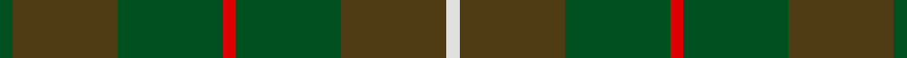

This page is one **sett** — a single exact thread-count. It belongs to the [tartan](/tartans/dg1dy8dg8r1dg8dy8w1/)
(the same proportion at any scale), whose colour order is pattern [GGGRGGW](/stripes/gggrggw/).

Sourced from register-of-tartans.  It is a [7 stripe tartan](/stripes/stripes7/).

Original link https://www.tartanregister.gov.uk/tartanDetails.aspx?ref=2555

## Register references

External register numbers recorded for this tartan.

- Scottish Register of Tartans: [2555](https://www.tartanregister.gov.uk/tartanDetails.aspx?ref=2555)
- Scottish Tartans World Register: 917

## Thread count
G/2 T16 G16 R2 G16 T16 LN/2

## Palette

Palette: <strong>Tartan Register</strong>
<table><thead><tr><th>Colour</th><th>Threads</th><th>Shade</th><th>Base</th><th>OKLCh</th></tr></thead><tbody><tr><td>G/</td><td style="text-align:right;font-variant-numeric:tabular-nums">2</td><td><code style="background-color:#005020;">#005020</code> <small style="color:#888">#005020</small></td><td>G <code style="background-color:#006100;">#006100</code></td><td><small style="color:#888">oklch(37.7% 0.105 149.6)</small></td></tr><tr><td>T</td><td style="text-align:right;font-variant-numeric:tabular-nums">16</td><td><code style="background-color:#503C14;">#503C14</code> <small style="color:#888">#503C14</small></td><td>G <code style="background-color:#006100;">#006100</code></td><td><small style="color:#888">oklch(37.0% 0.062 81.8)</small></td></tr><tr><td>G</td><td style="text-align:right;font-variant-numeric:tabular-nums">16</td><td><code style="background-color:#005020;">#005020</code> <small style="color:#888">#005020</small></td><td>G <code style="background-color:#006100;">#006100</code></td><td><small style="color:#888">oklch(37.7% 0.105 149.6)</small></td></tr><tr><td>R</td><td style="text-align:right;font-variant-numeric:tabular-nums">2</td><td><code style="background-color:#DC0000;">#DC0000</code> <small style="color:#888">#DC0000</small></td><td>R <code style="background-color:#CC0000;">#CC0000</code></td><td><small style="color:#888">oklch(56.2% 0.230 29.2)</small></td></tr><tr><td>G</td><td style="text-align:right;font-variant-numeric:tabular-nums">16</td><td><code style="background-color:#005020;">#005020</code> <small style="color:#888">#005020</small></td><td>G <code style="background-color:#006100;">#006100</code></td><td><small style="color:#888">oklch(37.7% 0.105 149.6)</small></td></tr><tr><td>T</td><td style="text-align:right;font-variant-numeric:tabular-nums">16</td><td><code style="background-color:#503C14;">#503C14</code> <small style="color:#888">#503C14</small></td><td>G <code style="background-color:#006100;">#006100</code></td><td><small style="color:#888">oklch(37.0% 0.062 81.8)</small></td></tr><tr><td>LN/</td><td style="text-align:right;font-variant-numeric:tabular-nums">2</td><td><code style="background-color:#E0E0E0;">#E0E0E0</code> <small style="color:#888">#E0E0E0</small></td><td>W <code style="background-color:#F7F7F7;">#F7F7F7</code></td><td><small style="color:#888">oklch(90.7% 0.000 89.9)</small></td></tr></tbody></table>

# Sample pattern

## Nearest tartans

The nearest existing variants by ΔTartan distance, with this tartan at the top so the swatches line up against it.

ΔTartan

Tartan

Sett

—

<a href="/ttd/edit/#slug=dg1dy8dg8r1dg8dy8w1~x2">MacKinnon Hunting</a> <a class="nn-out" href="/setts/s7/dg1dy8dg8r1dg8dy8w1~x2/" title="open its dictionary page">↗</a>

1.12

<a href="/ttd/edit/#slug=y4dg18dg6dg6dg24k3~x2">Park Estate</a> <a class="nn-out" href="/setts/s6/y4dg18dg6dg6dg24k3~x2/" title="open its dictionary page">↗</a>

1.15

<a href="/ttd/edit/#slug=y4dg18dg6dg6dg24ly3~x2">Park (Estate Check)</a> <a class="nn-out" href="/setts/s6/y4dg18dg6dg6dg24ly3~x2/" title="open its dictionary page">↗</a>

1.21

<a href="/ttd/edit/#slug=g1dy8g8r1g8dy8w1~x2">MacKinnon Hunting Clan Tartan Tartan Number: 917. Earliest known date: 1960 The modern hunting MacKinnon is based on the sett published in the Vestiarium Scoticum in 1842. The change is simply from red in the V.S. to brown in the modern version. The result was registered with Lord Lyon in 1960. See products available Copyright © Blair Urquhart, Comrie, 2015</a> <a class="nn-out" href="/setts/s7/g1dy8g8r1g8dy8w1~x2/" title="open its dictionary page">↗</a>

1.51

<a href="/ttd/edit/#slug=dy8w1dy8g8r1g8dy8g1dy8g8r1g8~x8">MacKinnon Hunting #3</a> <a class="nn-out" href="/setts/s12/dy8w1dy8g8r1g8dy8g1dy8g8r1g8~x8/" title="open its dictionary page">↗</a>

1.52

<a href="/ttd/edit/#slug=dg11n4dg6dy11n1k1dy4~x4">Calais (Fashion)</a> <a class="nn-out" href="/setts/s7/dg11n4dg6dy11n1k1dy4~x4/" title="open its dictionary page">↗</a>

1.60

<a href="/ttd/edit/#slug=dg4ly2dg17dg2r4dg2dg3dg11dg2~x2">Armagh, County</a> <a class="nn-out" href="/setts/s9/dg4ly2dg17dg2r4dg2dg3dg11dg2~x2/" title="open its dictionary page">↗</a>

1.61

<a href="/ttd/edit/#slug=dg1dr8dg8r1dg8dr8lr1~x4">MacKinnon Hunting</a> <a class="nn-out" href="/setts/s7/dg1dr8dg8r1dg8dr8lr1~x4/" title="open its dictionary page">↗</a>

1.61

<a href="/ttd/edit/#slug=dg1dr8dg8r1dg8dr8lr1~x2">MacKinnon Hunting</a> <a class="nn-out" href="/setts/s7/dg1dr8dg8r1dg8dr8lr1~x2/" title="open its dictionary page">↗</a>

1.73

<a href="/ttd/edit/#slug=dg5k2dg28k10dy26db4dg4~x2">John Telfar Dunbar Hunting</a> <a class="nn-out" href="/setts/s7/dg5k2dg28k10dy26db4dg4~x2/" title="open its dictionary page">↗</a>

1.77

<a href="/ttd/edit/#slug=dg8do2dg13db4dg12n22dg5ly3~x2">Scottish Pup</a> <a class="nn-out" href="/setts/s8/dg8do2dg13db4dg12n22dg5ly3~x2/" title="open its dictionary page">↗</a>

## Neighbour map

Every grey dot is one of 14299 variants placed by the first two principal components of the ΔTartan feature space (44% of its variance). Red is this tartan; blue dots are its nearest — click one to open its page.

<svg viewBox="0 0 640 380" role="img" style="max-width:100%;height:auto;border:1px solid #e0e0e0;border-radius:4px;display:block" xmlns="http://www.w3.org/2000/svg"><image href="/nn/cloud.v1.png" width="640" height="380"/><a href="/setts/s6/y4dg18dg6dg6dg24k3~x2/"><circle cx="369.9" cy="301.1" r="4" fill="#3465a4"><title>Park Estate</title></circle></a><a href="/setts/s6/y4dg18dg6dg6dg24ly3~x2/"><circle cx="377.3" cy="303.3" r="4" fill="#3465a4"><title>Park (Estate Check)</title></circle></a><a href="/setts/s7/g1dy8g8r1g8dy8w1~x2/"><circle cx="353.1" cy="281.6" r="4" fill="#3465a4"><title>MacKinnon Hunting Clan Tartan Tartan Number: 917. Earliest known date: 1960 The modern hunting MacKinnon is based on the sett published in the Vestiarium Scoticum in 1842. The change is simply from red in the V.S. to brown in the modern version. The result was registered with Lord Lyon in 1960. See products available Copyright © Blair Urquhart, Comrie, 2015</title></circle></a><a href="/setts/s12/dy8w1dy8g8r1g8dy8g1dy8g8r1g8~x8/"><circle cx="358.1" cy="283.9" r="4" fill="#3465a4"><title>MacKinnon Hunting #3</title></circle></a><a href="/setts/s7/dg11n4dg6dy11n1k1dy4~x4/"><circle cx="369.6" cy="292.4" r="4" fill="#3465a4"><title>Calais (Fashion)</title></circle></a><a href="/setts/s9/dg4ly2dg17dg2r4dg2dg3dg11dg2~x2/"><circle cx="385.9" cy="256.1" r="4" fill="#3465a4"><title>Armagh, County</title></circle></a><a href="/setts/s7/dg1dr8dg8r1dg8dr8lr1~x4/"><circle cx="361.8" cy="281.9" r="4" fill="#3465a4"><title>MacKinnon Hunting</title></circle></a><a href="/setts/s7/dg1dr8dg8r1dg8dr8lr1~x2/"><circle cx="361.8" cy="281.9" r="4" fill="#3465a4"><title>MacKinnon Hunting</title></circle></a><a href="/setts/s7/dg5k2dg28k10dy26db4dg4~x2/"><circle cx="392.1" cy="269.1" r="4" fill="#3465a4"><title>John Telfar Dunbar Hunting</title></circle></a><a href="/setts/s8/dg8do2dg13db4dg12n22dg5ly3~x2/"><circle cx="358.1" cy="250.2" r="4" fill="#3465a4"><title>Scottish Pup</title></circle></a><circle cx="371.2" cy="295.8" r="5" fill="#c00000"/></svg>

ID: /setts/s7/dg1dy8dg8r1dg8dy8w1~x2/
