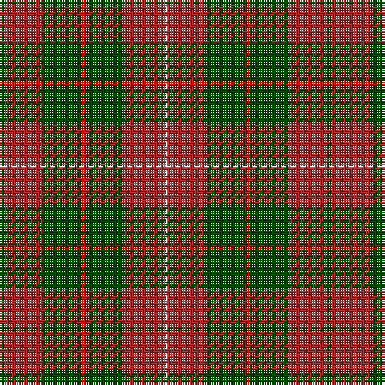

**Bands:** [GRGRGRW](/stripes/grgrgrw/) · **Stripes:** [DG R DG R DG R LB](/stripes/stripes7/) DG R DG R DG R LB

This was sourced from weddslist.  It is a [7 band tartan](/bands/bands7/).

Original link http://www.weddslist.com/cgi-bin/tartans/pg.pl?source=rb

## Register references

External register numbers recorded for this tartan.

- Scottish Register of Tartans: [2540](https://www.tartanregister.gov.uk/tartanDetails.aspx?ref=2540)
- Scottish Register of Tartans: [2666](https://www.tartanregister.gov.uk/tartanDetails.aspx?ref=2666)
- Scottish Register of Tartans: [3808](https://www.tartanregister.gov.uk/tartanDetails.aspx?ref=3808)
- Scottish Tartans Authority (ITI): 218
- Scottish Tartans World Register: 1010
- Scottish Tartans World Register: 1585
- Scottish Tartans World Register: 218

## Thread count
G/2 DR16 G16 R2 G16 DR16 N/2

## Palette
Each colour and its ΔE from the base-6 reference it is a variant of.

| Colour | Shade | Base | ΔE (OKLab) |
|---|---|---|---|
| DR | <code style="background-color:#A52A2A;">#A52A2A</code> `#A52A2A` | R <code style="background-color:#CC0000;">#CC0000</code> | 0.08 |
| G | <code style="background-color:#004C00;">#004C00</code> `#004C00` | G <code style="background-color:#006100;">#006100</code> | 0.07 |
| N | <code style="background-color:#D0D0D0;">#D0D0D0</code> `#D0D0D0` | W <code style="background-color:#F7F7F7;">#F7F7F7</code> | 0.12 |
| R | <code style="background-color:#C80000;">#C80000</code> `#C80000` | R <code style="background-color:#CC0000;">#CC0000</code> | 0.01 |

# Sample pattern

## Nearest tartans

The nearest existing variants by ΔTartan distance.

1. [Comyn](/setts/s8/k1r9dg2r2dg4lr1dg4r1~x2/) — ΔT 1.08
1. [Comyn](/setts/s8/k1r9dg2r2dg4lr1dg4r1/) — ΔT 1.08
1. [Invertere, (Daks)](/setts/s8/r5dg12o4db4o22dg3o4r5/) — ΔT 1.15
1. [Crossnor School](/setts/s7/dg4r2dg13lb2r13dg2r4~x2/) — ΔT 1.16
1. [Hubbard (2016)](/setts/s9/dt5r19dt2y8r3y18dt2y9dt2~x2/) — ΔT 1.23
1. [Tartan for London, A (Fashion)](/setts/s7/r30dg18lr3dg18r20lb3g3~x2/) — ΔT 1.25
1. [Bruce](/setts/s11/lr1r8dg2r2dg6r1dg6r2dg2r8ly1~x2/) — ΔT 1.27
1. [Fulton Family Tartan Tartan Number: 2205. Earliest known date: 1982 For anyone of the name Fulton. See products available Copyright © Blair Urquhart, Comrie, 2015](/setts/s9/r4k2g17r6g6r6g15r20lo3~x2/) — ΔT 1.32
1. [Burnett](/setts/s8/r4g14ly3g14r4g3r29y4~x2/) — ΔT 1.32
1. [Oakwood](/setts/s8/dg13ly2dg2ly2dg4r10g2r2~x4/) — ΔT 1.33

## Neighbour map

Every grey dot is one of 14313 variants placed by the first two principal components of the ΔTartan feature space (44% of its variance). Red is this tartan; blue dots are its nearest — click one to open its page.

<svg viewBox="0 0 640 380" role="img" style="max-width:100%;height:auto;border:1px solid #e0e0e0;border-radius:4px;display:block" xmlns="http://www.w3.org/2000/svg"><image href="/nn/cloud.v1.png" width="640" height="380"/><a href="/setts/s8/k1r9dg2r2dg4lr1dg4r1~x2/"><circle cx="305.6" cy="206.2" r="4" fill="#3465a4"><title>Comyn</title></circle></a><a href="/setts/s8/k1r9dg2r2dg4lr1dg4r1/"><circle cx="305.6" cy="206.2" r="4" fill="#3465a4"><title>Comyn</title></circle></a><a href="/setts/s8/r5dg12o4db4o22dg3o4r5/"><circle cx="285.6" cy="224.6" r="4" fill="#3465a4"><title>Invertere, (Daks)</title></circle></a><a href="/setts/s7/dg4r2dg13lb2r13dg2r4~x2/"><circle cx="327.4" cy="250.3" r="4" fill="#3465a4"><title>Crossnor School</title></circle></a><a href="/setts/s9/dt5r19dt2y8r3y18dt2y9dt2~x2/"><circle cx="317.6" cy="212.5" r="4" fill="#3465a4"><title>Hubbard (2016)</title></circle></a><a href="/setts/s7/r30dg18lr3dg18r20lb3g3~x2/"><circle cx="309.5" cy="216.0" r="4" fill="#3465a4"><title>Tartan for London, A (Fashion)</title></circle></a><a href="/setts/s11/lr1r8dg2r2dg6r1dg6r2dg2r8ly1~x2/"><circle cx="327.6" cy="211.1" r="4" fill="#3465a4"><title>Bruce</title></circle></a><a href="/setts/s9/r4k2g17r6g6r6g15r20lo3~x2/"><circle cx="262.2" cy="193.2" r="4" fill="#3465a4"><title>Fulton Family Tartan Tartan Number: 2205. Earliest known date: 1982 For anyone of the name Fulton. See products available Copyright © Blair Urquhart, Comrie, 2015</title></circle></a><a href="/setts/s8/r4g14ly3g14r4g3r29y4~x2/"><circle cx="308.9" cy="194.0" r="4" fill="#3465a4"><title>Burnett</title></circle></a><a href="/setts/s8/dg13ly2dg2ly2dg4r10g2r2~x4/"><circle cx="279.0" cy="217.0" r="4" fill="#3465a4"><title>Oakwood</title></circle></a><circle cx="303.9" cy="240.4" r="5" fill="#c00000"/></svg>

ID: /setts/s7/dg1r8dg8r1dg8r8lb1~x2/
