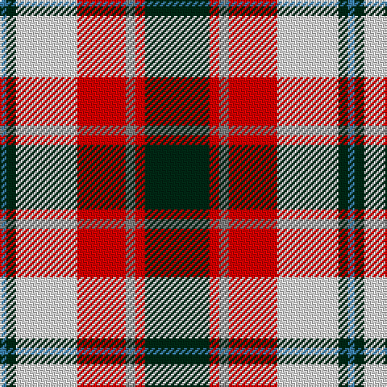

In pattern [BGWRGRG](/stripes/bgwrgrg/).

This was sourced from register-of-tartans.  It is a [7 stripe tartan](/stripes/stripes7/).

Original link https://www.tartanregister.gov.uk/tartanDetails.aspx?ref=1348

## Attestations

This cloth appears in 2 source records; the oldest owns this page.

- undated — Glasgow (register-of-tartans, [record](https://www.tartanregister.gov.uk/tartanDetails.aspx?ref=1348))
- undated — Glasgow (weddslist, [record](http://www.weddslist.com/cgi-bin/tartans/pg.pl?source=sts))

## Register references

External register numbers recorded for this tartan.

- Scottish Register of Tartans: [1348](https://www.tartanregister.gov.uk/tartanDetails.aspx?ref=1348)
- Scottish Tartans World Register: 195

## Thread count
DG/40 R6 N6 R30 LN38 DG6 B/4

## Palette
Each colour and the base-6 reference it is a variant of.

| Colour | Shade | Base |
|---|---|---|
| B | <code style="background-color:#3C82AF;">#3C82AF</code> `oklch(58.1% 0.099 239.8)` <small>#3C82AF</small> | B <code style="background-color:#2A418A;">#2A418A</code> |
| DG | <code style="background-color:#002814;">#002814</code> `oklch(24.4% 0.059 156.5)` <small>#002814</small> | G <code style="background-color:#006100;">#006100</code> |
| LN | <code style="background-color:#E0E0E0;">#E0E0E0</code> `oklch(90.7% 0.000 89.9)` <small>#E0E0E0</small> | W <code style="background-color:#F7F7F7;">#F7F7F7</code> |
| N | <code style="background-color:#808080;">#808080</code> `oklch(60.0% 0.000 89.9)` <small>#808080</small> | G <code style="background-color:#006100;">#006100</code> |
| R | <code style="background-color:#DC0000;">#DC0000</code> `oklch(56.2% 0.230 29.2)` <small>#DC0000</small> | R <code style="background-color:#CC0000;">#CC0000</code> |

# Sample pattern

## Nearest tartans

The nearest existing variants by ΔTartan distance, with this tartan at the top so the swatches line up against it.

ΔTartan

Tartan

Sett

—

<a href="/ttd/edit/#slug=dg20r3y3r15w19dg3t2~x2">Glasgow</a> <a class="nn-out" href="/setts/s7/dg20r3y3r15w19dg3t2~x2/" title="open its dictionary page">↗</a>

0.57

<a href="/ttd/edit/#slug=r2w12y1k12o12k1~x2">Dutch Dress</a> <a class="nn-out" href="/setts/s6/r2w12y1k12o12k1~x2/" title="open its dictionary page">↗</a>

0.73

<a href="/ttd/edit/#slug=r2w12t1k12lo12k1~x2">Dutch, dress</a> <a class="nn-out" href="/setts/s6/r2w12t1k12lo12k1~x2/" title="open its dictionary page">↗</a>

0.76

<a href="/ttd/edit/#slug=r36w3lo4g24w24k3lo6~x2">MacLachlan Dress</a> <a class="nn-out" href="/setts/s7/r36w3lo4g24w24k3lo6~x2/" title="open its dictionary page">↗</a>

0.85

<a href="/ttd/edit/#slug=g4ly7o9ly9db20w2db2~x2">Tombow 140th Anniversary, The</a> <a class="nn-out" href="/setts/s7/g4ly7o9ly9db20w2db2~x2/" title="open its dictionary page">↗</a>

0.90

<a href="/ttd/edit/#slug=dg2do8dg8r3do1w12dg2y1~x2">National Trust Corporate Tartan Tartan Number: 2117. Earliest known date: pre 1991 Sent in by Tweedmill for information. See products available Copyright © Blair Urquhart, Comrie, 2015</a> <a class="nn-out" href="/setts/s8/dg2do8dg8r3do1w12dg2y1~x2/" title="open its dictionary page">↗</a>

0.94

<a href="/ttd/edit/#slug=lb5k26ly4lb24dp8k3r4~x2">Pengelly, The Cornish (Name)</a> <a class="nn-out" href="/setts/s7/lb5k26ly4lb24dp8k3r4~x2/" title="open its dictionary page">↗</a>

0.99

<a href="/ttd/edit/#slug=r4o25k6w12k11ly3~x2">Thomson Dress (Grey) (Fashion)</a> <a class="nn-out" href="/setts/s6/r4o25k6w12k11ly3~x2/" title="open its dictionary page">↗</a>

1.00

<a href="/ttd/edit/#slug=r34w3dg4g23w24k3dg4~x2">MacLachlan, dress</a> <a class="nn-out" href="/setts/s7/r34w3dg4g23w24k3dg4~x2/" title="open its dictionary page">↗</a>

1.04

<a href="/ttd/edit/#slug=r5w2o20ly2k16w18k2w5~x2">Ailsa Craig</a> <a class="nn-out" href="/setts/s8/r5w2o20ly2k16w18k2w5~x2/" title="open its dictionary page">↗</a>

1.07

<a href="/ttd/edit/#slug=r34w3g4g23w24k3g4~x2">MacLachlan Dress Clan Tartan Tartan Number: 828. Earliest known date: 1990 Based on the MacLachlan pattern in Old And Rare See products available Copyright © Blair Urquhart, Comrie, 2015</a> <a class="nn-out" href="/setts/s7/r34w3g4g23w24k3g4~x2/" title="open its dictionary page">↗</a>

## Neighbour map

Every grey dot is one of 14299 variants placed by the first two principal components of the ΔTartan feature space (44% of its variance). Red is this tartan; blue dots are its nearest — click one to open its page.

<svg viewBox="0 0 640 380" role="img" style="max-width:100%;height:auto;border:1px solid #e0e0e0;border-radius:4px;display:block" xmlns="http://www.w3.org/2000/svg"><image href="/nn/cloud.v1.png" width="640" height="380"/><a href="/setts/s6/r2w12y1k12o12k1~x2/"><circle cx="132.4" cy="162.1" r="4" fill="#3465a4"><title>Dutch Dress</title></circle></a><a href="/setts/s6/r2w12t1k12lo12k1~x2/"><circle cx="121.0" cy="154.0" r="4" fill="#3465a4"><title>Dutch, dress</title></circle></a><a href="/setts/s7/r36w3lo4g24w24k3lo6~x2/"><circle cx="140.3" cy="146.4" r="4" fill="#3465a4"><title>MacLachlan Dress</title></circle></a><a href="/setts/s7/g4ly7o9ly9db20w2db2~x2/"><circle cx="156.1" cy="170.7" r="4" fill="#3465a4"><title>Tombow 140th Anniversary, The</title></circle></a><a href="/setts/s8/dg2do8dg8r3do1w12dg2y1~x2/"><circle cx="123.0" cy="151.9" r="4" fill="#3465a4"><title>National Trust Corporate Tartan Tartan Number: 2117. Earliest known date: pre 1991 Sent in by Tweedmill for information. See products available Copyright © Blair Urquhart, Comrie, 2015</title></circle></a><a href="/setts/s7/lb5k26ly4lb24dp8k3r4~x2/"><circle cx="152.6" cy="162.2" r="4" fill="#3465a4"><title>Pengelly, The Cornish (Name)</title></circle></a><a href="/setts/s6/r4o25k6w12k11ly3~x2/"><circle cx="141.3" cy="185.0" r="4" fill="#3465a4"><title>Thomson Dress (Grey) (Fashion)</title></circle></a><a href="/setts/s7/r34w3dg4g23w24k3dg4~x2/"><circle cx="148.8" cy="150.9" r="4" fill="#3465a4"><title>MacLachlan, dress</title></circle></a><a href="/setts/s8/r5w2o20ly2k16w18k2w5~x2/"><circle cx="117.9" cy="146.9" r="4" fill="#3465a4"><title>Ailsa Craig</title></circle></a><a href="/setts/s7/r34w3g4g23w24k3g4~x2/"><circle cx="154.6" cy="155.2" r="4" fill="#3465a4"><title>MacLachlan Dress Clan Tartan Tartan Number: 828. Earliest known date: 1990 Based on the MacLachlan pattern in Old And Rare See products available Copyright © Blair Urquhart, Comrie, 2015</title></circle></a><circle cx="134.8" cy="157.9" r="5" fill="#c00000"/></svg>

ID: /setts/s7/dg20r3y3r15w19dg3t2~x2/
