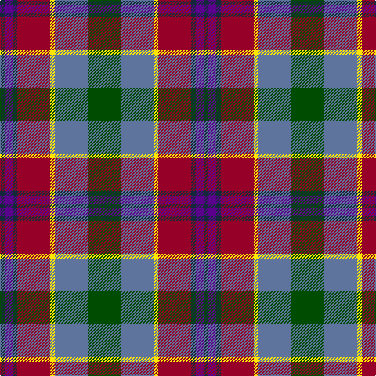

This page is one **sett** — a single exact thread-count. It belongs to the [tartan](/tartans/dg21t21ly3r21dt3dp5dt3/)
(the same proportion at any scale), whose colour order is pattern [BBBRYBG](/stripes/bbbrybg/).

Sourced from register-of-tartans.  It is a [7 stripe tartan](/stripes/stripes7/).

Original link https://www.tartanregister.gov.uk/tartanDetails.aspx?ref=11033

## Register references

External register numbers recorded for this tartan.

- Scottish Register of Tartans: [11033](https://www.tartanregister.gov.uk/tartanDetails.aspx?ref=11033)

## Thread count
G/42 B42 Y6 DR42 DN6 P10 DN/6

## Palette

Palette: <strong>Tartan Register</strong>
<table><thead><tr><th>Colour</th><th>Threads</th><th>Shade</th><th>Base</th><th>OKLCh</th></tr></thead><tbody><tr><td>G/</td><td style="text-align:right;font-variant-numeric:tabular-nums">42</td><td><code style="background-color:#004C00;">#004C00</code> <small style="color:#888">#004C00</small></td><td>G <code style="background-color:#006100;">#006100</code></td><td><small style="color:#888">oklch(36.1% 0.123 142.5)</small></td></tr><tr><td>B</td><td style="text-align:right;font-variant-numeric:tabular-nums">42</td><td><code style="background-color:#5F749C;">#5F749C</code> <small style="color:#888">#5F749C</small></td><td>B <code style="background-color:#2A418A;">#2A418A</code></td><td><small style="color:#888">oklch(55.8% 0.067 262.9)</small></td></tr><tr><td>Y</td><td style="text-align:right;font-variant-numeric:tabular-nums">6</td><td><code style="background-color:#FFE600;">#FFE600</code> <small style="color:#888">#FFE600</small></td><td>Y <code style="background-color:#F2BF00;">#F2BF00</code></td><td><small style="color:#888">oklch(91.7% 0.192 101.4)</small></td></tr><tr><td>DR</td><td style="text-align:right;font-variant-numeric:tabular-nums">42</td><td><code style="background-color:#960028;">#960028</code> <small style="color:#888">#960028</small></td><td>R <code style="background-color:#CC0000;">#CC0000</code></td><td><small style="color:#888">oklch(42.7% 0.171 18.3)</small></td></tr><tr><td>DN</td><td style="text-align:right;font-variant-numeric:tabular-nums">6</td><td><code style="background-color:#14283C;">#14283C</code> <small style="color:#888">#14283C</small></td><td>B <code style="background-color:#2A418A;">#2A418A</code></td><td><small style="color:#888">oklch(27.1% 0.046 249.9)</small></td></tr><tr><td>P</td><td style="text-align:right;font-variant-numeric:tabular-nums">10</td><td><code style="background-color:#5A008C;">#5A008C</code> <small style="color:#888">#5A008C</small></td><td>B <code style="background-color:#2A418A;">#2A418A</code></td><td><small style="color:#888">oklch(37.0% 0.191 306.3)</small></td></tr><tr><td>DN/</td><td style="text-align:right;font-variant-numeric:tabular-nums">6</td><td><code style="background-color:#14283C;">#14283C</code> <small style="color:#888">#14283C</small></td><td>B <code style="background-color:#2A418A;">#2A418A</code></td><td><small style="color:#888">oklch(27.1% 0.046 249.9)</small></td></tr></tbody></table>

# Sample pattern

## Nearest tartans

The nearest existing variants by ΔTartan distance, with this tartan at the top so the swatches line up against it.

ΔTartan

Tartan

Sett

—

<a href="/ttd/edit/#slug=dg21t21ly3r21dt3dp5dt3~x2">Falardeau-Murphy (Canada) (Personal)</a> <a class="nn-out" href="/setts/s7/dg21t21ly3r21dt3dp5dt3~x2/" title="open its dictionary page">↗</a>

0.79

<a href="/ttd/edit/#slug=g21t21ly3r21n3dp5n3~x2">Falardeau-Murphy (Canada) (Personal)</a> <a class="nn-out" href="/setts/s7/g21t21ly3r21n3dp5n3~x2/" title="open its dictionary page">↗</a>

1.00

<a href="/ttd/edit/#slug=w3db17o16dbi2dg17ly2~x2">Atlantic, Ancient</a> <a class="nn-out" href="/setts/s6/w3db17o16dbi2dg17ly2~x2/" title="open its dictionary page">↗</a>

1.09

<a href="/ttd/edit/#slug=w3dbi17dy16db2dg17ly2~x2">Atlantic Ancient Trade Tartan Tartan Number: 1781. Earliest known date: 1968 Also known as Murray of Atholl, it has been authorized by Ian Murray, Duke of Atholl. See products available Copyright © Blair Urquhart, Comrie, 2015</a> <a class="nn-out" href="/setts/s6/w3dbi17dy16db2dg17ly2~x2/" title="open its dictionary page">↗</a>

1.09

<a href="/ttd/edit/#slug=lo3do2n18lb3o13lb4k3lb4do18lb3~x2">Leitrim, County</a> <a class="nn-out" href="/setts/s10/lo3do2n18lb3o13lb4k3lb4do18lb3~x2/" title="open its dictionary page">↗</a>

1.13

<a href="/ttd/edit/#slug=m6y2db12k2y12m9k2lo2~x2">Orkney</a> <a class="nn-out" href="/setts/s8/m6y2db12k2y12m9k2lo2~x2/" title="open its dictionary page">↗</a>

1.15

<a href="/ttd/edit/#slug=o21ly4dy5ly4o5k21g21lo5~x2">Labrador Club of Scotland (Corporate</a> <a class="nn-out" href="/setts/s8/o21ly4dy5ly4o5k21g21lo5~x2/" title="open its dictionary page">↗</a>

1.15

<a href="/ttd/edit/#slug=do19dg23lo3db15r11w5~x2">Mekos, The</a> <a class="nn-out" href="/setts/s6/do19dg23lo3db15r11w5~x2/" title="open its dictionary page">↗</a>

1.16

<a href="/setts/s9/w6b36ly12dyi19dy6r6dy6r28dy4/">Derry Family (Olney, Buckinghamshire) (Personal)</a>

1.17

<a href="/ttd/edit/#slug=k3y16k2dp12dg12k2o16lb3~x2">YPO Dress</a> <a class="nn-out" href="/setts/s8/k3y16k2dp12dg12k2o16lb3~x2/" title="open its dictionary page">↗</a>

1.18

<a href="/ttd/edit/#slug=m21lg4do5lg4m5k21g21lo5~x2">Caledonian Labrador Retrievers</a> <a class="nn-out" href="/setts/s8/m21lg4do5lg4m5k21g21lo5~x2/" title="open its dictionary page">↗</a>

## Neighbour map

Every grey dot is one of 14359 variants placed by the first two principal components of the ΔTartan feature space (44% of its variance). Red is this tartan; blue dots are its nearest — click one to open its page.

<svg viewBox="0 0 640 380" role="img" style="max-width:100%;height:auto;border:1px solid #e0e0e0;border-radius:4px;display:block" xmlns="http://www.w3.org/2000/svg"><image href="/nn/cloud.v1.png" width="640" height="380"/><a href="/setts/s7/g21t21ly3r21n3dp5n3~x2/"><circle cx="112.0" cy="194.5" r="4" fill="#3465a4"><title>Falardeau-Murphy (Canada) (Personal)</title></circle></a><a href="/setts/s6/w3db17o16dbi2dg17ly2~x2/"><circle cx="119.5" cy="198.8" r="4" fill="#3465a4"><title>Atlantic, Ancient</title></circle></a><a href="/setts/s6/w3dbi17dy16db2dg17ly2~x2/"><circle cx="132.5" cy="207.4" r="4" fill="#3465a4"><title>Atlantic Ancient Trade Tartan Tartan Number: 1781. Earliest known date: 1968 Also known as Murray of Atholl, it has been authorized by Ian Murray, Duke of Atholl. See products available Copyright © Blair Urquhart, Comrie, 2015</title></circle></a><a href="/setts/s10/lo3do2n18lb3o13lb4k3lb4do18lb3~x2/"><circle cx="114.2" cy="157.8" r="4" fill="#3465a4"><title>Leitrim, County</title></circle></a><a href="/setts/s8/m6y2db12k2y12m9k2lo2~x2/"><circle cx="141.2" cy="218.8" r="4" fill="#3465a4"><title>Orkney</title></circle></a><a href="/setts/s8/o21ly4dy5ly4o5k21g21lo5~x2/"><circle cx="70.5" cy="193.4" r="4" fill="#3465a4"><title>Labrador Club of Scotland (Corporate</title></circle></a><a href="/setts/s6/do19dg23lo3db15r11w5~x2/"><circle cx="86.5" cy="218.3" r="4" fill="#3465a4"><title>Mekos, The</title></circle></a><a href="/setts/s9/w6b36ly12dyi19dy6r6dy6r28dy4/"><circle cx="107.7" cy="163.9" r="4" fill="#3465a4"><title>Derry Family (Olney, Buckinghamshire) (Personal)</title></circle></a><a href="/setts/s8/k3y16k2dp12dg12k2o16lb3~x2/"><circle cx="91.5" cy="195.8" r="4" fill="#3465a4"><title>YPO Dress</title></circle></a><a href="/setts/s8/m21lg4do5lg4m5k21g21lo5~x2/"><circle cx="64.4" cy="190.1" r="4" fill="#3465a4"><title>Caledonian Labrador Retrievers</title></circle></a><circle cx="104.8" cy="192.7" r="5" fill="#c00000"/></svg>

ID: /setts/s7/dg21t21ly3r21dt3dp5dt3~x2/
