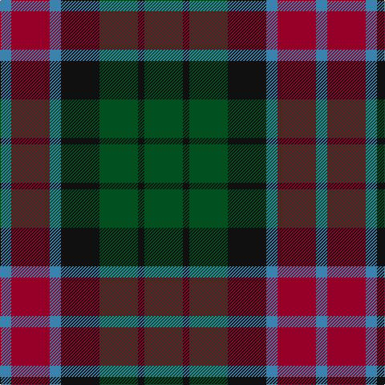

**Bands:** [BRBKGKG](/stripes/brbkgkg/) · **Stripes:** [T R T K DG K DG](/stripes/stripes7/) T R T K DG K DG

This was sourced from register-of-tartans.  It is a [7 band tartan](/bands/bands7/).

Original link https://www.tartanregister.gov.uk/tartanDetails.aspx?ref=4341

## Register references

External register numbers recorded for this tartan.

- Scottish Register of Tartans: [4341](https://www.tartanregister.gov.uk/tartanDetails.aspx?ref=4341)
- Scottish Tartans World Register: 413

## Thread count
B/14 DR48 B14 K48 G48 K8 G/48

## Palette
Each colour and its ΔE from the base-6 reference it is a variant of.

| Colour | Shade | Base | ΔE (OKLab) |
|---|---|---|---|
| B | <code style="background-color:#3C82AF;">#3C82AF</code> `#3C82AF` | B <code style="background-color:#2A418A;">#2A418A</code> | 0.19 |
| DR | <code style="background-color:#960028;">#960028</code> `#960028` | R <code style="background-color:#CC0000;">#CC0000</code> | 0.12 |
| G | <code style="background-color:#005020;">#005020</code> `#005020` | G <code style="background-color:#006100;">#006100</code> | 0.07 |
| K | <code style="background-color:#101010;">#101010</code> `#101010` | K <code style="background-color:#000000;">#000000</code> | 0.17 |

# Sample pattern

## Nearest tartans

The nearest existing variants by ΔTartan distance.

1. [Gleneagles Group Corporate Tartan Tartan Number: 2107. Earliest known date: 1989 Designed for a range of tartan goods called the Gleneagles Collection. See products available Copyright © Blair Urquhart, Comrie, 2015](/setts/s7/dr5g6dy1g6dr5db6dr1~x2/) — ΔT 0.90
1. [Tennant](/setts/s7/r1db7g7db7g7dr7r1~x4/) — ΔT 0.90
1. [Abercrombie (Wilsons No 2/64)](/setts/s7/k6dg6ly1dg6k6dp6k1~x4/) — ΔT 0.93
1. [MacCallum](/setts/s7/g21k6t3g11k17db17k3~x2/) — ΔT 1.04
1. [Gunn - 1810 (Clan)](/setts/s6/r4g12k12g2db12g3~x2/) — ΔT 1.05
1. [Daks (Navy)](/setts/s8/r3g6db2db2db11g9db2r3~x2/) — ΔT 1.05
1. [Scottish Parliament (unofficial)](/setts/s7/db14g18k3g18r20k14lo3~x2/) — ΔT 1.07
1. [Hebrides #8](/setts/s8/db7r3g7r1g7r3db7t1~x2/) — ΔT 1.07
1. [Scottish Airports](/setts/s6/n4g18n3k17n18p4~x2/) — ΔT 1.08
1. [MacKay (Bonner)](/setts/s6/dg1db5dg1k5dg6ly1~x2/) — ΔT 1.09

## Neighbour map

Every grey dot is one of 14313 variants placed by the first two principal components of the ΔTartan feature space (44% of its variance). Red is this tartan; blue dots are its nearest — click one to open its page.

<svg viewBox="0 0 640 380" role="img" style="max-width:100%;height:auto;border:1px solid #e0e0e0;border-radius:4px;display:block" xmlns="http://www.w3.org/2000/svg"><image href="/nn/cloud.v1.png" width="640" height="380"/><a href="/setts/s7/dr5g6dy1g6dr5db6dr1~x2/"><circle cx="212.8" cy="283.4" r="4" fill="#3465a4"><title>Gleneagles Group Corporate Tartan Tartan Number: 2107. Earliest known date: 1989 Designed for a range of tartan goods called the Gleneagles Collection. See products available Copyright © Blair Urquhart, Comrie, 2015</title></circle></a><a href="/setts/s7/r1db7g7db7g7dr7r1~x4/"><circle cx="179.9" cy="265.0" r="4" fill="#3465a4"><title>Tennant</title></circle></a><a href="/setts/s7/k6dg6ly1dg6k6dp6k1~x4/"><circle cx="192.5" cy="278.7" r="4" fill="#3465a4"><title>Abercrombie (Wilsons No 2/64)</title></circle></a><a href="/setts/s7/g21k6t3g11k17db17k3~x2/"><circle cx="205.7" cy="262.1" r="4" fill="#3465a4"><title>MacCallum</title></circle></a><a href="/setts/s6/r4g12k12g2db12g3~x2/"><circle cx="167.4" cy="263.6" r="4" fill="#3465a4"><title>Gunn - 1810 (Clan)</title></circle></a><a href="/setts/s8/r3g6db2db2db11g9db2r3~x2/"><circle cx="200.6" cy="247.1" r="4" fill="#3465a4"><title>Daks (Navy)</title></circle></a><a href="/setts/s7/db14g18k3g18r20k14lo3~x2/"><circle cx="143.1" cy="245.7" r="4" fill="#3465a4"><title>Scottish Parliament (unofficial)</title></circle></a><a href="/setts/s8/db7r3g7r1g7r3db7t1~x2/"><circle cx="193.6" cy="247.0" r="4" fill="#3465a4"><title>Hebrides #8</title></circle></a><a href="/setts/s6/n4g18n3k17n18p4~x2/"><circle cx="211.2" cy="274.9" r="4" fill="#3465a4"><title>Scottish Airports</title></circle></a><a href="/setts/s6/dg1db5dg1k5dg6ly1~x2/"><circle cx="212.7" cy="265.6" r="4" fill="#3465a4"><title>MacKay (Bonner)</title></circle></a><circle cx="192.4" cy="268.7" r="5" fill="#c00000"/></svg>

ID: /setts/s7/dg24k4dg24k24t7r24t7~x2/
