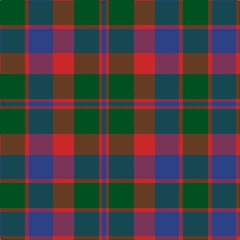

In pattern [BRGRBRG](/stripes/brgrbrg/).

This was sourced from register-of-tartans.  It is a [7 stripe tartan](/stripes/stripes7/).

Original link https://www.tartanregister.gov.uk/tartanDetails.aspx?ref=1349

## Also known as

This cloth is also recorded under:

- Glasgow #2

## Register references

External register numbers recorded for this tartan.

- Scottish Register of Tartans: [1349](https://www.tartanregister.gov.uk/tartanDetails.aspx?ref=1349)
- Scottish Tartans World Register: 534

## Thread count
G/50 R8 B48 R42 G50 R6 B/8

## Palette
Each colour and the base-6 reference it is a variant of.

| Colour | Shade | Base |
|---|---|---|
| B | <code style="background-color:#2C4084;">#2C4084</code> `oklch(39.4% 0.117 268.3)` <small>#2C4084</small> | B <code style="background-color:#2A418A;">#2A418A</code> |
| G | <code style="background-color:#005020;">#005020</code> `oklch(37.7% 0.105 149.6)` <small>#005020</small> | G <code style="background-color:#006100;">#006100</code> |
| R | <code style="background-color:#C82828;">#C82828</code> `oklch(54.2% 0.196 26.8)` <small>#C82828</small> | R <code style="background-color:#CC0000;">#CC0000</code> |

# Sample pattern

## Nearest tartans

The nearest existing variants by ΔTartan distance.

1. [GS Gaelic School (School)](/setts/s7/dt30r5g30r22dt30r5g4/) — ΔT 0.41
1. [Rob Roy (Film)](/setts/s6/t3dg1t10dg4r10t2~x4/) — ΔT 1.01
1. [Glasgow, Rock and Wheel](/setts/s7/g25m4db24m21g25m4db2~x2/) — ΔT 1.02
1. [MacBean of Tomatin (Clan)](/setts/s7/db3r19db13r5g21r8db3~x2/) — ΔT 1.02
1. [Skene D](/setts/s7/db9r6dg2r6dg18r6dg2~x2/) — ΔT 1.03
1. [Logan #5](/setts/s6/db9r3db1g9r3db1~x2/) — ΔT 1.12
1. [Rob Roy (Film) (Corporate)](/setts/s6/t3dg1t10dg4dy10t2~x4/) — ΔT 1.15
1. [Daks-Simpson (Muted Skye)](/setts/s8/db5o15dy4o4dy24o4dy4db5/) — ΔT 1.17
1. [Skene Clan Tartan Tartan Number: 516. Earliest known date: 1886 Smith No 53 has ROSE in place of RED. Grant's version is similar to the sample named Skene in the 1830 pattern book of Wilson's of Bannockburn. See products available Copyright © Blair Urquhart, Comrie, 2015](/setts/s7/db6r3g2r3g12r3g2~x2/) — ΔT 1.18
1. [Robertson of Struan](/setts/s7/r6db2r2db21dg20r4dg4~x2/) — ΔT 1.19

## Neighbour map

Every grey dot is one of 14299 variants placed by the first two principal components of the ΔTartan feature space (44% of its variance). Red is this tartan; blue dots are its nearest — click one to open its page.

<svg viewBox="0 0 640 380" role="img" style="max-width:100%;height:auto;border:1px solid #e0e0e0;border-radius:4px;display:block" xmlns="http://www.w3.org/2000/svg"><image href="/nn/cloud.v1.png" width="640" height="380"/><a href="/setts/s7/dt30r5g30r22dt30r5g4/"><circle cx="270.3" cy="261.8" r="4" fill="#3465a4"><title>GS Gaelic School (School)</title></circle></a><a href="/setts/s6/t3dg1t10dg4r10t2~x4/"><circle cx="314.4" cy="246.9" r="4" fill="#3465a4"><title>Rob Roy (Film)</title></circle></a><a href="/setts/s7/g25m4db24m21g25m4db2~x2/"><circle cx="291.4" cy="245.1" r="4" fill="#3465a4"><title>Glasgow, Rock and Wheel</title></circle></a><a href="/setts/s7/db3r19db13r5g21r8db3~x2/"><circle cx="256.4" cy="257.4" r="4" fill="#3465a4"><title>MacBean of Tomatin (Clan)</title></circle></a><a href="/setts/s7/db9r6dg2r6dg18r6dg2~x2/"><circle cx="277.2" cy="246.1" r="4" fill="#3465a4"><title>Skene D</title></circle></a><a href="/setts/s6/db9r3db1g9r3db1~x2/"><circle cx="260.7" cy="242.6" r="4" fill="#3465a4"><title>Logan #5</title></circle></a><a href="/setts/s6/t3dg1t10dg4dy10t2~x4/"><circle cx="334.4" cy="265.5" r="4" fill="#3465a4"><title>Rob Roy (Film) (Corporate)</title></circle></a><a href="/setts/s8/db5o15dy4o4dy24o4dy4db5/"><circle cx="315.5" cy="253.8" r="4" fill="#3465a4"><title>Daks-Simpson (Muted Skye)</title></circle></a><a href="/setts/s7/db6r3g2r3g12r3g2~x2/"><circle cx="284.0" cy="253.3" r="4" fill="#3465a4"><title>Skene Clan Tartan Tartan Number: 516. Earliest known date: 1886 Smith No 53 has ROSE in place of RED. Grant's version is similar to the sample named Skene in the 1830 pattern book of Wilson's of Bannockburn. See products available Copyright © Blair Urquhart, Comrie, 2015</title></circle></a><a href="/setts/s7/r6db2r2db21dg20r4dg4~x2/"><circle cx="284.7" cy="228.7" r="4" fill="#3465a4"><title>Robertson of Struan</title></circle></a><circle cx="281.8" cy="261.5" r="5" fill="#c00000"/></svg>

ID: /setts/s7/dg25r4db24r21dg25r3db4~x2/
