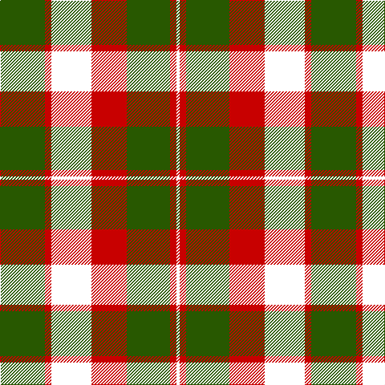

This page is one **sett** — a single exact thread-count. It belongs to the [tartan](/tartans/dg28r4k25r22dg27r4k2/)
(the same proportion at any scale), whose colour order is pattern [GRKRGRK](/stripes/grkrgrk/).

Sourced from house-of-tartan.  It is a [7 stripe tartan](/stripes/stripes7/).

Original link http://www.house-of-tartan.scotland.net/house/TartanViewjs.asp?colr=Def&tnam=515

## Thread count
Ga/56 R8 DP50 R44 Ga54 R8 DP/4

## Palette

Palette: <strong>Tartan Register</strong>
<table><thead><tr><th>Colour</th><th>Threads</th><th>Shade</th><th>Base</th><th>OKLCh</th></tr></thead><tbody><tr><td>Ga/</td><td style="text-align:right;font-variant-numeric:tabular-nums">56</td><td><code style="background-color:#285800;">#285800</code> <small style="color:#888">#285800</small></td><td>G <code style="background-color:#006100;">#006100</code></td><td><small style="color:#888">oklch(41.0% 0.122 135.8)</small></td></tr><tr><td>R</td><td style="text-align:right;font-variant-numeric:tabular-nums">8</td><td><code style="background-color:#C80000;">#C80000</code> <small style="color:#888">#C80000</small></td><td>R <code style="background-color:#CC0000;">#CC0000</code></td><td><small style="color:#888">oklch(52.3% 0.215 29.2)</small></td></tr><tr><td></td><td style="text-align:right;font-variant-numeric:tabular-nums">50</td><td><code style="background-color:;"></code> <small style="color:#888"></small></td><td> <code style="background-color:;"></code></td><td><small style="color:#888"></small></td></tr><tr><td>R</td><td style="text-align:right;font-variant-numeric:tabular-nums">44</td><td><code style="background-color:#C80000;">#C80000</code> <small style="color:#888">#C80000</small></td><td>R <code style="background-color:#CC0000;">#CC0000</code></td><td><small style="color:#888">oklch(52.3% 0.215 29.2)</small></td></tr><tr><td>Ga</td><td style="text-align:right;font-variant-numeric:tabular-nums">54</td><td><code style="background-color:#285800;">#285800</code> <small style="color:#888">#285800</small></td><td>G <code style="background-color:#006100;">#006100</code></td><td><small style="color:#888">oklch(41.0% 0.122 135.8)</small></td></tr><tr><td>R</td><td style="text-align:right;font-variant-numeric:tabular-nums">8</td><td><code style="background-color:#C80000;">#C80000</code> <small style="color:#888">#C80000</small></td><td>R <code style="background-color:#CC0000;">#CC0000</code></td><td><small style="color:#888">oklch(52.3% 0.215 29.2)</small></td></tr><tr><td>/</td><td style="text-align:right;font-variant-numeric:tabular-nums">4</td><td><code style="background-color:;"></code> <small style="color:#888"></small></td><td> <code style="background-color:;"></code></td><td><small style="color:#888"></small></td></tr></tbody></table>

# Sample pattern

## Nearest tartans

The nearest existing variants by ΔTartan distance, with this tartan at the top so the swatches line up against it.

ΔTartan

Tartan

Sett

—

<a href="/ttd/edit/#slug=dg28r4k25r22dg27r4k2~x2">Glasgow, City of District Tartan Tartan Number: 515. Earliest known date: 1819 Also known as 'Madder'. Marroon red is used in this illustration to convey what Wilson describes as madder. This colour, produced from plant dyes, is a dull shade of red. Rock and Wheel refers to an old form of manufacture. Worn by the City of Glasgow pp See products available Copyright © Blair Urquhart, Comrie, 2015</a> <a class="nn-out" href="/setts/s7/dg28r4k25r22dg27r4k2~x2/" title="open its dictionary page">↗</a>

1.19

<a href="/ttd/edit/#slug=db9r6dg2r6dg18r6dg2">Skene D</a> <a class="nn-out" href="/setts/s7/db9r6dg2r6dg18r6dg2/" title="open its dictionary page">↗</a>

1.19

<a href="/ttd/edit/#slug=k3dy3lo6k12lo1o2dy2~x4">Strummer, Joe (Commemorative)</a> <a class="nn-out" href="/setts/s7/k3dy3lo6k12lo1o2dy2~x4/" title="open its dictionary page">↗</a>

1.23

<a href="/ttd/edit/#slug=k14r6k2r6dg25r6k2~x2">Logan - 1810 (Cockburn Collection)</a> <a class="nn-out" href="/setts/s7/k14r6k2r6dg25r6k2~x2/" title="open its dictionary page">↗</a>

1.30

<a href="/ttd/edit/#slug=dg28r4db25w5r22dg27r4db2~x2">New Glasgow (Canada)</a> <a class="nn-out" href="/setts/s8/dg28r4db25w5r22dg27r4db2~x2/" title="open its dictionary page">↗</a>

1.43

<a href="/ttd/edit/#slug=k2r7k6g12ly1g1k2~x4">Blackstock Hunting</a> <a class="nn-out" href="/setts/s7/k2r7k6g12ly1g1k2~x4/" title="open its dictionary page">↗</a>

1.45

<a href="/ttd/edit/#slug=k3lo18dg6r17k31dg3~x2">MacMillan - 2002 (Black - Unofficial</a> <a class="nn-out" href="/setts/s6/k3lo18dg6r17k31dg3~x2/" title="open its dictionary page">↗</a>

1.51

<a href="/ttd/edit/#slug=g8r2g12k6g3db6r24k4~x2">Dickie</a> <a class="nn-out" href="/setts/s8/g8r2g12k6g3db6r24k4~x2/" title="open its dictionary page">↗</a>

1.51

<a href="/ttd/edit/#slug=dg28r4dp25w5r22dg27r4dp2~x2">New Glasgow (Canada)</a> <a class="nn-out" href="/setts/s8/dg28r4dp25w5r22dg27r4dp2~x2/" title="open its dictionary page">↗</a>

1.57

<a href="/ttd/edit/#slug=db6r3g1r3g12r3g1~x4">Skene - 1831 (Clan)</a> <a class="nn-out" href="/setts/s7/db6r3g1r3g12r3g1~x4/" title="open its dictionary page">↗</a>

1.57

<a href="/ttd/edit/#slug=k9r4k1r4g15r4k1~x2">Logan, Dark</a> <a class="nn-out" href="/setts/s7/k9r4k1r4g15r4k1~x2/" title="open its dictionary page">↗</a>

## Neighbour map

Every grey dot is one of 14299 variants placed by the first two principal components of the ΔTartan feature space (44% of its variance). Red is this tartan; blue dots are its nearest — click one to open its page.

<svg viewBox="0 0 640 380" role="img" style="max-width:100%;height:auto;border:1px solid #e0e0e0;border-radius:4px;display:block" xmlns="http://www.w3.org/2000/svg"><image href="/nn/cloud.v1.png" width="640" height="380"/><a href="/setts/s7/db9r6dg2r6dg18r6dg2/"><circle cx="256.1" cy="233.3" r="4" fill="#3465a4"><title>Skene D</title></circle></a><a href="/setts/s7/k3dy3lo6k12lo1o2dy2~x4/"><circle cx="264.7" cy="193.5" r="4" fill="#3465a4"><title>Strummer, Joe (Commemorative)</title></circle></a><a href="/setts/s7/k14r6k2r6dg25r6k2~x2/"><circle cx="250.3" cy="206.4" r="4" fill="#3465a4"><title>Logan - 1810 (Cockburn Collection)</title></circle></a><a href="/setts/s8/dg28r4db25w5r22dg27r4db2~x2/"><circle cx="228.4" cy="185.5" r="4" fill="#3465a4"><title>New Glasgow (Canada)</title></circle></a><a href="/setts/s7/k2r7k6g12ly1g1k2~x4/"><circle cx="229.5" cy="195.1" r="4" fill="#3465a4"><title>Blackstock Hunting</title></circle></a><a href="/setts/s6/k3lo18dg6r17k31dg3~x2/"><circle cx="218.1" cy="210.6" r="4" fill="#3465a4"><title>MacMillan - 2002 (Black - Unofficial</title></circle></a><a href="/setts/s8/g8r2g12k6g3db6r24k4~x2/"><circle cx="200.7" cy="180.3" r="4" fill="#3465a4"><title>Dickie</title></circle></a><a href="/setts/s8/dg28r4dp25w5r22dg27r4dp2~x2/"><circle cx="249.7" cy="188.7" r="4" fill="#3465a4"><title>New Glasgow (Canada)</title></circle></a><a href="/setts/s7/db6r3g1r3g12r3g1~x4/"><circle cx="298.8" cy="216.7" r="4" fill="#3465a4"><title>Skene - 1831 (Clan)</title></circle></a><a href="/setts/s7/k9r4k1r4g15r4k1~x2/"><circle cx="189.7" cy="172.6" r="4" fill="#3465a4"><title>Logan, Dark</title></circle></a><circle cx="266.0" cy="215.4" r="5" fill="#c00000"/></svg>

ID: /setts/s7/dg28r4k25r22dg27r4k2~x2/
