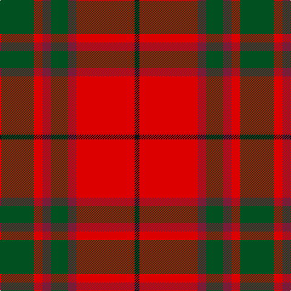

This page is one **sett** — a single exact thread-count. It belongs to the [tartan](/tartans/dg28r7m7dg14m7r48k4/)
(the same proportion at any scale), whose colour order is pattern [GRRGRRK](/stripes/grrgrrk/).

Sourced from register-of-tartans.  It is a [7 stripe tartan](/stripes/stripes7/).

Original link https://www.tartanregister.gov.uk/tartanDetails.aspx?ref=2668

## Register references

External register numbers recorded for this tartan.

- Scottish Register of Tartans: [2668](https://www.tartanregister.gov.uk/tartanDetails.aspx?ref=2668)
- Scottish Tartans World Register: 838

## Thread count
G/56 R14 DR14 G28 DR14 R96 K/8

## Palette

Palette: <strong>Tartan Register</strong>
<table><thead><tr><th>Colour</th><th>Threads</th><th>Shade</th><th>Base</th><th>OKLCh</th></tr></thead><tbody><tr><td>G/</td><td style="text-align:right;font-variant-numeric:tabular-nums">56</td><td><code style="background-color:#005020;">#005020</code> <small style="color:#888">#005020</small></td><td>G <code style="background-color:#006100;">#006100</code></td><td><small style="color:#888">oklch(37.7% 0.105 149.6)</small></td></tr><tr><td>R</td><td style="text-align:right;font-variant-numeric:tabular-nums">14</td><td><code style="background-color:#DC0000;">#DC0000</code> <small style="color:#888">#DC0000</small></td><td>R <code style="background-color:#CC0000;">#CC0000</code></td><td><small style="color:#888">oklch(56.2% 0.230 29.2)</small></td></tr><tr><td>DR</td><td style="text-align:right;font-variant-numeric:tabular-nums">14</td><td><code style="background-color:#781C38;">#781C38</code> <small style="color:#888">#781C38</small></td><td>R <code style="background-color:#CC0000;">#CC0000</code></td><td><small style="color:#888">oklch(38.7% 0.127 7.4)</small></td></tr><tr><td>G</td><td style="text-align:right;font-variant-numeric:tabular-nums">28</td><td><code style="background-color:#005020;">#005020</code> <small style="color:#888">#005020</small></td><td>G <code style="background-color:#006100;">#006100</code></td><td><small style="color:#888">oklch(37.7% 0.105 149.6)</small></td></tr><tr><td>DR</td><td style="text-align:right;font-variant-numeric:tabular-nums">14</td><td><code style="background-color:#781C38;">#781C38</code> <small style="color:#888">#781C38</small></td><td>R <code style="background-color:#CC0000;">#CC0000</code></td><td><small style="color:#888">oklch(38.7% 0.127 7.4)</small></td></tr><tr><td>R</td><td style="text-align:right;font-variant-numeric:tabular-nums">96</td><td><code style="background-color:#DC0000;">#DC0000</code> <small style="color:#888">#DC0000</small></td><td>R <code style="background-color:#CC0000;">#CC0000</code></td><td><small style="color:#888">oklch(56.2% 0.230 29.2)</small></td></tr><tr><td>K/</td><td style="text-align:right;font-variant-numeric:tabular-nums">8</td><td><code style="background-color:#101010;">#101010</code> <small style="color:#888">#101010</small></td><td>K <code style="background-color:#000000;">#000000</code></td><td><small style="color:#888">oklch(17.3% 0.000 89.9)</small></td></tr></tbody></table>

# Sample pattern

## Nearest tartans

The nearest existing variants by ΔTartan distance, with this tartan at the top so the swatches line up against it.

ΔTartan

Tartan

Sett

—

<a href="/ttd/edit/#slug=dg28r7m7dg14m7r48k4~x2">MacNab (Crimson)</a> <a class="nn-out" href="/setts/s7/dg28r7m7dg14m7r48k4~x2/" title="open its dictionary page">↗</a>

0.32

<a href="/ttd/edit/#slug=dg6r2ri2dg4ri2r12k1~x2">MacNab #3</a> <a class="nn-out" href="/setts/s7/dg6r2ri2dg4ri2r12k1~x2/" title="open its dictionary page">↗</a>

0.57

<a href="/ttd/edit/#slug=g6r2ri2g4ri2r12k1~x2">MacNab 5</a> <a class="nn-out" href="/setts/s7/g6r2ri2g4ri2r12k1~x2/" title="open its dictionary page">↗</a>

0.70

<a href="/ttd/edit/#slug=g28r7m7g14m7r48k4~x2">MacNab 6</a> <a class="nn-out" href="/setts/s7/g28r7m7g14m7r48k4~x2/" title="open its dictionary page">↗</a>

0.75

<a href="/ttd/edit/#slug=r4k2r24k6db6dg16r3~x2">MacDuff #4</a> <a class="nn-out" href="/setts/s7/r4k2r24k6db6dg16r3~x2/" title="open its dictionary page">↗</a>

0.80

<a href="/ttd/edit/#slug=r8w2m30g12m3g12m3~x2">Wasko (Personal)</a> <a class="nn-out" href="/setts/s7/r8w2m30g12m3g12m3~x2/" title="open its dictionary page">↗</a>

0.86

<a href="/ttd/edit/#slug=r28db12r3dg20t2dg2r7~x2">Carrick (Strathmore) District Tartan Tartan Number: 3216. Earliest known date: c.1999 Sales help Princess Diana Memorial Trust See products available Copyright © Blair Urquhart, Comrie, 2015</a> <a class="nn-out" href="/setts/s7/r28db12r3dg20t2dg2r7~x2/" title="open its dictionary page">↗</a>

0.89

<a href="/ttd/edit/#slug=r15k1y2db3r2k1y15~x6">Scrymgeour</a> <a class="nn-out" href="/setts/s7/r15k1y2db3r2k1y15~x6/" title="open its dictionary page">↗</a>

0.92

<a href="/ttd/edit/#slug=r12db2w1db2r3g8r3db1~x2">Chisholm, The</a> <a class="nn-out" href="/setts/s8/r12db2w1db2r3g8r3db1~x2/" title="open its dictionary page">↗</a>

0.93

<a href="/ttd/edit/#slug=r12dp2lb1dp2r3dg8r3dp1">Chisholm</a> <a class="nn-out" href="/setts/s8/r12dp2lb1dp2r3dg8r3dp1/" title="open its dictionary page">↗</a>

0.93

<a href="/ttd/edit/#slug=k2r12db6r3dg12r4db1~x2">MacBean/MacElvain</a> <a class="nn-out" href="/setts/s7/k2r12db6r3dg12r4db1~x2/" title="open its dictionary page">↗</a>

## Neighbour map

Every grey dot is one of 14359 variants placed by the first two principal components of the ΔTartan feature space (44% of its variance). Red is this tartan; blue dots are its nearest — click one to open its page.

<svg viewBox="0 0 640 380" role="img" style="max-width:100%;height:auto;border:1px solid #e0e0e0;border-radius:4px;display:block" xmlns="http://www.w3.org/2000/svg"><image href="/nn/cloud.v1.png" width="640" height="380"/><a href="/setts/s7/dg6r2ri2dg4ri2r12k1~x2/"><circle cx="296.9" cy="192.2" r="4" fill="#3465a4"><title>MacNab #3</title></circle></a><a href="/setts/s7/g6r2ri2g4ri2r12k1~x2/"><circle cx="287.1" cy="191.2" r="4" fill="#3465a4"><title>MacNab 5</title></circle></a><a href="/setts/s7/g28r7m7g14m7r48k4~x2/"><circle cx="288.4" cy="187.7" r="4" fill="#3465a4"><title>MacNab 6</title></circle></a><a href="/setts/s7/r4k2r24k6db6dg16r3~x2/"><circle cx="278.1" cy="183.7" r="4" fill="#3465a4"><title>MacDuff #4</title></circle></a><a href="/setts/s7/r8w2m30g12m3g12m3~x2/"><circle cx="330.7" cy="187.0" r="4" fill="#3465a4"><title>Wasko (Personal)</title></circle></a><a href="/setts/s7/r28db12r3dg20t2dg2r7~x2/"><circle cx="308.1" cy="186.0" r="4" fill="#3465a4"><title>Carrick (Strathmore) District Tartan Tartan Number: 3216. Earliest known date: c.1999 Sales help Princess Diana Memorial Trust See products available Copyright © Blair Urquhart, Comrie, 2015</title></circle></a><a href="/setts/s7/r15k1y2db3r2k1y15~x6/"><circle cx="304.7" cy="166.9" r="4" fill="#3465a4"><title>Scrymgeour</title></circle></a><a href="/setts/s8/r12db2w1db2r3g8r3db1~x2/"><circle cx="323.2" cy="178.8" r="4" fill="#3465a4"><title>Chisholm, The</title></circle></a><a href="/setts/s8/r12dp2lb1dp2r3dg8r3dp1/"><circle cx="329.1" cy="178.8" r="4" fill="#3465a4"><title>Chisholm</title></circle></a><a href="/setts/s7/k2r12db6r3dg12r4db1~x2/"><circle cx="259.2" cy="199.1" r="4" fill="#3465a4"><title>MacBean/MacElvain</title></circle></a><circle cx="297.3" cy="188.5" r="5" fill="#c00000"/></svg>

ID: /setts/s7/dg28r7m7dg14m7r48k4~x2/
