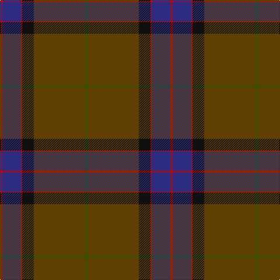

In pattern [GGGKRBR](/stripes/gggkrbr/).

This was sourced from tartans-authority.  It is a [7 stripe tartan](/stripes/stripes7/).

Original link http://www.tartansauthority.com/tartan-ferret/display/1417/

## Thread count
R/4 DB32 R2 K20 T24 T64 G/4

## Palette
Each colour and its ΔE from the base-6 reference it is a variant of.

| Colour | Shade | Base | ΔE (OKLab) |
|---|---|---|---|
| DB | <code style="background-color:#2C2C80;">#2C2C80</code> `#2C2C80` | B <code style="background-color:#2A418A;">#2A418A</code> | 0.06 |
| G | <code style="background-color:#285800;">#285800</code> `#285800` | G <code style="background-color:#006100;">#006100</code> | 0.03 |
| K | <code style="background-color:#101010;">#101010</code> `#101010` | K <code style="background-color:#000000;">#000000</code> | 0.17 |
| R | <code style="background-color:#C80000;">#C80000</code> `#C80000` | R <code style="background-color:#CC0000;">#CC0000</code> | 0.01 |
| T | <code style="background-color:#604000;">#604000</code> `#604000` | G <code style="background-color:#006100;">#006100</code> | 0.14 |

# Sample pattern

## Nearest tartans

The nearest existing variants by ΔTartan distance.

1. [Suttle (Personal)](/setts/s8/n36k18n5dt7n5k7r1g2~x2/) — ΔT 1.23
1. [Shaw of Tordarroch Hunting Clan Tartan Tartan Number: 318. Earliest known date: 1969 Also known as 'Green Shaw of Tordarroch'. Green is 'Sage Green' Proportionally reduced for display. (50%) See products available Copyright © Blair Urquhart, Comrie, 2015](/setts/s8/t5k1y30dp15r8y30r8dp2/) — ΔT 1.26
1. [Dunning Primary (School)](/setts/s5/n30do9w1r5ly1~x4/) — ΔT 1.43
1. [Raymond of Doune](/setts/s8/r4dg10lo1lb1dt4lb1dt25r2~x2/) — ΔT 1.49
1. [Shaw of Tordarroch, hunting](/setts/s8/t5k1y30p15r8y30r8p2~x2/) — ΔT 1.51
1. [Duchess of York (Fashion)](/setts/s9/db2dy18dg10dy1k10dy2dg10dy18w2~x2/) — ΔT 1.59
1. [Carbon](/setts/s9/do68k4do18dt20k3lb3k10lr8lo4/) — ΔT 1.62
1. [Hebridean Heather](/setts/s9/n4dt2n7dt30n8dt7r5dt1w2~x2/) — ΔT 1.64
1. [Unidentified #44](/setts/s7/db13k3db20dy70db20dy30w3~x2/) — ΔT 1.64
1. [Deeside, Royal](/setts/s6/lp4dy2dp4dy35n27r3~x2/) — ΔT 1.65

## Neighbour map

Every grey dot is one of 14299 variants placed by the first two principal components of the ΔTartan feature space (44% of its variance). Red is this tartan; blue dots are its nearest — click one to open its page.

<svg viewBox="0 0 640 380" role="img" style="max-width:100%;height:auto;border:1px solid #e0e0e0;border-radius:4px;display:block" xmlns="http://www.w3.org/2000/svg"><image href="/nn/cloud.v1.png" width="640" height="380"/><a href="/setts/s8/n36k18n5dt7n5k7r1g2~x2/"><circle cx="397.5" cy="152.7" r="4" fill="#3465a4"><title>Suttle (Personal)</title></circle></a><a href="/setts/s8/t5k1y30dp15r8y30r8dp2/"><circle cx="399.7" cy="164.3" r="4" fill="#3465a4"><title>Shaw of Tordarroch Hunting Clan Tartan Tartan Number: 318. Earliest known date: 1969 Also known as 'Green Shaw of Tordarroch'. Green is 'Sage Green' Proportionally reduced for display. (50%) See products available Copyright © Blair Urquhart, Comrie, 2015</title></circle></a><a href="/setts/s5/n30do9w1r5ly1~x4/"><circle cx="465.9" cy="176.2" r="4" fill="#3465a4"><title>Dunning Primary (School)</title></circle></a><a href="/setts/s8/r4dg10lo1lb1dt4lb1dt25r2~x2/"><circle cx="416.3" cy="162.5" r="4" fill="#3465a4"><title>Raymond of Doune</title></circle></a><a href="/setts/s8/t5k1y30p15r8y30r8p2~x2/"><circle cx="388.5" cy="158.9" r="4" fill="#3465a4"><title>Shaw of Tordarroch, hunting</title></circle></a><a href="/setts/s9/db2dy18dg10dy1k10dy2dg10dy18w2~x2/"><circle cx="334.0" cy="201.3" r="4" fill="#3465a4"><title>Duchess of York (Fashion)</title></circle></a><a href="/setts/s9/do68k4do18dt20k3lb3k10lr8lo4/"><circle cx="403.3" cy="143.1" r="4" fill="#3465a4"><title>Carbon</title></circle></a><a href="/setts/s9/n4dt2n7dt30n8dt7r5dt1w2~x2/"><circle cx="368.8" cy="142.2" r="4" fill="#3465a4"><title>Hebridean Heather</title></circle></a><a href="/setts/s7/db13k3db20dy70db20dy30w3~x2/"><circle cx="481.8" cy="221.0" r="4" fill="#3465a4"><title>Unidentified #44</title></circle></a><a href="/setts/s6/lp4dy2dp4dy35n27r3~x2/"><circle cx="337.9" cy="188.3" r="4" fill="#3465a4"><title>Deeside, Royal</title></circle></a><circle cx="412.7" cy="178.6" r="5" fill="#c00000"/></svg>

ID: /setts/s7/dg2dy32dy12k10r1db16r2~x2/
