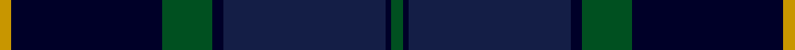

In pattern [GKBKGKY](/stripes/gkbkgky/).

This was sourced from register-of-tartans.  It is a [7 stripe tartan](/stripes/stripes7/).

Original link https://www.tartanregister.gov.uk/tartanDetails.aspx?ref=473

## Register references

External register numbers recorded for this tartan.

- Scottish Register of Tartans: [473](https://www.tartanregister.gov.uk/tartanDetails.aspx?ref=473)
- Scottish Tartans World Register: 2879

## Thread count
DY/4 DB54 G18 DB4 DBa58 DB2 G/4

## Palette
Each colour and its ΔE from the base-6 reference it is a variant of.

| Colour | Shade | Base | ΔE (OKLab) |
|---|---|---|---|
| DB | <code style="background-color:#000028;">#000028</code> `#000028` | K <code style="background-color:#000000;">#000000</code> | 0.15 |
| DBa | <code style="background-color:#141E46;">#141E46</code> `#141E46` | B <code style="background-color:#2A418A;">#2A418A</code> | 0.16 |
| DY | <code style="background-color:#C89600;">#C89600</code> `#C89600` | Y <code style="background-color:#F2BF00;">#F2BF00</code> | 0.13 |
| G | <code style="background-color:#005020;">#005020</code> `#005020` | G <code style="background-color:#006100;">#006100</code> | 0.07 |

# Sample pattern

## Nearest tartans

The nearest existing variants by ΔTartan distance.

1. [Pitceathly Chamberlain Tartan Tartan Number: 10190. Earliest known date: 2010 Designed for the 80th birthday of Sophia Joan Chamberlain nee Pitceathly for her own use and that of her immediate family. See products available Copyright © Blair Urquhart, Comrie, 2015](/setts/s10/db2k3dg5k7db20k2db5k2dg20lb1~x2/) — ΔT 1.16
1. [Doral](/setts/s7/db26dg6db2dg17dy4w1dy4~x4/) — ΔT 1.34
1. [Scottish Canals (Corporate)](/setts/s7/g2db1db29db2g9db26ly2~x2/) — ΔT 1.34
1. [Waterfront](/setts/s6/r2db38k20w1dg20r2/) — ΔT 1.49
1. [Java St Andrew Society hunting](/setts/s7/db50dg26k9dg4w2r2dg10~x2/) — ΔT 1.50
1. [Monarchs](/setts/s6/db19k4dr1k4dg9dr1~x4/) — ΔT 1.53
1. [Passion of Scotland (Fashion)](/setts/s7/dt6o4dt2db25k30g2k2~x2/) — ΔT 1.53
1. [Stansbury](/setts/s8/dg28r3k28db8t1dg8r2k3~x2/) — ΔT 1.58
1. [Peter of Lee](/setts/s8/r4dg3k2dg38db30k3db3k3~x2/) — ΔT 1.58
1. [Royal Highland Yacht Club](/setts/s11/k26db3k1dp2k1db3k3db12dg14k2w2~x2/) — ΔT 1.59

## Neighbour map

Every grey dot is one of 14299 variants placed by the first two principal components of the ΔTartan feature space (44% of its variance). Red is this tartan; blue dots are its nearest — click one to open its page.

<svg viewBox="0 0 640 380" role="img" style="max-width:100%;height:auto;border:1px solid #e0e0e0;border-radius:4px;display:block" xmlns="http://www.w3.org/2000/svg"><image href="/nn/cloud.v1.png" width="640" height="380"/><a href="/setts/s10/db2k3dg5k7db20k2db5k2dg20lb1~x2/"><circle cx="330.9" cy="205.3" r="4" fill="#3465a4"><title>Pitceathly Chamberlain Tartan Tartan Number: 10190. Earliest known date: 2010 Designed for the 80th birthday of Sophia Joan Chamberlain nee Pitceathly for her own use and that of her immediate family. See products available Copyright © Blair Urquhart, Comrie, 2015</title></circle></a><a href="/setts/s7/db26dg6db2dg17dy4w1dy4~x4/"><circle cx="348.8" cy="199.2" r="4" fill="#3465a4"><title>Doral</title></circle></a><a href="/setts/s7/g2db1db29db2g9db26ly2~x2/"><circle cx="359.1" cy="199.0" r="4" fill="#3465a4"><title>Scottish Canals (Corporate)</title></circle></a><a href="/setts/s6/r2db38k20w1dg20r2/"><circle cx="355.5" cy="191.1" r="4" fill="#3465a4"><title>Waterfront</title></circle></a><a href="/setts/s7/db50dg26k9dg4w2r2dg10~x2/"><circle cx="381.6" cy="196.2" r="4" fill="#3465a4"><title>Java St Andrew Society hunting</title></circle></a><a href="/setts/s6/db19k4dr1k4dg9dr1~x4/"><circle cx="380.9" cy="232.6" r="4" fill="#3465a4"><title>Monarchs</title></circle></a><a href="/setts/s7/dt6o4dt2db25k30g2k2~x2/"><circle cx="334.9" cy="210.7" r="4" fill="#3465a4"><title>Passion of Scotland (Fashion)</title></circle></a><a href="/setts/s8/dg28r3k28db8t1dg8r2k3~x2/"><circle cx="349.2" cy="184.1" r="4" fill="#3465a4"><title>Stansbury</title></circle></a><a href="/setts/s8/r4dg3k2dg38db30k3db3k3~x2/"><circle cx="358.5" cy="190.9" r="4" fill="#3465a4"><title>Peter of Lee</title></circle></a><a href="/setts/s11/k26db3k1dp2k1db3k3db12dg14k2w2~x2/"><circle cx="324.6" cy="153.5" r="4" fill="#3465a4"><title>Royal Highland Yacht Club</title></circle></a><circle cx="360.5" cy="201.6" r="5" fill="#c00000"/></svg>

ID: /setts/s7/dg2k1db29k2dg9k27lo2~x2/
